# [Tansoftware](https://www.tansoftware.com) - Architecture hexagonale


L'**architecture hexagonale** (aussi appelée *Ports & Adapters*, c'est-à-dire « ports et
adaptateurs ») a été formalisée par Alistair Cockburn en 2005. Elle range le code d'une
application de façon à séparer ce qui constitue le cœur du métier de ce qui relève de la
technique. Le **Domain-Driven Design (DDD)**, qui veut dire « conception pilotée par le
domaine », est sa méthode compagne : il indique comment modéliser le métier que
l'architecture hexagonale se contente de ranger.

> **Que veut dire « architecture logicielle » ?** C'est la façon d'organiser les morceaux
> d'un programme entre eux : quels dossiers existent, qui a le droit d'appeler qui, où
> vivent les règles importantes. Imaginez le plan d'une maison : il décide où sont les
> murs porteurs, les couloirs et les pièces. On peut changer la peinture (la technique)
> sans toucher aux murs porteurs (le métier).

Les exemples de code sont donnés en deux langages : **Python** (lisible, peu de syntaxe
parasite, idéal pour saisir l'idée) et **PHP/Symfony** (un framework de production réel,
pour montrer la transposition concrète). Chaque terme technique est expliqué dans un
encadré à sa première apparition, avec une analogie tirée de la vie courante.

---

## Table des matières

- [1. Introduction](#1-introduction)
- [2. Pourquoi l'hexagonal plutôt que le N-tier ?](#2-pourquoi-lhexagonal-plutôt-que-le-n-tier-)
- [3. Prérequis](#3-prérequis)
- [4. Glossaire](#4-glossaire)
- [5. Les fondations stratégiques : DDD et hexagonal](#5-les-fondations-stratégiques--ddd-et-hexagonal)
  - [5.1. Langage ubiquitaire](#51-langage-ubiquitaire)
  - [5.2. Bounded context (contexte borné)](#52-bounded-context-contexte-borné)
  - [5.3. Anti-corruption layer (ACL)](#53-anti-corruption-layer-acl)
  - [5.4. Communication entre bounded contexts](#54-communication-entre-bounded-contexts)
- [6. Les différentes couches](#6-les-différentes-couches)
  - [6.1. Le domaine](#61-le-domaine)
  - [6.2. L'application](#62-lapplication)
  - [6.3. L'infrastructure](#63-linfrastructure)
  - [6.4. L'interface (interface utilisateur / livraison)](#64-linterface-interface-utilisateur--livraison)
- [7. Ports et adaptateurs](#7-ports-et-adaptateurs)
  - [7.1. Ports primaires (driving)](#71-ports-primaires-driving)
  - [7.2. Ports secondaires (driven)](#72-ports-secondaires-driven)
  - [7.3. Adaptateurs](#73-adaptateurs)
- [8. L'inversion de dépendance](#8-linversion-de-dépendance)
- [9. Modélisation tactique : agrégats, entités, value objects](#9-modélisation-tactique--agrégats-entités-value-objects)
  - [9.1. Entité](#91-entité)
  - [9.2. Value object](#92-value-object)
  - [9.3. Aggregate root (racine d'agrégat)](#93-aggregate-root-racine-dagrégat)
  - [9.4. Services de domaine vs services applicatifs](#94-services-de-domaine-vs-services-applicatifs)
- [10. Le pattern Repository](#10-le-pattern-repository)
- [11. Événements de domaine et communication asynchrone](#11-événements-de-domaine-et-communication-asynchrone)
- [12. Bénéfices en testabilité (TDD)](#12-bénéfices-en-testabilité-tdd)
  - [12.1. La pyramide hexagonale](#121-la-pyramide-hexagonale)
  - [12.2. TDD : le design émerge des tests, pas d'un BDUF](#122-tdd--le-design-émerge-des-tests-pas-dun-bduf)
  - [12.3. Test d'application avec fakes en mémoire](#123-test-dapplication-avec-fakes-en-mémoire)
- [13. Hexagonal vs Clean Architecture vs Onion](#13-hexagonal-vs-clean-architecture-vs-onion)
- [14. Hexagonal et CQRS : commandes, requêtes, lecture](#14-hexagonal-et-cqrs--commandes-requêtes-lecture)
- [15. Composition Root et câblage](#15-composition-root-et-câblage)
- [16. Hexagonal à l'échelle : monolithe modulaire et microservices](#16-hexagonal-à-léchelle--monolithe-modulaire-et-microservices)
- [17. Migrer un legacy Symfony vers l'hexagonal](#17-migrer-un-legacy-symfony-vers-lhexagonal)
- [18. Exemple complet en Python](#18-exemple-complet-en-python)
- [19. Symfony en hexagonal : exemple complet](#19-symfony-en-hexagonal--exemple-complet)
  - [19.1. Mapping conceptuel](#191-mapping-conceptuel)
  - [19.2. Arborescence proposée](#192-arborescence-proposée)
  - [19.3. Le domaine en POPO](#193-le-domaine-en-popo)
  - [19.4. Les ports applicatifs](#194-les-ports-applicatifs)
  - [19.5. Le use case applicatif](#195-le-use-case-applicatif)
  - [19.6. L'adaptateur secondaire Doctrine](#196-ladaptateur-secondaire-doctrine)
  - [19.7. L'adaptateur primaire HTTP](#197-ladaptateur-primaire-http)
  - [19.8. Le conteneur de services Symfony](#198-le-conteneur-de-services-symfony)
  - [19.9. Tests](#199-tests)
- [20. Anti-patterns et pièges courants](#20-anti-patterns-et-pièges-courants)
- [21. Quand ne PAS utiliser l'hexagonal ?](#21-quand-ne-pas-utiliser-lhexagonal-)
- [22. Pour aller plus loin](#22-pour-aller-plus-loin)
- [23. Auteur](#23-auteur)
- [24. Licence](#24-licence)

---

## 1. Introduction

L'**architecture hexagonale** sépare la **logique métier** des **détails techniques**
(stockage des données, interface utilisateur, services externes, frameworks).

> **Que veut dire « logique métier » (en anglais *business logic*) ?** C'est l'ensemble
> des règles qui décrivent *le problème que résout l'application*, indépendamment de la
> manière dont on l'affiche ou dont on la stocke. Exemple : « une commande ne peut pas
> être expédiée si elle n'a pas été payée ». Analogie : dans un restaurant, la logique
> métier, ce sont les recettes et les règles du chef (on ne sert pas un plat cru). Que la
> cuisine soit au gaz ou à l'induction (la technique) ne change pas les recettes.

> **Que veut dire « détails techniques » ?** Ce sont les choix d'outils qui peuvent
> changer sans que le problème métier change : le moteur de base de données (PostgreSQL,
> MongoDB), le protocole de communication (HTTP, gRPC), le framework (Symfony, Laravel),
> le format d'échange des données (JSON, XML). Ce sont les appareils de la cuisine, pas
> les recettes.

Au cœur de l'hexagone se trouve le **domaine**, qui contient les règles métier et les cas
d'utilisation. Il est entouré de **ports**, qui définissent les contrats d'échange avec le
monde extérieur, et d'**adaptateurs**, qui réalisent concrètement ces contrats.

> **Que veut dire « port » ?** Un port est une *interface*, c'est-à-dire une liste de
> fonctions promises sans le code qui les réalise, un simple contrat. Il appartient à
> l'application et décrit, dans le vocabulaire du métier, un échange avec l'extérieur.
> Analogie : la prise électrique murale. Elle promet « du 230 volts ici ». Elle ne dit
> pas d'où vient l'électricité (barrage, éolienne, centrale). Un port n'est jamais une
> classe concrète ; c'est la forme du trou de la prise.

> **Que veut dire « adaptateur » ?** C'est l'*implémentation concrète* d'un port : le code
> qui sait réellement parler à PostgreSQL, à HTTP ou à un *broker* de messages. Analogie :
> l'appareil que vous branchez dans la prise (lampe, ordinateur). Le mur (le domaine) ne
> voit que la prise (le port), jamais l'appareil. On peut changer d'appareil sans toucher
> au mur.
>
> *Broker* veut dire « courtier » : un programme intermédiaire qui reçoit les messages
> d'un côté et les distribue de l'autre, comme un bureau de tri postal.

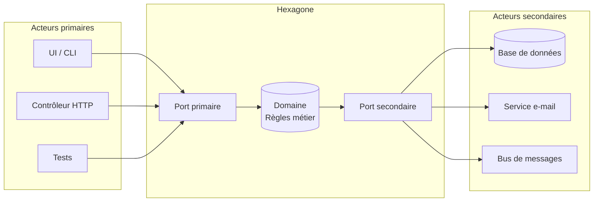

Le sens des flèches illustre la **règle d'or** de l'hexagonal : les dépendances pointent
toujours **vers l'intérieur**, c'est-à-dire **vers le domaine**, jamais l'inverse.

> **Que veut dire « dépendance » ?** Un morceau de code A « dépend de » B quand A a besoin
> de B pour fonctionner (il l'appelle, l'importe, le connaît). Analogie : si votre recette
> exige une marque précise de four, la recette dépend de ce four ; changez de four et la
> recette casse. On veut donc que les recettes (le domaine) ne dépendent d'aucun appareil.

Le domaine ignore tout du reste du monde. C'est précisément ce qui le rend stable,
testable et durable : aucun changement d'appareil ne peut le casser, puisqu'il n'en
connaît aucun.

[Retour en haut](#table-des-matières)

---

## 2. Pourquoi l'hexagonal plutôt que le N-tier ?

L'architecture **N-tier** classique (présentation puis métier puis données) est simple à
comprendre, mais elle souffre de plusieurs limites profondes.

> **Que veut dire « N-tier » ?** *Tier* veut dire « étage » ou « niveau » en anglais, et
> *N* signifie « un nombre quelconque ». Une architecture N-tier empile donc des couches
> en cascade : la présentation (l'écran) appelle le métier, qui appelle la persistance
> (le stockage). Analogie : une chaîne de commandement où chaque chef parle au chef du
> dessous. Le défaut : la couche métier *connaît* la couche stockage et hérite donc de ses
> contraintes (le modèle de la base de données, les types SQL, les erreurs du pilote de
> base de données). Le métier devient prisonnier de la technique.
>
> *SQL* veut dire *Structured Query Language*, « langage de requêtes structuré » : le
> langage standard pour interroger une base de données relationnelle (des tables avec des
> lignes et des colonnes). *Persistance* veut dire « le fait de conserver des données
> durablement », typiquement sur disque, pour les retrouver après extinction du programme.

| Aspect | N-tier classique | Hexagonal |
|---|---|---|
| Sens des dépendances | Métier dépend de la base de données | Tout dépend du métier |
| Testabilité du domaine | Nécessite des doublures de la base ou une base en mémoire | Tests purs, sans entrées-sorties (I/O) |
| Remplacement d'un adaptateur (ex. SQL → MongoDB) | Coûteux, touche le métier | Isolé à un seul adaptateur |
| Indépendance du framework | Faible (souvent couplé à Spring/Symfony/Django) | Forte |
| Évolutivité | Bonne tant que la couche métier reste fine | Pensée pour absorber la complexité métier |
| Durée de vie typique du métier | Court à moyen terme | Long terme (plusieurs migrations techniques) |

> **Que veut dire « I/O » (entrées-sorties) ?** *I/O* est l'abréviation de *Input/Output*,
> « entrée/sortie ». Cela désigne toute communication d'un programme avec l'extérieur :
> lire un fichier, interroger une base, appeler le réseau. Ces opérations sont lentes et
> imprévisibles. Un « test pur, sans I/O » ne touche à rien de tout cela : il s'exécute
> entièrement en mémoire, donc en une fraction de milliseconde.

En résumé : l'hexagonal protège votre **investissement métier** (la partie la plus durable
de votre code) contre l'instabilité des choix techniques. Une application bien structurée
doit pouvoir survivre à un changement complet de framework ou de moteur de stockage **sans
réécrire son domaine**.

[Retour en haut](#table-des-matières)

---

## 3. Prérequis

Quelques notions facilitent la lecture. Elles sont expliquées au fil du texte, mais les
voici regroupées :

- les principes **SOLID**, en particulier le **D**, le *Dependency Inversion Principle*
  (DIP) ;
- la notion d'**injection de dépendances** (DI) ;
- les bases de la **POO** : interfaces, abstractions, polymorphisme ;
- les concepts de base du **DDD** (entité, value object, agrégat), introduits ici à
  mesure du besoin.

> **Que veut dire « POO » ?** *POO* signifie « programmation orientée objet ». C'est une
> façon d'écrire du code en regroupant les données et les fonctions qui les manipulent
> dans des « objets ». Une *interface* est la liste des fonctions qu'un objet promet
> d'offrir ; le *polymorphisme* est le fait que plusieurs objets différents respectent la
> même interface et sont donc interchangeables (une lampe et un grille-pain se branchent
> tous deux dans la même prise).

> **Que veut dire « injection de dépendances » (DI, *Dependency Injection*) ?** C'est le
> fait de *fournir* à un objet ses collaborateurs depuis l'extérieur, au lieu de le
> laisser les fabriquer lui-même. Concrètement, on les passe dans le constructeur (la
> fonction qui crée l'objet). Analogie : un cuisinier qui reçoit ses ingrédients livrés
> plutôt que d'aller les cueillir. On peut alors lui livrer de faux ingrédients pour
> tester sa recette sans aller au marché.

> **Que veut dire « SOLID » ?** C'est un moyen mnémotechnique pour cinq principes de bonne
> conception orientée objet, dont l'initiale forme le mot SOLID (« solide » en anglais) :
> *Single responsibility* (une seule responsabilité par classe), *Open-closed* (ouvert à
> l'extension, fermé à la modification), *Liskov substitution* (toute sous-classe doit
> pouvoir remplacer sa classe mère), *Interface segregation* (de petites interfaces
> spécifiques plutôt qu'une grosse), *Dependency inversion* (dépendre d'abstractions, pas
> de détails, expliqué en détail en section 8).

[Retour en haut](#table-des-matières)

---

## 4. Glossaire

| Terme | Définition |
|---|---|
| **Domaine** | Cœur de l'application contenant les règles métier, libre de toute dépendance technique. |
| **Port** | Interface (au sens POO) définie par l'application pour communiquer avec l'extérieur. |
| **Adaptateur** | Implémentation concrète d'un port, côté infrastructure ou présentation. |
| **Port primaire** *(driving)* | Définit ce que l'application **offre** (ex. `CreateUser`). Appelé par les acteurs primaires. |
| **Port secondaire** *(driven)* | Définit ce dont l'application **a besoin** (ex. `UserRepository`). Implémenté par l'infrastructure. |
| **Acteur primaire** | Élément qui *initie* une interaction (UI, contrôleur HTTP, CLI, test). |
| **Acteur secondaire** | Élément que l'application *pilote* (base de données, broker, service externe). |
| **Use case** | Cas d'utilisation applicatif qui orchestre le domaine pour répondre à un besoin métier. |
| **Service applicatif** | Synonyme de *use case* : orchestre le domaine, ne contient pas de règle métier. |
| **Service de domaine** | Logique métier qui ne tient pas dans une seule entité (ex. calcul de remise inter-comptes). |
| **Entité** | Objet métier identifié par un `id`, doté d'un cycle de vie. |
| **Value object** | Objet métier immuable, sans identité, comparé par valeur (ex. `Money`, `Email`). |
| **Aggregate root** | Entité qui sert de point d'entrée unique à un agrégat et garantit ses invariants. |
| **Agrégat** | Cluster d'entités/VO traités comme une seule unité de cohérence transactionnelle. |
| **Repository** | Port secondaire qui simule une *collection en mémoire* d'aggregate roots. |
| **DTO** | *Data Transfer Object* : structure plate, sans comportement, qui transporte des données entre couches. |
| **DIP** | *Dependency Inversion Principle* : les modules de haut niveau ne dépendent pas des modules de bas niveau ; les deux dépendent d'abstractions. |
| **POPO** | *Plain Old PHP Object* : classe PHP sans héritage de framework, ni annotation technique imposée. Équivalent du POJO en Java. |
| **Bounded context** | Frontière à l'intérieur de laquelle un terme du langage métier a un sens unique et non ambigu. |
| **Langage ubiquitaire** | Vocabulaire métier partagé entre experts, code et conversations, à l'intérieur d'un bounded context. |
| **Anti-corruption layer (ACL)** | Couche de traduction qui empêche le modèle d'un contexte de polluer celui d'un autre. |
| **Domain event** | Fait métier qui s'est produit (au passé : `OrderPlaced`, `PaymentCaptured`). |
| **Idempotence** | Propriété d'une opération qui produit le même résultat qu'elle soit appelée une ou plusieurs fois. |
| **Anémie** | Anti-pattern où les entités n'ont aucun comportement, juste des getters/setters. |
| **BDUF** | *Big Design Up Front* : tentation de tout modéliser (ports, adaptateurs, agrégats) avant la première ligne de test. À éviter. |
| **CQRS** | *Command Query Responsibility Segregation* : sépare les commandes (qui écrivent) des requêtes (qui lisent). |
| **Read model** | Modèle de lecture dénormalisé, distinct des agrégats, pensé pour servir efficacement une vue. |
| **Composition Root** | Unique endroit du programme où l'on assemble le graphe d'objets et où l'on associe ports et adaptateurs. |
| **Strangler Fig pattern** | Stratégie de migration legacy : enrober progressivement le code existant jusqu'à le remplacer entièrement. |
| **Transactional outbox** | Pattern garantissant qu'un événement de domaine est publié *si et seulement si* l'écriture du même use case a été commitée. |
| **Onion Architecture** | Variante cousine de l'hexagonal (Palermo, 2008), couches concentriques centrées sur le domaine. |
| **Clean Architecture** | Synthèse de Robert C. Martin (2012), élève le *use case* en couche autonome avec ses propres *boundaries*. |

[Retour en haut](#table-des-matières)

---

## 5. Les fondations stratégiques : DDD et hexagonal

L'architecture hexagonale décrit *où mettre le code*. Le **Domain-Driven Design** (DDD)
décrit *comment modéliser le métier*. Les deux se complètent : l'hexagonal est le
squelette, le DDD le remplit. Voici les notions *stratégiques* du DDD, celles qui
concernent l'organisation d'ensemble plutôt que le détail du code.

> **Que veut dire « Domain-Driven Design » (DDD) ?** Traduit, « conception pilotée par le
> domaine ». C'est une approche, formalisée par Eric Evans en 2003, qui dit : modélisez le
> code à partir du vrai métier et de son vocabulaire, pas à partir de la base de données.
> Le *domaine*, c'est le sujet que traite le logiciel (la vente, la facturation, la
> logistique). « Piloté par le domaine » signifie donc « guidé d'abord par le métier ».
> *Stratégique* désigne les grandes décisions de découpage (quels modules, quelles
> frontières) ; *tactique* (section 9) désigne les briques de code à l'intérieur.

### 5.1. Langage ubiquitaire

> **Que veut dire « langage ubiquitaire » (en anglais *ubiquitous language*) ?**
> *Ubiquitaire* veut dire « présent partout ». C'est un vocabulaire commun, précis et
> stable, employé à l'identique par les experts métier, les développeurs, la documentation
> et le code. Si un expert dit « commande », le code contient une classe `Order`, jamais
> `OrderEntityDto2`. Analogie : dans un hôpital, médecins, infirmiers et dossiers
> utilisent les mêmes mots pour les mêmes choses, sinon les erreurs s'accumulent.

Concrètement, le langage ubiquitaire impose une discipline : **chaque terme du domaine a
un nom unique** et *ce nom apparaît tel quel dans le code*. Les noms des classes du
domaine, des méthodes, des événements et des use cases sont tirés directement des
discussions avec les experts. C'est ce qui permet au code de devenir un support de
conversation, et plus seulement un artefact technique.

À la frontière du domaine (c'est-à-dire au niveau des ports) le langage ubiquitaire est
*roi*. Un port n'a pas le droit d'utiliser un mot qui n'appartient pas au métier ;
inversement, l'adaptateur peut introduire son propre vocabulaire technique (`Row`,
`Document`, `Payload`) sans contaminer le domaine.

### 5.2. Bounded context (contexte borné)

> **Que veut dire « bounded context » (contexte borné) ?** Traduit, « contexte délimité ».
> C'est une frontière (souvent un module, un service ou un dépôt) à l'intérieur de laquelle
> un mot du vocabulaire métier a un sens unique. Un même mot (`Client`, `Produit`,
> `Facture`) peut désigner des choses très différentes dans deux contextes (le service
> commercial et la comptabilité). Analogie : le mot « avocat » ne signifie pas la même
> chose au tribunal et chez le marchand de fruits ; chaque lieu est son propre contexte
> borné.

Exemple :

- Dans le contexte **Catalogue**, un *Produit* a un titre, une description, des photos,
  des dimensions.
- Dans le contexte **Logistique**, un *Produit* est un objet à mettre dans un carton,
  caractérisé par un poids, un volume et une zone de stockage.
- Dans le contexte **Comptabilité**, un *Produit* est une ligne TVA avec un taux et un
  compte général.

Tenter de modéliser **un seul** `Product` qui réunit toutes ces facettes mène
inévitablement à une classe gigantesque, ambiguë, et impossible à faire évoluer. Le DDD
recommande de séparer les contextes et d'accepter que chaque contexte ait *sa propre*
définition du même mot.

L'hexagonal, lui, vit *à l'intérieur d'un* bounded context : chaque hexagone est
typiquement un contexte borné, avec son propre domaine, ses propres ports, ses propres
adaptateurs.

### 5.3. Anti-corruption layer (ACL)

> **Que veut dire « anti-corruption layer » (ACL, couche anti-corruption) ?** C'est une
> couche de traduction placée à la frontière entre deux contextes (ou entre votre domaine
> et un vieux système externe), dont l'unique rôle est d'empêcher les mots et les concepts
> d'un côté de contaminer l'autre. Analogie : un interprète à une réunion internationale.
> Chaque partie parle sa langue ; l'interprète traduit pour qu'aucune ne soit obligée
> d'apprendre la langue de l'autre.
>
> *Legacy* veut dire « hérité du passé » : du code ancien, toujours en service, souvent mal
> structuré, que l'on doit composer avec sans pouvoir le réécrire d'un coup.

Quand deux contextes doivent collaborer, ils ne se parlent **jamais** directement avec
leurs modèles internes. On insère une ACL qui *traduit* : elle prend les concepts du
contexte source et les exprime dans le vocabulaire du contexte destinataire.

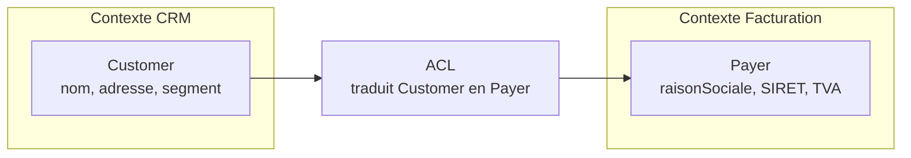

L'ACL est typiquement implémentée comme un **adaptateur secondaire** dans l'hexagonal :
le contexte appelant définit un port (`PayerProvider`), et l'adaptateur traduit en
appelant l'API du CRM. Le domaine de la facturation ne voit jamais un `Customer` venu de
l'extérieur ; il ne voit que des `Payer` qu'il comprend.

Cas d'usage typiques d'une ACL :

- intégration avec un **legacy** dont le modèle est mal nommé ou mal taillé ;
- consommation d'une **API tierce** dont les noms ne sont pas les vôtres ;
- communication entre deux **bounded contexts** internes qui ont évolué de manière
  divergente.

### 5.4. Communication entre bounded contexts

Une fois posée la frontière, comment deux contextes échangent-ils ?

- **Synchrone** : le contexte A appelle un port secondaire (`PayerProvider`) ; un
  adaptateur appelle l'API HTTP/gRPC du contexte B. Simple à mettre en place, mais
  introduit un couplage de disponibilité (B doit répondre).
- **Asynchrone par événements de domaine** : le contexte A publie un *domain event*
  (`OrderPlaced`) sur un bus de messages ; le contexte B y souscrit et réagit. Découplage
  fort, mais introduit la complexité de la cohérence éventuelle (*eventual consistency*).

> **Que veut dire « cohérence éventuelle » (en anglais *eventual consistency*) ?** Dans un
> système réparti sur plusieurs machines, après un court délai de propagation, tous les
> contextes finissent par voir les mêmes données. Mais à un instant donné, deux d'entre eux
> peuvent être brièvement désynchronisés. « Éventuelle » est un faux ami de l'anglais :
> il faut comprendre « finit par devenir cohérente », pas « peut-être ». Analogie : un
> commérage dans un village ; tout le monde finira par le savoir, mais pas exactement au
> même instant.

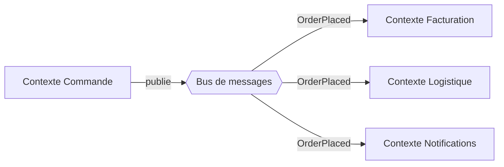

> **Que veut dire « bus de messages » ?** C'est un canal partagé où l'on dépose des
> messages et où d'autres viennent les récupérer, sans que l'expéditeur connaisse les
> destinataires. Analogie : un tableau d'affichage dans un hall ; on y punaise une note,
> et quiconque est intéressé la lit. RabbitMQ, Kafka et Symfony Messenger sont trois outils
> qui jouent ce rôle de tableau d'affichage.

Dans une architecture hexagonale, le bus est un port secondaire (`EventPublisher`) du côté
qui émet, et un adaptateur primaire (`EventListener`) du côté qui reçoit. Le domaine ne
sait rien de RabbitMQ, Kafka ou Symfony Messenger : il sait seulement produire un événement
dans son langage métier.

[Retour en haut](#table-des-matières)

---

## 6. Les différentes couches

L'architecture hexagonale s'organise en couches emboîtées comme des poupées russes.
**Aucune couche extérieure ne doit être connue d'une couche intérieure.** C'est la forme
géométrique de la règle de dépendance : *les flèches pointent toujours vers le centre*.

> **Que veut dire « couche » ?** Un regroupement de code qui partage un même rôle et un
> même niveau de proximité avec le métier. De l'intérieur vers l'extérieur : le domaine
> (les règles), l'application (l'enchaînement des étapes), l'infrastructure (la technique),
> l'interface (la porte d'entrée). Analogie : les peaux d'un oignon, le cœur étant le plus
> protégé.

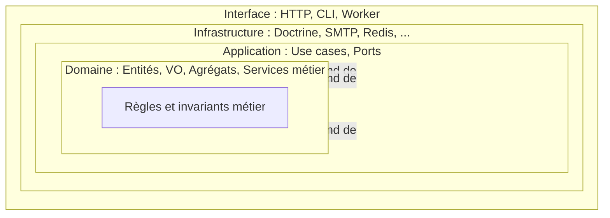

### 6.1. Le domaine

C'est le **cœur** de l'application. Il contient :

- les **entités** (objets identifiés par un `id` et dotés d'un cycle de vie) ;
- les **value objects** (immuables, comparés par valeur, par exemple `Money`, `Email`) ;
- les **aggregate roots** (entités qui pilotent un groupe d'objets cohérents) ;
- les **services de domaine** (logique qui ne *colle* pas à une entité unique) ;
- les **événements de domaine** (faits métier au passé, signalant un changement d'état) ;
- les **invariants** (règles toujours vraies, qu'aucune opération ne doit pouvoir violer).

> **Que veut dire « invariant » ?** Une condition qui doit rester vraie en permanence,
> avant comme après chaque opération. Analogie : sur un compte courant sans découvert
> autorisé, « le solde ne peut jamais être négatif » est un invariant. Tout le rôle du
> domaine est de rendre ces règles impossibles à enfreindre.

> **Règle absolue.** Le domaine n'importe **rien** des couches extérieures : pas de SQL,
> pas de HTTP, pas de framework, pas de logger d'infrastructure, pas d'annotation ORM,
> pas de `Symfony\...`, pas de `Doctrine\ORM\Mapping\Column`. *Le seul code qu'on accepte
> dans le domaine est du code que l'on pourrait copier-coller dans un projet en console
> sans dépendance et qui s'exécuterait.*

Cette discipline est le test ultime : essayez de compiler ou d'exécuter votre dossier
`Domain/` sans aucune dépendance externe. S'il a besoin d'un framework, c'est qu'il n'est
pas pur.

### 6.2. L'application

Cette couche orchestre le domaine pour réaliser les **cas d'utilisation**. Elle contient :

- les **use cases** (un par scénario métier, par exemple `RegisterUser`, `PlaceOrder`) ;
- les **interfaces de ports** (primaires et secondaires) ;
- les **DTO d'entrée/sortie** des use cases ;
- la **gestion transactionnelle** logique (le « tout ou rien » d'un cas d'utilisation).

> **Que veut dire « use case » (cas d'utilisation) ?** Un scénario complet rendu par
> l'application, du début à la fin, vu côté métier : « inscrire un utilisateur », « passer
> une commande ». Le use case enchaîne les étapes (lire, appeler le domaine, sauvegarder)
> sans contenir lui-même de règle métier. Analogie : un chef d'orchestre, qui ne joue
> d'aucun instrument mais coordonne les musiciens.

> **Que veut dire « DTO » ?** *Data Transfer Object*, « objet de transport de données ».
> C'est une structure plate, sans intelligence, qui sert uniquement à transporter des
> valeurs d'une couche à une autre. Analogie : une enveloppe ; elle contient l'information
> mais ne décide rien.

> **Que veut dire « transactionnel » (le « tout ou rien ») ?** Une *transaction* regroupe
> plusieurs opérations sur les données en un bloc indivisible : soit tout réussit, soit
> rien n'est appliqué. Analogie : un virement bancaire ; débiter un compte sans créditer
> l'autre serait catastrophique, donc les deux se font ensemble ou pas du tout.

Elle dépend du domaine, mais reste ignorante de l'infrastructure. **Un use case ne doit
jamais contenir de règle métier** ; il *orchestre* le domaine. La règle « un client
qui doit plus de 1000 € ne peut pas commander » appartient à l'entité `Customer`, pas au
use case `PlaceOrderUseCase`.

### 6.3. L'infrastructure

Couche externe qui réalise concrètement les ports secondaires :

- adaptateurs de **persistance** (SQL via Doctrine/PDO, NoSQL, fichier) ;
- adaptateurs de **services externes** (SMTP, S3, Stripe, etc.) ;
- adaptateurs d'**horloge**, de **génération d'identifiants**, de **chiffrement** ;
- configuration, **injection de dépendances**, démarrage de l'application ;
- **mappers** entre entités du domaine et représentations techniques (lignes SQL, JSON).

> **Que veut dire « ORM » ?** *Object-Relational Mapping*, « correspondance objet vers
> relationnel ». C'est un outil (Doctrine en PHP) qui traduit automatiquement les objets
> du code en lignes de table SQL et inversement. Analogie : un traducteur entre la langue
> des objets et celle des tables. *NoSQL* désigne les bases qui ne sont pas des tables
> relationnelles (documents, clé-valeur). *SMTP* est le protocole d'envoi d'e-mails ; *S3*
> un service de stockage de fichiers ; *Stripe* un service de paiement.

> **Que veut dire « mapper » ?** Un petit objet dont le seul travail est de convertir une
> forme de donnée en une autre, par exemple une entité métier en ligne de base de données.
> Analogie : un changeur de devises, qui transforme des euros en dollars sans modifier la
> valeur réelle de l'argent.

### 6.4. L'interface (interface utilisateur / livraison)

Certaines variantes (notamment la *Clean Architecture* de Robert C. Martin) séparent
l'**interface** (ou *delivery mechanism*, « mécanisme de livraison ») de l'infrastructure :

- adaptateurs de **transport entrant** : contrôleurs REST, GraphQL, ligne de commande
  (CLI), gRPC, consommateurs de messages AMQP ;
- vues, sérialisation, formats de réponse, codes HTTP.

> **Que veut dire « sérialisation » ?** Transformer un objet en mémoire en une suite de
> caractères transmissible (souvent du JSON ou du XML), puis l'inverse à la réception.
> Analogie : démonter un meuble pour le faire tenir dans un carton de transport, puis le
> remonter à l'arrivée. *CLI* veut dire *Command Line Interface*, « interface en ligne de
> commande » : piloter le programme en tapant des commandes au clavier, sans écran
> graphique.

Dans la pratique Symfony, on regroupe souvent infrastructure et interface ; mais
conceptuellement, distinguer « ce qui pilote le domaine » (interface) de « ce que le
domaine pilote » (infrastructure) clarifie la conception.

[Retour en haut](#table-des-matières)

---

## 7. Ports et adaptateurs

### 7.1. Ports primaires *(driving)*

> **Que veut dire « port primaire » (en anglais *driving*, « qui conduit ») ?** C'est un
> port par lequel le monde extérieur *commande* l'application. Le mot *driving* renvoie au
> conducteur d'une voiture : c'est lui qui décide où l'on va. Un acteur primaire (un écran,
> un contrôleur HTTP) appuie sur un port primaire pour déclencher un use case.

Ils définissent **ce que fait** l'application : les commandes et requêtes exposées à
l'extérieur. Exemples : `RegisterUserUseCase`, `GetOrderQuery`. Un port primaire est
typiquement réalisé par un *use case*, et appelé par un *adaptateur primaire* (un
contrôleur HTTP, par exemple).

> **Aperçu de CQRS (détaillé en section 14).** *CQRS* veut dire *Command Query
> Responsibility Segregation*, « séparation des responsabilités entre commandes et
> requêtes ». On sépare les *commands* qui *modifient* l'état (`PlaceOrder`) des *queries*
> qui *lisent* l'état (`GetOrderById`). Analogie : dans un magasin, la caisse (qui modifie
> le stock) et la vitrine (qui montre les produits) sont deux comptoirs distincts. Cette
> séparation n'est pas obligatoire mais clarifie souvent la conception.

### 7.2. Ports secondaires *(driven)*

> **Que veut dire « port secondaire » (en anglais *driven*, « qui est conduit ») ?** C'est
> un port par lequel l'application *commande* un service extérieur dont elle a besoin
> (stockage, e-mail, horloge). Ici, c'est l'application qui conduit et l'extérieur qui
> obéit, d'où *driven*. Analogie : le conducteur (l'application) appuie sur la pédale
> d'accélérateur (le port secondaire) et le moteur (l'adaptateur) exécute.

Ils définissent **ce dont l'application a besoin** : persistance, notifications, horloge,
identifiants. Exemples : `UserRepository`, `EmailNotifier`, `Clock`, `IdGenerator`.

Le piège classique est de concevoir un port secondaire **depuis l'implémentation**
(« j'ai besoin de Doctrine, donc je crée un `DoctrineUserRepository` ») au lieu de le
concevoir **depuis le besoin du domaine** (« le domaine a besoin de retrouver un
utilisateur par e-mail, donc le port a une méthode `findByEmail` »). Le port doit avoir
*le vocabulaire du domaine*, jamais celui de la technologie sous-jacente.

### 7.3. Adaptateurs

Les adaptateurs *adaptent* les technologies externes aux ports.

- **Adaptateurs primaires** : reçoivent une requête externe (HTTP, CLI, message) et
  appellent un port primaire après conversion des données. Exemple : `UserController`
  REST → `RegisterUserUseCase`.
- **Adaptateurs secondaires** : implémentent un port secondaire en utilisant une
  technologie concrète. Exemple : `DoctrineUserRepository`, `SymfonyMailerNotifier`,
  `SystemClock`.

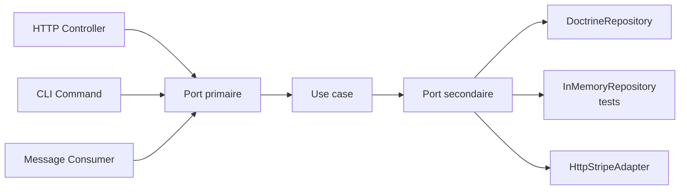

Un point souvent mal compris : **un même port peut avoir plusieurs adaptateurs en
parallèle**. C'est précisément ce qui rend les tests faciles (`InMemoryRepository`) et
les changements de fournisseur indolores (`StripeAdapter` vs `PaypalAdapter` derrière un
même `PaymentGateway`).

### 7.4. Toutes les interfaces ne sont pas des ports

Un malentendu très répandu en PHP : appeler *« port »* **toute** interface du projet.
C'est faux, et c'est nuisible : quand tout est port, le mot ne distingue plus rien et perd
son utilité.

> **Règle.** Une interface est un **port** *uniquement* si elle décrit un échange à la
> **frontière de l'hexagone**. Les interfaces internes (`StrategyInterface`,
> `FormatterInterface` au sein de l'application, `EventInterface` dans le domaine) sont
> des interfaces ordinaires, utiles pour la conception, mais elles ne sont pas des
> ports.

Ports légitimes (en PHP/Symfony) :

| Interface | Port ? | Raison |
|---|---|---|
| `TaskRepositoryInterface` (Domain) | Oui (port secondaire) | Frontière vers la persistance |
| `EmailNotifierInterface` (Application) | Oui (port secondaire) | Frontière vers SMTP |
| `ClockInterface` (Application) | Oui (port secondaire) | Frontière vers l'horloge système |
| `PlaceOrderUseCaseInterface` (Application) | Oui (port primaire) | Frontière offerte aux acteurs entrants |
| `OrderEventInterface` (Domain) | **Non** | Type interne au domaine, aucune frontière |
| `OrderStatusStrategy` interne au domaine | **Non** | Polymorphisme métier, pas un échange externe |
| `LoggerInterface` (PSR-3) injecté dans un adaptateur | **Non** | Détail d'implémentation interne à l'adaptateur |

Pourquoi cette discipline compte : si vous déclarez un alias dans `services.yaml` pour
*chaque* interface du projet, vous noyez les véritables ports (les seuls qui méritent d'être
inspectés à chaque revue d'architecture) sous une mer d'interfaces ordinaires.

> **Que veut dire « PSR-3 » ?** *PSR* signifie *PHP Standard Recommendation*,
> « recommandation standard PHP » : des conventions partagées par l'écosystème PHP. PSR-3
> est celle qui décrit l'interface standard d'un *logger* (un journal d'événements). C'est
> un détail technique d'adaptateur, pas un port métier.

[Retour en haut](#table-des-matières)

---

## 8. L'inversion de dépendance

Le **DIP** (*Dependency Inversion Principle*) est le pilier qui rend l'hexagonal possible.
Sans inversion, le domaine finirait par dépendre de la base de données ; avec inversion,
c'est l'infrastructure qui dépend du domaine.

> **Que veut dire « Dependency Inversion Principle » (DIP) ?** Traduit, « principe
> d'inversion des dépendances ». La formule originale de Robert C. Martin : *les modules de
> haut niveau ne doivent pas dépendre des modules de bas niveau ; les deux doivent dépendre
> d'abstractions. Les abstractions ne doivent pas dépendre des détails ; les détails
> doivent dépendre des abstractions.* En clair : le code important (le métier) ne se branche
> pas sur le code technique ; au contraire, c'est le code technique qui se branche sur un
> contrat défini par le métier. Analogie : votre rasoir électrique ne se câble pas
> directement à la centrale ; c'est la centrale qui respecte le standard de la prise, et
> votre rasoir s'y conforme. « Inversion » nomme ce renversement du sens habituel.

Concrètement, en hexagonal, **l'abstraction (le port) appartient au domaine** ;
le code concret (l'adaptateur) appartient à l'infrastructure et **dépend** du domaine
(il réalise *son* interface). C'est ce renversement qui inverse la flèche habituelle
« métier vers base de données » en « base de données vers métier ».

> **Que veut dire « abstraction » ?** Une description épurée qui dit *ce qu'on attend* sans
> dire *comment c'est fait*. Une interface est une abstraction. Analogie : « un moyen de
> transport » est abstrait ; « ce TGV précis » est concret. Dépendre de l'abstraction
> permet d'échanger le concret sans rien casser.

**Exemple sans DIP :**

```python
# UserService dépend directement d'une implémentation SQL : couplage fort.
class UserService:
    def __init__(self):
        self.repo = PostgresUserRepository()  # couplage en dur
```

Problème : `UserService` ne peut être testé qu'avec une vraie base PostgreSQL, et un
changement de moteur de stockage casse `UserService`.

**Exemple avec DIP :**

```python
# UserService dépend d'une abstraction : couplage faible.
class UserService:
    def __init__(self, repo: UserRepository):  # UserRepository = interface
        self.repo = repo
```

Schématiquement :

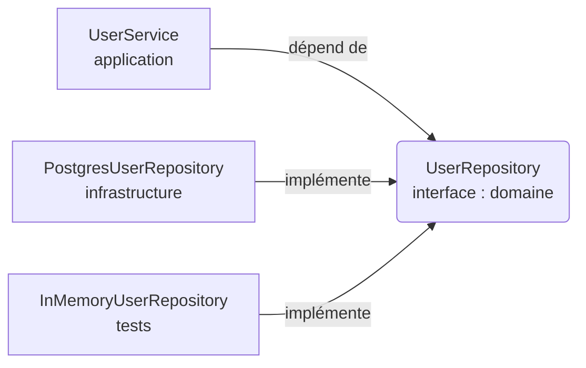

L'avantage : la classe `UserService` peut être testée avec un repository en mémoire et
déployée avec un repository Postgres, **sans qu'aucune ligne de son code ne change**.
C'est cette propriété qui justifie tout le reste de l'architecture.

[Retour en haut](#table-des-matières)

---

## 9. Modélisation tactique : agrégats, entités, value objects

L'hexagonal dit *où* mettre les choses ; le DDD dit *quelles* choses mettre. Voici le
vocabulaire de base pour modéliser un domaine riche. *Tactique* s'oppose ici à
*stratégique* (section 5) : on descend des grandes frontières aux briques de code.

### 9.1. Entité

> **Que veut dire « entité » ?** Un objet métier reconnu par une **identité propre, unique
> et stable** (souvent un UUID), conservée toute sa vie même si ses attributs changent. Un
> client `#42` reste `#42` même s'il change de nom. Analogie : vous restez vous-même malgré
> un changement de coiffure ou d'adresse ; votre identité ne tient pas à vos attributs.
>
> *UUID* veut dire *Universally Unique Identifier*, « identifiant unique universel » : un
> long code (par exemple `f47ac10b-58cc-...`) pratiquement impossible à voir apparaître
> deux fois, ce qui sert à étiqueter un objet de façon sûre.

Caractéristiques :

- comparaison par **identité**, jamais par valeur ;
- méthodes qui *font évoluer son état* tout en garantissant ses **invariants** ;
- jamais d'`setX($x)` aveugle : on préfère des méthodes métier (`renameTo`,
  `changeAddress`, `markAsVip`).

### 9.2. Value object

> **Que veut dire « value object » (VO, objet-valeur) ?** Un objet métier **immuable** (que
> l'on ne modifie jamais après création), sans identité, comparé *par sa valeur*. Deux
> `Money(10, "EUR")` sont parfaitement interchangeables, comme deux pièces de 10 euros : on
> ne se demande pas « laquelle ». Un VO représente une *quantité* ou une *qualité*, pas une
> *chose*. Analogie : un billet de banque (une valeur) face à une personne (une entité,
> avec son histoire).

Avantages des VO :

- ils **portent des invariants locaux** (`Email` ne peut pas exister s'il est mal formé) ;
- ils **rendent le code typé** : une signature `transfer(Money amount)` est plus claire
  que `transfer(float amount)` ;
- ils **éliminent les bugs de conversion** : on n'additionne pas un `Money(EUR)` et un
  `Money(USD)` par accident.

Règle pratique : *si vous hésitez entre une primitive et un VO, prenez le VO*.

### 9.3. Aggregate root (racine d'agrégat)

> **Que veut dire « agrégat » et « aggregate root » (racine d'agrégat) ?** Un *agrégat* est
> un petit groupe d'entités et de value objects étroitement liés, traité comme **une seule
> unité de cohérence** : on les sauvegarde et on les modifie ensemble, jamais séparément.
> L'*aggregate root* (la racine) est l'unique objet par lequel on a le droit de toucher au
> groupe ; c'est lui qui garantit les invariants. Analogie : une commande au restaurant. La
> note (la racine) regroupe ses lignes de plats ; on n'ajoute pas un plat directement, on
> passe toujours par la note, qui recalcule le total et refuse une note déjà payée. *Mot
> anglais « cluster »* = grappe, groupe serré.

Exemple : un agrégat `Order` contient une racine `Order` et des `OrderLine` enfants. On
ne modifie **jamais** une `OrderLine` directement depuis l'extérieur ; on appelle
`order.addLine(...)`, `order.removeLine(...)`. La racine vérifie alors que la commande
est encore modifiable, que la ligne est valide, que le total est cohérent.

Trois règles de conception :

1. **Une seule racine** par agrégat. Les entités enfants sont *internes* à l'agrégat.
2. **Les références entre agrégats se font par identifiant**, jamais par référence
   d'objet. Un `Order` ne référence pas un objet `Customer` complet, il garde un
   `customerId`.
3. **Un repository par aggregate root**, pas un par entité. On ne *persiste* pas une
   `OrderLine` toute seule ; on persiste l'`Order` entier.

Le diagramme suivant montre la frontière de l'agrégat (le cadre) : tout passe par la
racine, et le lien vers `Customer` se fait par identifiant, pas par objet.

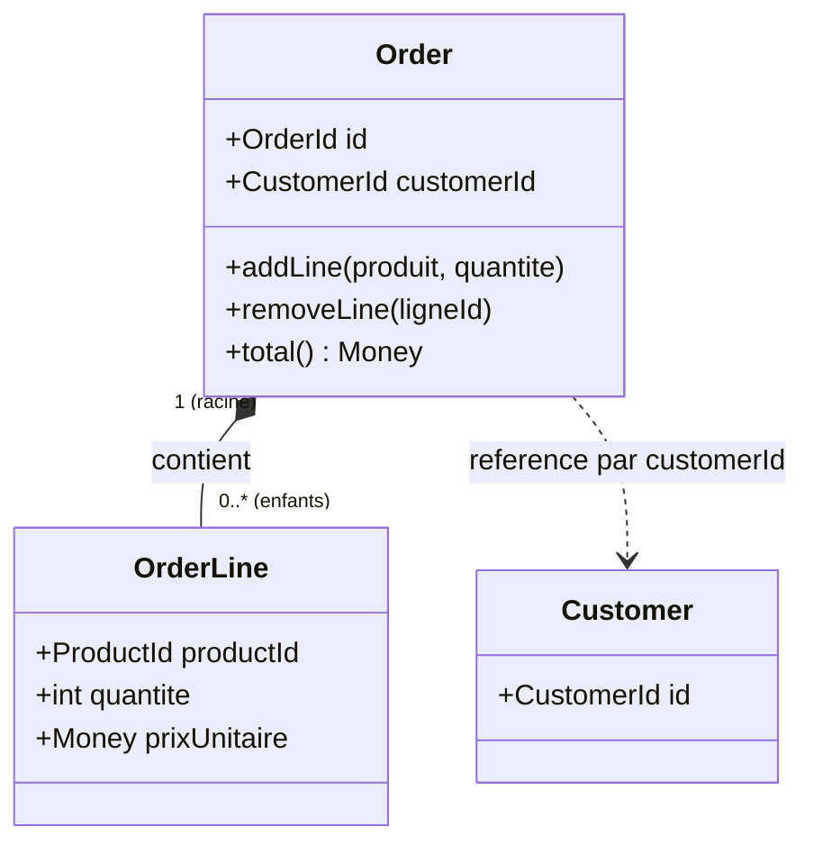

### 9.4. Services de domaine vs services applicatifs

Distinction souvent floue mais essentielle :

> **Que veut dire « service de domaine » ?** C'est une logique métier qui **ne loge
> naturellement dans aucune entité ni VO**, parce qu'elle concerne plusieurs agrégats à la
> fois. Elle vit dans la couche **domaine**. Exemple : un `TransferService` qui débite un
> compte et crédite un autre ; la règle ne « tient » ni dans le compte débité ni dans le
> compte crédité seul. Analogie : la règle du jeu d'échecs « le roque » implique deux
> pièces ; elle n'appartient ni à la tour seule, ni au roi seul.

> **Que veut dire « service applicatif » (autre nom du use case) ?** C'est l'objet qui
> coordonne **les étapes techniques** d'un cas d'utilisation : lire depuis un repository,
> appeler le domaine, sauvegarder, publier un événement. Il vit dans la couche
> **application** et ne contient **aucune** règle métier. C'est le chef d'orchestre, pas le
> compositeur.

Test simple pour les distinguer :

- *Si on enlevait le service, perdrait-on une règle métier ?* Alors c'est un service de
  domaine.
- *Si on enlevait le service, perdrait-on seulement de l'enchaînement technique ?* Alors
  c'est un service applicatif.

Un service applicatif peut appeler un service de domaine ; l'inverse est interdit.

[Retour en haut](#table-des-matières)

---

## 10. Le pattern Repository

> **Que veut dire « repository » (entrepôt, dépôt) ?** C'est un port secondaire qui fait
> *comme si* tous vos aggregate roots vivaient dans une simple collection en mémoire : on
> `add`, on `get`, on `find`, on `remove`. Il cache totalement le stockage réel : aucun
> `SELECT`, aucun `JOIN`, aucun nom de requête SQL tordu. Analogie : un bibliothécaire ;
> vous demandez « le livre numéro 42 » et il vous le rapporte, sans que vous sachiez s'il
> est rangé en rayon, en réserve ou numérisé.
>
> *SELECT* et *JOIN* sont des mots-clés SQL (lire des lignes, croiser deux tables) : ce sont
> précisément les détails que le repository ne doit jamais laisser voir.

Le repository est probablement le port le plus mal réalisé en pratique. Voici les règles
solides à appliquer :

1. **Un repository par aggregate root.** Pas un par table SQL, pas un par entité enfant.
2. **Le contrat est dans le domaine**, l'implémentation dans l'infrastructure.
3. **Le vocabulaire est métier** : `findActiveCustomersWithOverduePayment()`, pas
   `findByStatusAndDateLessThan(int $status, DateTime $d)`.
4. **Pas de fuite ORM** : la signature ne mentionne ni `QueryBuilder`, ni `EntityManager`,
   ni `Criteria`, ni `Doctrine\Collections`.
5. **Renvoie des aggregate roots reconstitués**, pas des `array` ou des `stdClass`.
6. **Pas de pagination générique** dans le port, sauf si la pagination est un concept
   métier (ce qui est rare).

> **Que veut dire « anti-pattern » ?** Un *pattern* (« patron » ou « modèle ») est une
> solution éprouvée à un problème récurrent. Un *anti-pattern* est l'inverse : une solution
> tentante mais qui empire les choses sur le long terme. Repérer les anti-patterns évite de
> répéter des erreurs connues.

> **Anti-pattern : repository fourre-tout.** Une méthode `findBy(array $criteria)` qui
> accepte n'importe quoi. C'est l'API d'un ORM, pas d'un repository de domaine. Les
> appelants finissent par recopier la même logique de critères partout, et le port se met
> à laisser fuir l'ORM. (*API* veut dire *Application Programming Interface*, « interface de
> programmation » : l'ensemble des fonctions qu'un composant offre aux autres.)

```php
// MAUVAIS : signature qui fuit l'ORM
interface OrderRepositoryInterface
{
    public function findBy(array $criteria, ?array $orderBy = null): array;
}

// BON : signature dans le langage métier
interface OrderRepositoryInterface
{
    public function findById(OrderId $id): ?Order;
    public function findUnpaidOrdersOlderThan(\DateTimeImmutable $threshold): iterable;
    public function save(Order $order): void;
}
```

[Retour en haut](#table-des-matières)

---

## 11. Événements de domaine et communication asynchrone

> **Que veut dire « domain event » (événement de domaine) ?** Un objet immuable qui
> annonce **un fait métier déjà arrivé**, nommé au passé : `OrderPlaced` (commande passée),
> `PaymentCaptured` (paiement encaissé). Il transporte juste assez d'informations pour que
> d'autres parties du système réagissent. Analogie : un faire-part ; il déclare un fait
> accompli (« le mariage a eu lieu ») et chacun en fait ce qu'il veut.

> **Que veut dire « asynchrone » ?** *Synchrone* : on appelle quelqu'un et on attend sa
> réponse avant de continuer (un appel téléphonique). *Asynchrone* : on dépose un message
> et on continue son travail ; l'autre y répondra quand il pourra (un e-mail). La
> communication par événements est asynchrone, ce qui découple les parties dans le temps.

Un événement de domaine est *produit* par une entité ou un agrégat lors d'un changement
d'état :

```php
final class Order
{
    /** @var DomainEvent[] */
    private array $recordedEvents = [];

    public function place(): void
    {
        if ($this->status !== OrderStatus::Draft) {
            throw new DomainException('Order already placed');
        }
        $this->status = OrderStatus::Placed;
        $this->recordedEvents[] = new OrderPlaced($this->id, $this->total);
    }

    /** @return DomainEvent[] */
    public function pullDomainEvents(): array
    {
        $events = $this->recordedEvents;
        $this->recordedEvents = [];
        return $events;
    }
}
```

Le **service applicatif** récupère les événements après l'opération métier et les publie
via un port `EventPublisher`. Un adaptateur (Symfony Messenger, RabbitMQ, Kafka) les
distribue ensuite aux consommateurs.

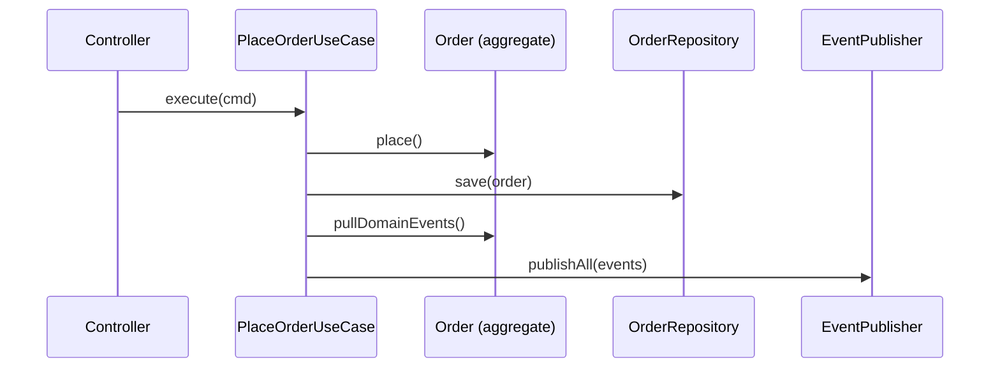

Avantages de ce pattern :

- **découplage temporel** : les autres contextes réagissent quand ils peuvent ;
- **historicité** : chaque événement est un fait du passé, traçable et rejouable ;
- **extensibilité** : ajouter un nouveau consommateur n'impacte pas le producteur.

> **Piège en production : la fenêtre fatale entre `save` et `publish`.** Le use case
> ci-dessus appelle d'abord `repository->save($order)`, puis `eventBus->publish($events)`.
> Si le programme s'arrête brutalement *entre* les deux, l'agrégat est enregistré mais
> l'événement n'est jamais émis : incohérence silencieuse. La solution éprouvée est le
> **transactional outbox**.

> **Que veut dire « transactional outbox » (boîte d'envoi transactionnelle) ?** Plutôt que
> de publier l'événement séparément, on l'écrit dans une table `outbox` (« boîte d'envoi »)
> *dans la même transaction* que l'agrégat. Comme la transaction est « tout ou rien », soit
> les deux sont enregistrés, soit aucun. Un programme à part (le *relay*, « relais ») lit
> ensuite cette table et publie vraiment les événements sur le bus, en cochant ceux qui sont
> partis. Analogie : au lieu de poster une lettre à part (risque de l'oublier), on la glisse
> dans le même colis que le reste ; un facteur passe ensuite vider la boîte. *Worker* veut
> dire « ouvrier » : un programme de fond qui tourne sans intervention humaine.

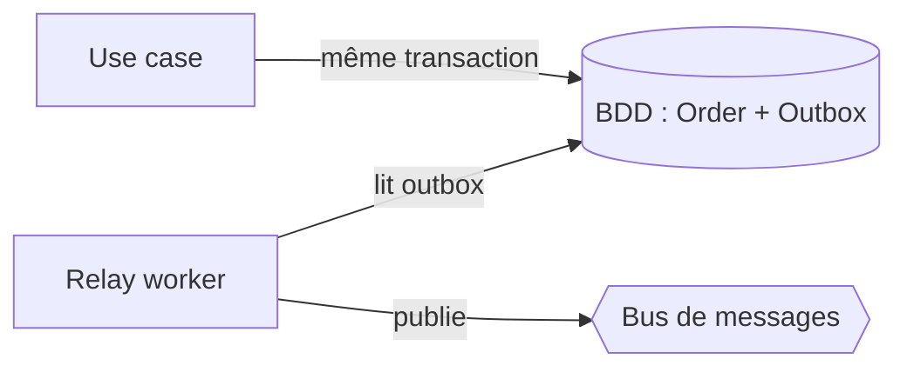

Sans outbox, on accepte un risque résiduel ; avec outbox, la livraison est garantie *au
moins une fois*. Il faut alors que les consommateurs soient **idempotents**, ce qui est de
toute façon une bonne discipline.

> **Que veut dire « idempotent » ?** Une opération est idempotente si l'exécuter une fois
> ou plusieurs fois produit exactement le même résultat. Analogie : appuyer sur le bouton
> « éteindre » d'un appareil déjà éteint ne change rien ; il reste éteint. Comme un
> événement peut être livré deux fois, le consommateur doit pouvoir le retraiter sans dégât
> (par exemple en ignorant un paiement déjà encaissé).

[Retour en haut](#table-des-matières)

---

## 12. Bénéfices en testabilité (TDD)

L'hexagonal n'impose pas le **TDD** (*Test-Driven Development*), mais les deux se
renforcent. Voici *quel type de test* écrire à *quelle couche*, puis, point souvent passé
sous silence, pourquoi le design hexagonal **émerge** des tests au lieu d'être posé
d'avance.

> **Que veut dire « TDD » (*Test-Driven Development*) ?** Traduit, « développement piloté
> par les tests ». On écrit le test *avant* le code. Le cycle s'appelle *red, green,
> refactor* (« rouge, vert, remanier ») : on écrit un test qui échoue (rouge), on écrit le
> minimum pour qu'il réussisse (vert), puis on nettoie le code sans casser les tests
> (remanier). Analogie : tracer la cible avant de tirer, plutôt que de dessiner la cible
> autour du trou après coup. *Refactoriser* veut dire réorganiser le code sans changer ce
> qu'il fait.

> **Que veut dire « double de test » ?** Un objet qui *remplace* une vraie dépendance le
> temps d'un test, comme une doublure remplace l'acteur pour les cascades. Variantes :
> *fake* (version simplifiée mais qui marche, par exemple un repository en mémoire), *stub*
> (renvoie des valeurs fixées d'avance), *mock* (vérifie qu'une méthode a bien été appelée
> avec tels arguments), *spy* (« espion », enregistre les appels pour les examiner après).

### 12.1. La pyramide hexagonale

> **Que veut dire « test unitaire », « test d'intégration », « test end-to-end » ?** Un
> *test unitaire* vérifie une petite brique isolée, sans rien d'extérieur (rapide, par
> milliers). Un *test d'intégration* vérifie que deux pièces réelles s'emboîtent, par
> exemple un adaptateur face à une vraie base. Un *test end-to-end* (« de bout en bout »)
> parcourt tout le système comme un vrai utilisateur (lent, peu nombreux). Analogie : tester
> une pièce de moteur seule, puis tester le moteur monté, puis faire rouler la voiture
> entière sur circuit.

À chaque couche correspond *un type de test* avec *des dépendances bien définies*.

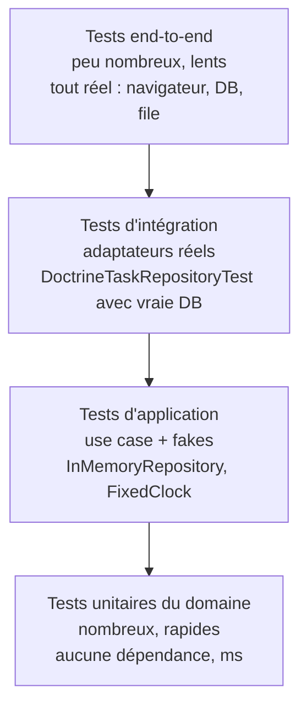

| Couche testée | Dépendances réelles | Dépendances doublées | Objectif |
|---|---|---|---|
| Domaine | Aucune | Aucune | Vérifier les invariants et transitions d'état |
| Application (use case) | Le domaine | Tous les ports secondaires (fakes en mémoire) | Vérifier l'orchestration |
| Infrastructure (adaptateur) | DB / HTTP / file réels | Aucune | Vérifier que l'adaptateur respecte le contrat du port |
| End-to-end | Tout | Aucune | Vérifier qu'un parcours utilisateur fonctionne |

> **Piège fréquent.** Un test « unitaire » qui démarre Doctrine, crée une vraie base en
> mémoire (SQLite) et appelle `DoctrineTaskRepository` n'est *pas* un test unitaire : c'est
> un test d'intégration. La promesse hexagonale (« les tests unitaires tournent sans
> infrastructure ») n'est tenue que si la classe testée ne touche aucun adaptateur réel.

### 12.2. TDD : le design émerge des tests, pas d'un BDUF

Une lecture naïve de l'hexagonal donne l'impression d'un processus en cascade : *« je
définis d'abord tous mes ports, puis tous mes adaptateurs, puis je remplis le domaine »*.
C'est faux, et ce malentendu produit des architectures sur-modélisées avant la première
ligne de code utile.

> **Que veut dire « BDUF » (*Big Design Up Front*) ?** Traduit, « grande conception faite
> d'avance ». C'est l'anti-pattern qui consiste à dessiner toute l'architecture (interfaces,
> classes, schéma de base) *avant* d'avoir écrit le moindre code ou test. L'hexagonal y est
> très exposé car son vocabulaire séduisant (ports, adaptateurs, agrégats) donne envie de
> tout créer trop tôt. Analogie : commander tous les meubles d'une maison sur plan, avant
> d'avoir vécu dedans et de savoir comment on s'en sert.

La pratique correcte, qui mêle hexagonal et TDD :

1. **Partir d'un cas d'utilisation** réel (`PlaceOrder`, `RegisterUser`) ; pas d'une
   couche, pas d'un module.
2. **Écrire un test d'application** (use case + fakes) qui décrit le scénario *du point
   de vue métier*. Ce test ne compile pas encore : c'est normal.
3. **Faire émerger le port secondaire dont vous avez besoin** au moment où le test le
   réclame (ex. *« il faudrait un `OrderRepository` »*). Le port a *exactement* les
   méthodes que le test exige, pas une de plus.
4. **Implémenter le strict minimum** dans le domaine pour faire passer le test.
5. **Refactoriser** : extraire des VO, déplacer une règle d'un use case vers une entité,
   simplifier des signatures.
6. **Écrire l'adaptateur réel** (Doctrine, HTTP) seulement quand le besoin de production
   le demande. Tant que vous itérez sur la conception, le fake suffit.

Cette inversion (*test d'abord, port ensuite, adaptateur en dernier*) garantit qu'**aucun
port ne survit s'il n'est pas justifié par un test**. C'est le meilleur garde-fou contre la
sur-architecture. Un port qu'aucun test ne motive est un port spéculatif : supprimez-le.

> **Règle de l'expert.** Si vous écrivez un port `XxxRepositoryInterface` avant d'avoir
> un test qui s'en sert, vous faites du BDUF. Renversez : un test rouge dicte le port,
> jamais l'inverse.

### 12.3. Test d'application avec fakes en mémoire

L'exemple Symfony de la [section 19.9](#199-tests) ne montre que des tests de domaine.
Voici le chaînon manquant : le test d'application, qui exerce un *use case* avec un
repository et une horloge en mémoire.

```php
<?php
// tests/TaskManagement/Application/CompleteTaskUseCaseTest.php
declare(strict_types=1);

namespace App\Tests\TaskManagement\Application;

use App\TaskManagement\Application\Port\ClockInterface;
use App\TaskManagement\Application\UseCase\CompleteTask\CompleteTaskCommand;
use App\TaskManagement\Application\UseCase\CompleteTask\CompleteTaskUseCase;
use App\TaskManagement\Domain\Event\TaskCompleted;
use App\TaskManagement\Domain\Model\Priority;
use App\TaskManagement\Domain\Model\Task;
use App\TaskManagement\Domain\Model\TaskId;
use App\TaskManagement\Domain\Repository\TaskRepositoryInterface;
use PHPUnit\Framework\TestCase;
use Symfony\Component\Messenger\Envelope;
use Symfony\Component\Messenger\MessageBusInterface;

// Fake : implémentation simplifiée, *fonctionnelle*, du port secondaire.
final class InMemoryTaskRepository implements TaskRepositoryInterface
{
    /** @var array<string, Task> */
    private array $store = [];

    public function save(Task $task): void { $this->store[$task->id->value] = $task; }
    public function get(TaskId $id): Task
    {
        return $this->store[$id->value]
            ?? throw new \DomainException("Task not found: {$id->value}");
    }
    public function listAll(): iterable { return array_values($this->store); }
}

// Fake : horloge fixe, déterministe.
final class FixedClock implements ClockInterface
{
    public function __construct(private \DateTimeImmutable $now) {}
    public function now(): \DateTimeImmutable { return $this->now; }
}

// Spy : enregistre les messages dispatchés sans les transporter réellement.
final class SpyEventBus implements MessageBusInterface
{
    /** @var object[] */
    public array $dispatched = [];
    public function dispatch(object $message, array $stamps = []): Envelope
    {
        $this->dispatched[] = $message;
        return new Envelope($message);
    }
}

final class CompleteTaskUseCaseTest extends TestCase
{
    public function testCompleteTaskMarksItDoneAndPublishesEvent(): void
    {
        $repo = new InMemoryTaskRepository();
        $clock = new FixedClock(new \DateTimeImmutable('2026-05-02 12:00:00'));
        $bus = new SpyEventBus();

        $task = new Task(
            TaskId::generate(),
            'Rédiger le mémo',
            new \DateTimeImmutable('2026-12-31'),
            Priority::High,
        );
        $repo->save($task);

        $useCase = new CompleteTaskUseCase($repo, $clock, $bus);
        $useCase(new CompleteTaskCommand($task->id->value));

        self::assertTrue($repo->get($task->id)->isDone());
        self::assertCount(1, $bus->dispatched);
        self::assertInstanceOf(TaskCompleted::class, $bus->dispatched[0]);
    }
}
```

Ce test :

- *n'instancie pas* le kernel Symfony ;
- *ne touche pas* à Doctrine, ni à une vraie file de messages ;
- s'exécute en *quelques millisecondes* ;
- échouera *uniquement* si la logique d'orchestration ou la règle métier change.

C'est le test à écrire **en premier**, avant même d'avoir un adaptateur Doctrine.

[Retour en haut](#table-des-matières)

---

## 13. Hexagonal vs Clean Architecture vs Onion

Trois noms circulent pour des architectures *cousines* mais *non identiques* : Hexagonal
(Cockburn, 2005), Onion (Palermo, 2008), Clean Architecture (Martin, 2012). Beaucoup de
tutoriels les confondent. Elles partagent un cœur commun mais diffèrent dans les détails,
et ces détails comptent au moment de structurer un projet.

> **Que veut dire « Onion Architecture » (architecture en oignon) ?** Variante de Jeffrey
> Palermo. Couches concentriques, de l'intérieur vers l'extérieur : modèle de domaine, puis
> services de domaine, puis services applicatifs, puis infrastructure. Comme un oignon, et
> avec la même règle : toute dépendance va vers le centre.

> **Que veut dire « Clean Architecture » (architecture propre) ?** Synthèse de Robert C.
> Martin. Quatre cercles : *Entities* (règles métier de l'entreprise), puis *Use Cases*
> (règles propres à l'application), puis *Interface Adapters* (contrôleurs, presenters,
> gateways), puis *Frameworks & Drivers* (base, web, périphériques). Elle ajoute la notion
> de *boundary* (« frontière » explicite entre cercles) et de *presenter* (objet chargé de
> mettre en forme la sortie, par exemple en JSON ou en HTML).

| Aspect | Hexagonal | Onion | Clean |
|---|---|---|---|
| Année | 2005 | 2008 | 2012 |
| Métaphore | Polygone à *N* côtés | Couches concentriques | Cercles concentriques |
| Vocabulaire central | *Ports & Adapters* | *Domain / Application / Infra* | *Entities / Use Cases / Interface Adapters / Frameworks* |
| Symétrie entrée/sortie | Forte (tout est port) | Asymétrique | Asymétrique (controller vs presenter) |
| Use cases nommés | Implicites | Implicites | **Explicites** (cercle dédié) |
| Direction des dépendances | Vers l'hexagone | Vers le domaine | Vers le centre (*Dependency Rule*) |

Points communs :

- séparer la **logique métier** des **détails techniques** ;
- inverser les dépendances via des interfaces possédées par les couches internes ;
- rendre testables les règles métier sans I/O.

Différences pratiques qui changent quelque chose :

1. **Symétrie**. L'hexagonal traite les flux entrants et sortants de la même manière :
   ce sont tous des ports. Clean introduit deux notions distinctes (les *controllers* en
   entrée, les *presenters* en sortie) qui rappellent le pattern MVP (*Model-View-Presenter*,
   un découpage écran/données/présentation).
2. **Use cases comme cercle**. Clean élève le *use case* au rang de couche autonome avec
   ses propres *boundaries* (interfaces d'entrée et de sortie). L'hexagonal les place
   dans une couche application sans cérémonie particulière.
3. **Onion** est essentiellement de l'hexagonal redessiné en oignon. Elle est moins
   précise sur les ports nommés et plus insistante sur la pureté du domaine. Sur le
   plan opérationnel, les deux conduisent au même code.

> **Posture pragmatique.** Pour un projet PHP/Symfony, choisir une étiquette importe
> moins que respecter les invariants partagés : domaine pur, ports possédés par
> l'intérieur, adaptateurs à l'extérieur, dépendances dirigées vers le centre. Le reste
> est cosmétique.

[Retour en haut](#table-des-matières)

---

## 14. Hexagonal et CQRS : commandes, requêtes, lecture

L'architecture hexagonale ne dit rien de la manière dont les données *sortent* de
l'application. Le **CQRS** apporte une réponse claire, qui s'intègre bien dans un hexagone à
condition d'en comprendre les compromis.

> **Que veut dire « CQRS » (*Command Query Responsibility Segregation*) ?** Traduit,
> « séparation des responsabilités entre commandes et requêtes ». On sépare les opérations
> qui *modifient* l'état (les *commands*, qui ne renvoient idéalement rien, `void`) de
> celles qui *lisent* l'état (les *queries*, qui renvoient un DTO). Conséquence : les deux
> côtés peuvent avoir des modèles, des chemins de code, voire des stockages différents.
> Analogie : un robinet (qui modifie le niveau d'eau) et une jauge (qui le lit) sont deux
> dispositifs séparés, même si tous deux concernent la même cuve.

> **Que veut dire « read model » (modèle de lecture) ?** Une représentation des données
> pensée pour être *lue vite*, souvent *dénormalisée* (les informations sont recopiées et
> pré-assemblées pour éviter de recalculer à chaque lecture), distincte du modèle
> d'écriture (les agrégats). Analogie : un tableau de bord de voiture ; il affiche
> directement la vitesse, sans vous obliger à recalculer à partir des tours de roue. *Vue
> SQL*, *index Elasticsearch*, *projection d'événements* sont trois techniques pour le
> construire.

### 14.1. Côté écriture : le use case retourne `void` (ou un identifiant)

Une *command* applicative doit retourner le strict minimum :

- `void` quand l'identifiant est connu de l'appelant ;
- l'**identifiant** (`OrderId`) quand l'application l'a généré.

Retourner l'agrégat entier depuis un use case d'écriture est un anti-pattern : cela
encourage l'appelant à le sérialiser tel quel, à fuiter sa structure interne, et à le
modifier en dehors de la transaction.

```php
// BON : la commande renvoie void, ou l'id généré
final class PlaceOrderUseCase
{
    public function __invoke(PlaceOrderCommand $cmd): OrderId { /* ... */ }
}

// MAUVAIS : la commande renvoie l'agrégat sérialisé
final class PlaceOrderUseCase
{
    public function __invoke(PlaceOrderCommand $cmd): Order { /* ... */ }
}
```

### 14.2. Côté lecture : un port dédié, pas le repository d'écriture

Le repository (port d'écriture) sert à *charger un agrégat pour le modifier*. Il est
inadapté pour servir une page d'écran qui affiche 50 commandes paginées avec leurs
clients. Pour cela, on définit un **port de lecture** distinct.

```php
// Domain/Repository/OrderRepositoryInterface.php  (côté écriture)
interface OrderRepositoryInterface
{
    public function get(OrderId $id): Order;       // charge un agrégat complet
    public function save(Order $order): void;
}

// Application/Query/OrderListReadModel.php  (côté lecture)
interface OrderListReadModel
{
    /** @return iterable<OrderListItemDto> */
    public function listForCustomer(CustomerId $id, int $offset, int $limit): iterable;
}
```

L'adaptateur de lecture peut interroger *directement* la base avec un `SELECT` qui croise
plusieurs tables, sans passer par les agrégats : c'est tout l'intérêt. Le port de lecture
vit dans `Application/` (et non dans `Domain/`) car son DTO est orienté *écran*, pas métier.

Les deux chemins, écriture et lecture, partent du même client mais ne se croisent pas :

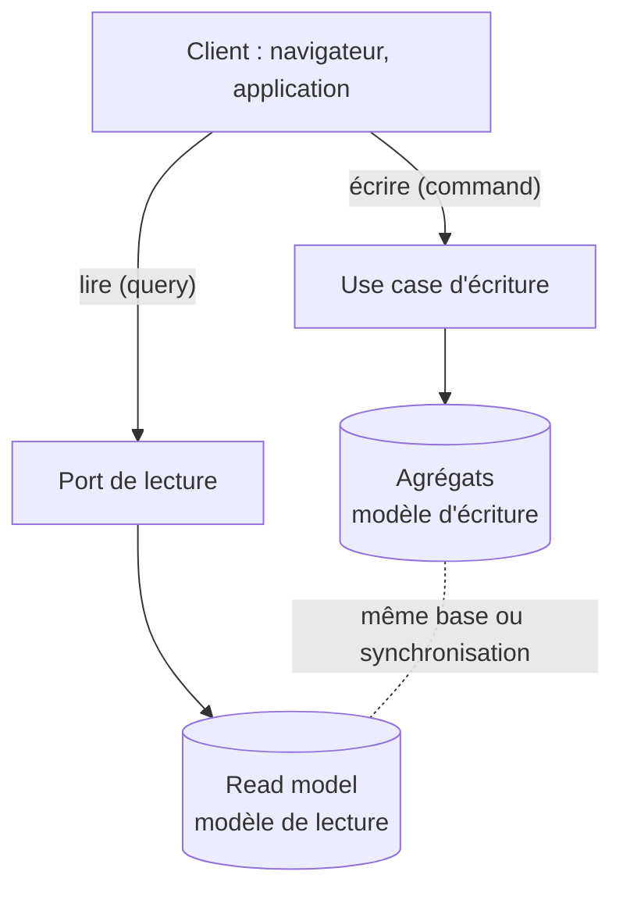

### 14.3. Trois niveaux d'engagement CQRS

| Niveau | Description | Coût | Quand l'adopter |
|---|---|---|---|
| **CQRS léger** | Use cases *commands* et *queries* séparés, même base, mêmes tables | Quasi nul | Par défaut |
| **CQRS modéré** | Read models dénormalisés (vues SQL, projections) dans la même base | Moyen | Quand les requêtes de lecture deviennent complexes ou lentes |
| **CQRS complet** | Stockage d'écriture et de lecture séparés, synchronisés par événements | Élevé | Très gros volumes, latence de lecture critique |

> **Posture.** En PHP/Symfony, le CQRS léger est le bon réglage par défaut : un dossier
> `Application/UseCase/` pour les commandes, un dossier `Application/Query/` pour les
> lectures, le même Doctrine dessous. Ne montez d'un niveau qu'avec une raison mesurée (par
> exemple un *p95* de requête qui dépasse son SLA, ou un volume qui justifie une copie de la
> base dédiée à la lecture).
>
> *p95* veut dire « 95e centile » : la durée que 95 % des requêtes ne dépassent pas (une
> mesure de lenteur plus honnête que la moyenne). *SLA* veut dire *Service Level
> Agreement*, « engagement de niveau de service » : la performance promise (par exemple
> « réponse sous 200 ms »).

[Retour en haut](#table-des-matières)

---

## 15. Composition Root et câblage

Question rarement traitée de front : *où* exactement décide-t-on quelle implémentation va
satisfaire quel port ? La réponse a un nom.

> **Que veut dire « Composition Root » (racine de composition) ?** C'est l'*unique* endroit
> du programme, situé tout au début du démarrage, où l'on assemble le graphe des objets : on
> choisit quel adaptateur réalise quel port, on règle les dépendances, on crée le conteneur.
> Aucune autre partie du code n'a le droit de fabriquer un adaptateur directement. Analogie :
> le standard téléphonique d'autrefois, où une seule opératrice branchait les fils pour
> relier chaque appelant au bon correspondant.

Pourquoi un *seul* endroit ? Parce que c'est la seule façon de garantir qu'un changement de
branchement (passer de `DoctrineTaskRepository` à `InMemoryTaskRepository` en test)
n'oblige à modifier *rien* d'autre. Si plusieurs endroits fabriquent des adaptateurs, vous
avez plusieurs racines de composition, donc des couplages cachés.

| Plateforme | Où vit la Composition Root |
|---|---|
| Symfony | `config/services.yaml` + le compilateur du conteneur |
| Spring | Classe `@Configuration` |
| .NET | `Startup.cs` / `Program.cs` |
| Node.js (sans framework) | `index.js` ou `bootstrap.js` |
| Python (Flask/FastAPI) | Le module qui crée l'application + injection manuelle |

En Symfony, la Composition Root se compose de :

- `config/services.yaml` (et ses variantes `_dev.yaml`, `_test.yaml`, `_prod.yaml`) ;
- les `CompilerPass` que vous écrivez pour des liaisons dynamiques (rare) ;
- les attributs `#[AsAlias]`, `#[AsTaggedItem]` quand vous préférez la configuration en
  PHP plutôt qu'en YAML.

> **Anti-pattern : Composition Root éclatée.** Instancier `new DoctrineTaskRepository(...)`
> à l'intérieur d'un contrôleur, d'un use case ou d'une factory métier. Le code n'est
> plus testable : on ne peut plus substituer le repository sans toucher à la classe qui
> l'instancie. Si vous voyez un `new` d'adaptateur en dehors de `config/`, c'est une
> fuite.

Astuce concrète Symfony : utilisez `bin/console debug:container --parameters` et
`bin/console debug:autowiring` pour vérifier que *chaque* interface du domaine a bien un
alias unique. Une interface sans alias égale un port sans implémentation, donc une erreur à
l'exécution (*runtime*, « au moment où le programme tourne », par opposition à la
compilation).

[Retour en haut](#table-des-matières)

---

## 16. Hexagonal à l'échelle : monolithe modulaire et microservices

Un seul hexagone est rarement suffisant pour un système réel. Cette section traite la
question de la *composition* de plusieurs hexagones.

> **Que veut dire « monolithe modulaire » ?** Un *monolithe* est une application livrée et
> lancée d'un seul bloc. *Modulaire* signifie qu'à l'intérieur, elle est découpée en
> modules indépendants, chacun étant un bounded context complet (avec ses propres
> `Domain/`, `Application/`, `Infrastructure/`). Les modules se parlent par des ports
> explicites, jamais en fouillant dans le code interne (*internals*) du voisin. Analogie :
> un immeuble unique, mais avec des appartements bien séparés et des interphones officiels
> entre eux.

> **Que veut dire « microservice » ?** Un bounded context lancé comme un *programme
> séparé*, qui parle aux autres par le réseau (HTTP, gRPC, messages). Les frontières
> hexagonales deviennent alors des frontières de déploiement. Analogie : non plus des
> appartements dans un immeuble, mais des maisons indépendantes reliées par la route.

### 16.1. Composition dans un monolithe modulaire

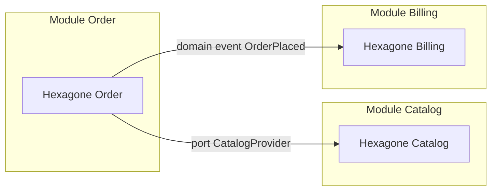

Règles de composition :

1. **Aucun module n'importe l'`Domain/` d'un autre.** La communication se fait toujours
   via un port défini dans le module *appelant* et implémenté en infrastructure.
2. **Les domain events sont le canal de prédilection** pour les notifications
   inter-modules. Le producteur n'a pas à savoir qui consomme.
3. **Une ACL par frontière** : chaque module qui consomme un autre traduit le vocabulaire
   à la frontière, comme expliqué [section 5.3](#53-anti-corruption-layer-acl).
4. **Outils de contrôle structurel** : `deptrac` (PHP) ou `phparkitect` vérifient
   *automatiquement* qu'aucun `import` (lien de code) ne franchit une frontière interdite.
   Sans cette vérification automatique, les frontières finissent toujours par fuiter.

### 16.2. De monolithe modulaire à microservices

Un monolithe modulaire bien fait se *casse* en microservices presque mécaniquement :

- chaque module devient un service ;
- les ports synchrones deviennent des appels HTTP/gRPC ;
- les domain events deviennent des messages Kafka/AMQP/Messenger transport ;
- l'ACL devient une DTO sur le réseau au lieu d'un mapper en mémoire.

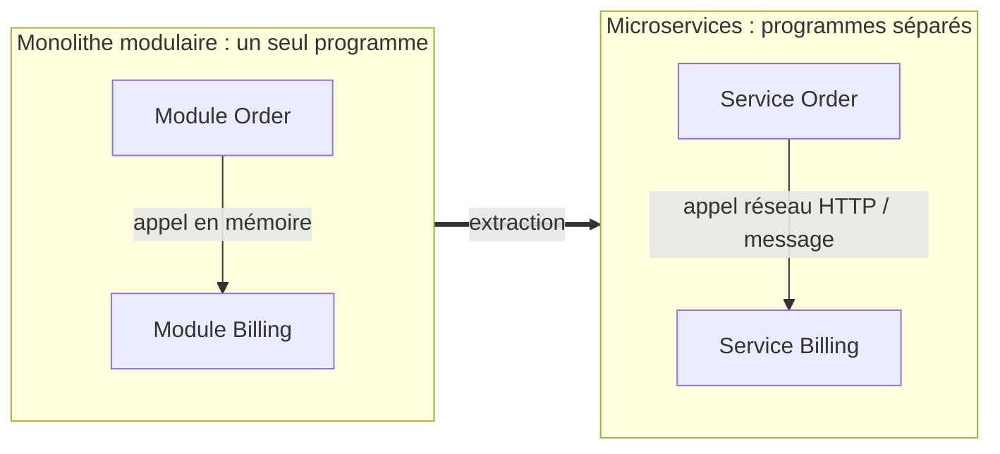

> **Conseil solide.** Commencez *toujours* par un monolithe modulaire. Tant que les
> frontières hexagonales sont propres et vérifiées par `deptrac`, le passage en
> microservices devient une extraction presque mécanique. Commencer directement en
> microservices, avant d'avoir compris ses bounded contexts, conduit à un *distributed
> monolith* (« monolithe distribué » : des services soi-disant séparés mais si emmêlés
> qu'on ne peut plus les déployer indépendamment), le pire des deux mondes.

[Retour en haut](#table-des-matières)

---

## 17. Migrer un legacy Symfony vers l'hexagonal

La plupart des projets Symfony en production *ne sont pas* hexagonaux au départ. Voici
comment introduire l'hexagonal *sans* big-bang.

> **Que veut dire « big-bang » (en migration logicielle) ?** Tout réécrire d'un coup, puis
> basculer du jour au lendemain. C'est l'approche la plus risquée : si quoi que ce soit
> casse, tout casse en même temps. On lui préfère une migration progressive.

> **Que veut dire « Strangler Fig pattern » (motif du ficus étrangleur) ?** Stratégie de
> migration popularisée par Martin Fowler. On ne réécrit pas le legacy d'un coup ; on
> l'enrobe peu à peu. Chaque nouvelle fonctionnalité (et chaque réécriture d'une ancienne)
> passe par la nouvelle architecture, jusqu'à ce que le legacy soit doucement étouffé.
> L'image vient d'une plante tropicale, le ficus étrangleur, qui pousse autour d'un arbre
> hôte et finit par le remplacer entièrement.

> **Que veut dire « endpoint » ?** Un point d'entrée précis de l'application accessible de
> l'extérieur, typiquement une URL associée à une action (par exemple `POST /tasks/42/
> complete`). Migrer « un endpoint à la fois » veut dire rebrancher une seule URL vers le
> nouveau code, sans toucher aux autres.

### 17.1. Étapes recommandées

1. **Identifier un bounded context candidat**. Choisir un module métier suffisamment
   indépendant et suffisamment douloureux pour justifier l'effort. Idéalement un module
   sur lequel des évolutions sont déjà prévues.
2. **Tracer la frontière** dans `src/`. Créer `src/<NouveauContext>/Domain/`,
   `Application/`, `Infrastructure/`, `UserInterface/`. Les vieilles classes restent où
   elles sont.
3. **Poser une ACL au contact du legacy**. Définir un port (`LegacyCustomerProvider`)
   dans `Application/Port/`, et un adaptateur dans `Infrastructure/` qui *traduit* depuis
   les vieilles entités Doctrine du legacy. Le nouveau domaine ne voit *jamais* les
   entités legacy.
4. **Écrire le premier use case en TDD** dans le nouveau contexte. Faire passer les
   tests avec des fakes en mémoire.
5. **Brancher l'adaptateur Doctrine** réel *seulement après* que la conception du domaine
   soit stable.
6. **Rediriger un endpoint** vers le nouveau use case (un `Controller` du nouveau
   contexte qui remplace la route legacy).
7. **Itérer** : un endpoint à la fois, un cas d'utilisation à la fois.

Ces étapes forment une boucle que l'on répète jusqu'à ce que le legacy soit étouffé :

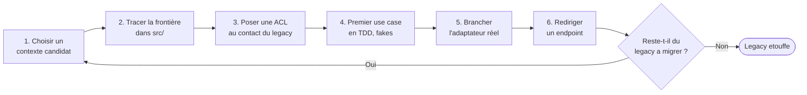

### 17.2. Schéma : ACL au contact du legacy

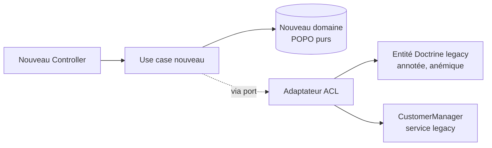

> **Que veut dire « anémique » (modèle de domaine anémique) ?** Se dit d'entités vidées de
> tout comportement, réduites à des sacs de getters et setters, dont toute la logique a fui
> dans des classes `*Service` géantes. Analogie : un patient anémique manque de fer ; ces
> entités manquent de logique. C'est un anti-pattern (voir section 20).

Règles d'or de la migration :

- **N'importez jamais** une classe du legacy directement dans le nouveau domaine.
- **N'étendez jamais** une classe du legacy depuis le nouveau code.
- **Doublez les écritures** pendant la transition : le nouveau code écrit dans le nouveau
  modèle *et* dans l'ancien (via l'ACL), jusqu'à ce que tous les lecteurs aient migré.
- **Outillez la frontière** avec `deptrac` pour bloquer les `import` interdits dès la *CI*.
  Sans contrainte automatique, la frontière finit toujours par fuiter.

> **Que veut dire « CI » ?** *Continuous Integration*, « intégration continue » : un
> serveur qui, à chaque envoi de code, relance automatiquement les tests et les
> vérifications. Analogie : un contrôle qualité posté à la sortie d'usine, qui inspecte
> chaque pièce avant qu'elle ne parte.

> **Piège classique du strangler.** Coincer la migration à 70 % parce que les 30 %
> restants sont *trop pénibles* à extraire. Pour éviter cela : prioriser la migration
> par valeur métier, et accepter que certains coins du legacy resteront *définitivement*
> derrière une ACL. Une ACL stable est préférable à une migration zombie.

[Retour en haut](#table-des-matières)

---

## 18. Exemple complet en Python

Un mini-domaine de **gestion de tâches** met en évidence les trois couches. Le code est
autonome et s'exécute tel quel. La version PHP/Symfony équivalente est donnée
[à la section 19](#19-symfony-en-hexagonal--exemple-complet).

### 18.1. Domaine

```python
# domain/task.py
from dataclasses import dataclass, field
from datetime import date
from enum import Enum
from uuid import UUID, uuid4


class Priority(str, Enum):
    LOW = "low"
    MEDIUM = "medium"
    HIGH = "high"


@dataclass
class Task:
    title: str
    due_date: date
    priority: Priority = Priority.MEDIUM
    done: bool = False
    id: UUID = field(default_factory=uuid4)

    def mark_done(self) -> None:
        if self.done:
            raise ValueError("Tâche déjà terminée")
        self.done = True

    def is_overdue(self, today: date) -> bool:
        return not self.done and today > self.due_date
```

### 18.2. Ports (application)

```python
# application/ports.py
from abc import ABC, abstractmethod
from typing import Iterable
from uuid import UUID

from domain.task import Task


class TaskRepository(ABC):  # Port secondaire
    @abstractmethod
    def add(self, task: Task) -> None: ...

    @abstractmethod
    def get(self, task_id: UUID) -> Task: ...

    @abstractmethod
    def list_all(self) -> Iterable[Task]: ...
```

### 18.3. Use case (application)

```python
# application/use_cases.py
from dataclasses import dataclass
from datetime import date
from uuid import UUID

from application.ports import TaskRepository
from domain.task import Priority, Task


@dataclass
class CreateTaskUseCase:  # Port primaire
    repo: TaskRepository

    def execute(self, title: str, due_date: date, priority: Priority) -> UUID:
        task = Task(title=title, due_date=due_date, priority=priority)
        self.repo.add(task)
        return task.id


@dataclass
class CompleteTaskUseCase:
    repo: TaskRepository

    def execute(self, task_id: UUID) -> None:
        task = self.repo.get(task_id)
        task.mark_done()
        self.repo.add(task)  # idempotent : même id
```

### 18.4. Adaptateur secondaire (infrastructure)

```python
# infrastructure/in_memory_repository.py
from typing import Dict
from uuid import UUID

from application.ports import TaskRepository
from domain.task import Task


class InMemoryTaskRepository(TaskRepository):
    def __init__(self) -> None:
        self._store: Dict[UUID, Task] = {}

    def add(self, task: Task) -> None:
        self._store[task.id] = task

    def get(self, task_id: UUID) -> Task:
        if task_id not in self._store:
            raise KeyError(f"Tâche introuvable : {task_id}")
        return self._store[task_id]

    def list_all(self):
        return list(self._store.values())
```

### 18.5. Adaptateur primaire et composition (infrastructure)

```python
# infrastructure/cli.py
from datetime import date

from application.use_cases import CompleteTaskUseCase, CreateTaskUseCase
from domain.task import Priority
from infrastructure.in_memory_repository import InMemoryTaskRepository


def main() -> None:
    repo = InMemoryTaskRepository()
    create = CreateTaskUseCase(repo)
    complete = CompleteTaskUseCase(repo)

    task_id = create.execute(
        title="Rédiger le mémo hexagonal",
        due_date=date(2026, 12, 31),
        priority=Priority.HIGH,
    )
    complete.execute(task_id)

    for task in repo.list_all():
        print(f"{task.title} -> done={task.done}")


if __name__ == "__main__":
    main()
```

### 18.6. Test unitaire pur

```python
# tests/test_task.py
from datetime import date

import pytest

from domain.task import Priority, Task


def test_mark_done_passes_a_task_to_done():
    task = Task(title="t", due_date=date(2026, 1, 1), priority=Priority.LOW)
    task.mark_done()
    assert task.done is True


def test_mark_done_twice_raises():
    task = Task(title="t", due_date=date(2026, 1, 1))
    task.mark_done()
    with pytest.raises(ValueError):
        task.mark_done()


def test_is_overdue():
    task = Task(title="t", due_date=date(2026, 1, 1))
    assert task.is_overdue(date(2026, 6, 1)) is True
    assert task.is_overdue(date(2025, 12, 1)) is False
```

Aucun de ces tests n'a besoin d'une base de données, d'un serveur HTTP ou d'un framework :
c'est l'objectif principal de l'architecture hexagonale.

[Retour en haut](#table-des-matières)

---

## 19. Symfony en hexagonal : exemple complet

Symfony est un framework PHP qui se prête bien à une organisation hexagonale, à condition de
**résister à la tentation** de tout coller dans des `Bundle`/`Service`/`Controller` collés à
Doctrine. Le même mini-domaine de gestion de tâches est décliné ici en PHP 8.2+ / Symfony 7.

> **Que veut dire « framework » ?** Un cadre de travail prêt à l'emploi : un ensemble
> d'outils et de conventions qui fait déjà le gros du travail répétitif (routage,
> sécurité, accès base). Symfony et Laravel sont des frameworks PHP. Analogie : une cuisine
> équipée louée, où le four et l'évier sont déjà installés ; vous apportez vos recettes.

### 19.1. Mapping conceptuel

> **Que veut dire « mapping conceptuel » ?** Une table de correspondance qui dit : « tel
> élément de Symfony joue le rôle de telle pièce hexagonale ». *Mapping* veut dire « mise
> en correspondance ». C'est un plan de traduction entre deux vocabulaires.

| Élément Symfony | Couche hexagonale | Rôle |
|---|---|---|
| `Controller` | Adaptateur primaire (HTTP) | Reçoit la requête, valide, appelle un use case, sérialise la réponse |
| `Console\Command` | Adaptateur primaire (CLI) | Lance un use case depuis la ligne de commande |
| `Messenger Handler` | Adaptateur primaire (message) | Réagit à un message asynchrone en appelant un use case |
| Classe Doctrine *qui n'étend pas* `EntityRepository` | Adaptateur secondaire (persistance) | Implémente un port de domaine `XxxRepositoryInterface` |
| `Symfony\Mailer` | Adaptateur secondaire (e-mail) | Implémente un port `EmailNotifierInterface` |
| `services.yaml` | Composition / câblage | Lie chaque interface du domaine à son adaptateur |
| Use case (classe `*UseCase`) | Couche application | Orchestre le domaine |
| Entité POPO | Couche domaine | Règles et invariants métier |
| Mapper Doctrine ↔ POPO | Infrastructure | Traduit la POPO en entité ORM et inversement |

> **Que veut dire « conteneur de services » (Symfony) ?** Un composant qui *fabrique* tous
> les objets de l'application et leur fournit automatiquement leurs dépendances. Il lit la
> configuration, résout qui a besoin de qui, et crée chaque service au moment voulu.
> Analogie : un majordome qui connaît tout l'inventaire de la maison et apporte à chacun
> exactement ce qu'il demande, sans qu'on aille le chercher soi-même. (*Service* désigne ici
> simplement un objet géré par ce conteneur.)

> **Que veut dire « autowiring » (câblage automatique) ?** À partir des *types* écrits dans
> le constructeur d'une classe, le conteneur retrouve tout seul le bon service à injecter.
> Quand le type est une interface (un port), il faut lui indiquer *quelle* implémentation
> choisir au moyen d'un **alias** dans `services.yaml`. Analogie : un branchement automatique
> qui sait reconnaître la forme de chaque prise. *Compiler pass* (« passe de compilation »)
> désigne un branchement plus avancé, fait en PHP au démarrage.

### 19.2. Arborescence proposée

```
src/
  TaskManagement/                    # Bounded context "Gestion de tâches"
    Domain/
      Model/
        Task.php
        TaskId.php
        Priority.php
      Event/
        TaskCompleted.php
      Repository/
        TaskRepositoryInterface.php
    Application/
      UseCase/
        CreateTask/
          CreateTaskCommand.php
          CreateTaskUseCase.php
        CompleteTask/
          CompleteTaskCommand.php
          CompleteTaskUseCase.php
      Port/
        ClockInterface.php
    Infrastructure/
      Persistence/
        Doctrine/
          DoctrineTaskRepository.php
          TaskMapper.php
          TaskOrmEntity.php       # entité Doctrine, séparée de la POPO du domaine
      Clock/
        SystemClock.php
    UserInterface/
      Http/
        TaskController.php
      Cli/
        CreateTaskCommand.php     # adaptateur Console
```

Chaque bounded context a son propre quadruplet `Domain / Application / Infrastructure /
UserInterface`. Cette arborescence rend la frontière hexagonale **visible à l'œil nu**.

### 19.3. Le domaine en POPO

> **Que veut dire « POPO » ?** *Plain Old PHP Object*, « simple objet PHP ordinaire ». Une
> classe PHP qui n'hérite d'aucune classe de framework et ne porte aucune annotation
> technique imposée : juste du PHP pur. C'est exactement ce qu'on veut dans le domaine.
> L'équivalent en Java se nomme POJO (*Plain Old Java Object*). Analogie : un ingrédient
> brut, non transformé, qui n'appartient à aucune marque.

```php
<?php
// src/TaskManagement/Domain/Model/TaskId.php
declare(strict_types=1);

namespace App\TaskManagement\Domain\Model;

use Symfony\Component\Uid\Uuid;

final class TaskId
{
    public function __construct(public readonly string $value)
    {
        if (!Uuid::isValid($value)) {
            throw new \InvalidArgumentException('TaskId must be a valid UUID');
        }
    }

    public static function generate(): self
    {
        return new self((string) Uuid::v4());
    }

    public function equals(self $other): bool
    {
        return $this->value === $other->value;
    }
}
```

> **Tolérance pratique.** Le composant `symfony/uid` est une bibliothèque utilitaire,
> pas un framework. La règle « zéro Symfony dans le domaine » s'entend pour les
> *frameworks* (HTTP, ORM, DI). Importer un VO d'UUID est admissible si l'équipe en
> assume le précédent.

```php
<?php
// src/TaskManagement/Domain/Model/Priority.php
declare(strict_types=1);

namespace App\TaskManagement\Domain\Model;

enum Priority: string
{
    case Low = 'low';
    case Medium = 'medium';
    case High = 'high';
}
```

```php
<?php
// src/TaskManagement/Domain/Model/Task.php
declare(strict_types=1);

namespace App\TaskManagement\Domain\Model;

use App\TaskManagement\Domain\Event\TaskCompleted;

final class Task
{
    /** @var object[] */
    private array $recordedEvents = [];

    public function __construct(
        public readonly TaskId $id,
        private string $title,
        private \DateTimeImmutable $dueDate,
        private Priority $priority,
        private bool $done = false,
    ) {
        if ($title === '') {
            throw new \DomainException('Title cannot be empty');
        }
    }

    public static function create(
        string $title,
        \DateTimeImmutable $dueDate,
        Priority $priority,
    ): self {
        return new self(TaskId::generate(), $title, $dueDate, $priority);
    }

    public function markDone(\DateTimeImmutable $now): void
    {
        if ($this->done) {
            throw new \DomainException('Task already completed');
        }
        $this->done = true;
        $this->recordedEvents[] = new TaskCompleted($this->id, $now);
    }

    public function isOverdue(\DateTimeImmutable $today): bool
    {
        return !$this->done && $today > $this->dueDate;
    }

    /** @return object[] */
    public function pullDomainEvents(): array
    {
        $events = $this->recordedEvents;
        $this->recordedEvents = [];
        return $events;
    }

    // Getters lecture seule pour la couche infrastructure
    public function title(): string { return $this->title; }
    public function dueDate(): \DateTimeImmutable { return $this->dueDate; }
    public function priority(): Priority { return $this->priority; }
    public function isDone(): bool { return $this->done; }
}
```

Notez :

- aucune annotation Doctrine, aucune dépendance HTTP ;
- les invariants sont **dans** le constructeur et dans `markDone` ;
- les événements de domaine sont *enregistrés* mais non *publiés* ; c'est le use case
  qui se charge de les transmettre au bus.

### 19.4. Les ports applicatifs

```php
<?php
// src/TaskManagement/Domain/Repository/TaskRepositoryInterface.php
declare(strict_types=1);

namespace App\TaskManagement\Domain\Repository;

use App\TaskManagement\Domain\Model\Task;
use App\TaskManagement\Domain\Model\TaskId;

interface TaskRepositoryInterface
{
    public function save(Task $task): void;

    public function get(TaskId $id): Task;

    /** @return iterable<Task> */
    public function listAll(): iterable;
}
```

```php
<?php
// src/TaskManagement/Application/Port/ClockInterface.php
declare(strict_types=1);

namespace App\TaskManagement\Application\Port;

interface ClockInterface
{
    public function now(): \DateTimeImmutable;
}
```

> **Pourquoi un port `Clock` ?** Pour que `markDone` reçoive *l'heure* depuis l'extérieur
> au lieu d'appeler `new \DateTimeImmutable()` lui-même. Cela rend le domaine
> *déterministe* et testable (on injecte une horloge fixe dans les tests).

### 19.5. Le use case applicatif

```php
<?php
// src/TaskManagement/Application/UseCase/CompleteTask/CompleteTaskCommand.php
declare(strict_types=1);

namespace App\TaskManagement\Application\UseCase\CompleteTask;

final readonly class CompleteTaskCommand
{
    public function __construct(public string $taskId) {}
}
```

```php
<?php
// src/TaskManagement/Application/UseCase/CompleteTask/CompleteTaskUseCase.php
declare(strict_types=1);

namespace App\TaskManagement\Application\UseCase\CompleteTask;

use App\TaskManagement\Application\Port\ClockInterface;
use App\TaskManagement\Domain\Model\TaskId;
use App\TaskManagement\Domain\Repository\TaskRepositoryInterface;
use Symfony\Component\Messenger\MessageBusInterface;

final class CompleteTaskUseCase
{
    public function __construct(
        private TaskRepositoryInterface $tasks,
        private ClockInterface $clock,
        private MessageBusInterface $eventBus,
    ) {}

    public function __invoke(CompleteTaskCommand $cmd): void
    {
        $task = $this->tasks->get(new TaskId($cmd->taskId));
        $task->markDone($this->clock->now());
        $this->tasks->save($task);

        foreach ($task->pullDomainEvents() as $event) {
            $this->eventBus->dispatch($event);
        }
    }
}
```

> **Note.** `MessageBusInterface` est ici importé directement de Symfony pour la lisibilité.
> Une version plus pure définirait un port `EventPublisherInterface` dans
> `Application/Port/` et un adaptateur `MessengerEventPublisher` dans `Infrastructure/`.
> C'est un arbitrage : pureté maximale (port dédié) vs pragmatisme (Symfony Messenger
> est déjà un bus stable et bien isolé). Choisissez selon le ratio coût/bénéfice de votre
> contexte.

### 19.6. L'adaptateur secondaire Doctrine

Pour respecter la règle « domaine sans annotation ORM », on sépare l'**entité du domaine**
(`Task`, POPO) de l'**entité Doctrine** (`TaskOrmEntity`, annotée pour l'ORM). Un
*mapper* fait la traduction.

```php
<?php
// src/TaskManagement/Infrastructure/Persistence/Doctrine/TaskOrmEntity.php
declare(strict_types=1);

namespace App\TaskManagement\Infrastructure\Persistence\Doctrine;

use Doctrine\ORM\Mapping as ORM;

#[ORM\Entity]
#[ORM\Table(name: 'task')]
class TaskOrmEntity
{
    #[ORM\Id]
    #[ORM\Column(type: 'uuid')]
    public string $id;

    #[ORM\Column(type: 'string', length: 255)]
    public string $title;

    #[ORM\Column(type: 'datetime_immutable')]
    public \DateTimeImmutable $dueDate;

    #[ORM\Column(type: 'string', length: 16)]
    public string $priority;

    #[ORM\Column(type: 'boolean')]
    public bool $done;
}
```

```php
<?php
// src/TaskManagement/Infrastructure/Persistence/Doctrine/TaskMapper.php
declare(strict_types=1);

namespace App\TaskManagement\Infrastructure\Persistence\Doctrine;

use App\TaskManagement\Domain\Model\Priority;
use App\TaskManagement\Domain\Model\Task;
use App\TaskManagement\Domain\Model\TaskId;

final class TaskMapper
{
    public function toOrm(Task $task): TaskOrmEntity
    {
        $orm = new TaskOrmEntity();
        $orm->id = $task->id->value;
        $orm->title = $task->title();
        $orm->dueDate = $task->dueDate();
        $orm->priority = $task->priority()->value;
        $orm->done = $task->isDone();
        return $orm;
    }

    public function toDomain(TaskOrmEntity $orm): Task
    {
        return new Task(
            new TaskId($orm->id),
            $orm->title,
            $orm->dueDate,
            Priority::from($orm->priority),
            $orm->done,
        );
    }
}
```

```php
<?php
// src/TaskManagement/Infrastructure/Persistence/Doctrine/DoctrineTaskRepository.php
declare(strict_types=1);

namespace App\TaskManagement\Infrastructure\Persistence\Doctrine;

use App\TaskManagement\Domain\Model\Task;
use App\TaskManagement\Domain\Model\TaskId;
use App\TaskManagement\Domain\Repository\TaskRepositoryInterface;
use Doctrine\ORM\EntityManagerInterface;

final class DoctrineTaskRepository implements TaskRepositoryInterface
{
    public function __construct(
        private EntityManagerInterface $em,
        private TaskMapper $mapper,
    ) {}

    public function save(Task $task): void
    {
        // Doctrine ORM 3 a supprimé EntityManager::merge(). On gère explicitement
        // l'insertion (entité non managée) et la mise à jour (entité existante en DB).
        $existing = $this->em->find(TaskOrmEntity::class, $task->id->value);
        $orm = $this->mapper->toOrm($task);

        if ($existing === null) {
            $this->em->persist($orm);
        } else {
            $existing->title = $orm->title;
            $existing->dueDate = $orm->dueDate;
            $existing->priority = $orm->priority;
            $existing->done = $orm->done;
        }
        $this->em->flush();
    }

    public function get(TaskId $id): Task
    {
        $orm = $this->em->find(TaskOrmEntity::class, $id->value);
        if ($orm === null) {
            throw new \DomainException("Task not found: {$id->value}");
        }
        return $this->mapper->toDomain($orm);
    }

    public function listAll(): iterable
    {
        foreach ($this->em->getRepository(TaskOrmEntity::class)->findAll() as $orm) {
            yield $this->mapper->toDomain($orm);
        }
    }
}
```

> **Mise au point Doctrine 3.** `EntityManager::merge()`, encore largement présent dans
> les tutoriels en ligne, a été *supprimé* en Doctrine ORM 3 (annoncé déprécié dès la
> 2.7). Toute documentation hexagonale qui montre encore `$em->merge($orm)` est obsolète :
> il faut `find` + `persist` (création) ou mutation des champs de l'entité managée
> (mise à jour). Cette nuance est *exactement* le genre de détail d'infrastructure qui
> *ne doit pas* fuiter dans le port `TaskRepositoryInterface` ; celui-ci se contente de
> dire `save(Task $task): void`.

Ce découplage a un coût (deux classes au lieu d'une). Pour un petit projet, on peut
**partir** d'une entité Doctrine annotée qui *est* aussi l'entité du domaine, et
introduire le mapper le jour où l'on veut nettoyer la frontière. L'important est d'avoir
*au moins* une interface `TaskRepositoryInterface` dans le domaine.

### 19.7. L'adaptateur primaire HTTP

```php
<?php
// src/TaskManagement/UserInterface/Http/TaskController.php
declare(strict_types=1);

namespace App\TaskManagement\UserInterface\Http;

use App\TaskManagement\Application\UseCase\CompleteTask\CompleteTaskCommand;
use App\TaskManagement\Application\UseCase\CompleteTask\CompleteTaskUseCase;
use Symfony\Component\HttpFoundation\JsonResponse;
use Symfony\Component\HttpFoundation\Response;
use Symfony\Component\Routing\Attribute\Route;

final class TaskController
{
    public function __construct(
        private CompleteTaskUseCase $completeTask,
    ) {}

    #[Route('/tasks/{id}/complete', methods: ['POST'])]
    public function complete(string $id): Response
    {
        try {
            ($this->completeTask)(new CompleteTaskCommand($id));
            return new JsonResponse(null, Response::HTTP_NO_CONTENT);
        } catch (\DomainException $e) {
            return new JsonResponse(['error' => $e->getMessage()], Response::HTTP_CONFLICT);
        }
    }
}
```

Le contrôleur ne fait *que* trois choses : extraire les données de la requête, instancier
une *command* applicative, et traduire la réponse (ou l'exception métier) en HTTP. Toute
règle métier est interdite ici.

### 19.8. Le conteneur de services Symfony

C'est la pièce qui *câble* l'hexagone. Le fichier `config/services.yaml` lie chaque
**interface du domaine** à son **adaptateur d'infrastructure** :

```yaml
# config/services.yaml
services:
    _defaults:
        autowire: true
        autoconfigure: true

    App\:
        resource: '../src/'
        exclude:
            - '../src/Kernel.php'

    # Liaison interface <-> implémentation
    App\TaskManagement\Domain\Repository\TaskRepositoryInterface:
        alias: App\TaskManagement\Infrastructure\Persistence\Doctrine\DoctrineTaskRepository

    App\TaskManagement\Application\Port\ClockInterface:
        alias: App\TaskManagement\Infrastructure\Clock\SystemClock
```

Avec ces alias, l'autowiring de Symfony sait que `TaskRepositoryInterface` doit être
satisfait par `DoctrineTaskRepository` en production. Pour les tests fonctionnels, on
peut *redéfinir* l'alias vers une implémentation `InMemoryTaskRepository` dans
`config/services_test.yaml` :

```yaml
# config/services_test.yaml
services:
    App\TaskManagement\Domain\Repository\TaskRepositoryInterface:
        alias: App\TaskManagement\Tests\Fixtures\InMemoryTaskRepository
        public: true
```

C'est *exactement* la promesse de l'hexagonal : *changer un adaptateur sans toucher au
domaine ni à l'application*. Le seul fichier modifié est le câblage.

### 19.9. Tests

```php
<?php
// tests/TaskManagement/Domain/TaskTest.php
declare(strict_types=1);

namespace App\Tests\TaskManagement\Domain;

use App\TaskManagement\Domain\Model\Priority;
use App\TaskManagement\Domain\Model\Task;
use App\TaskManagement\Domain\Model\TaskId;
use PHPUnit\Framework\TestCase;

final class TaskTest extends TestCase
{
    public function testMarkDoneTransitionsToDone(): void
    {
        $task = new Task(
            TaskId::generate(),
            'Rédiger le mémo',
            new \DateTimeImmutable('2026-12-31'),
            Priority::High,
        );

        $task->markDone(new \DateTimeImmutable('2026-05-02'));

        self::assertTrue($task->isDone());
        self::assertCount(1, $task->pullDomainEvents());
    }

    public function testMarkDoneTwiceThrows(): void
    {
        $task = new Task(
            TaskId::generate(),
            't',
            new \DateTimeImmutable('2026-12-31'),
            Priority::Low,
        );
        $task->markDone(new \DateTimeImmutable('2026-05-02'));

        $this->expectException(\DomainException::class);
        $task->markDone(new \DateTimeImmutable('2026-05-03'));
    }
}
```

Aucun démarrage de Symfony, aucune base de données, aucun `KernelTestCase`. Ces tests
s'exécutent en quelques millisecondes et n'ont **aucune raison** de casser tant que la
règle métier ne change pas.

> **Que veut dire « bootstrap » ?** La phase de démarrage d'une application, où elle charge
> sa configuration et construit ses objets avant de pouvoir travailler. L'image vient de
> l'expression anglaise « se hisser par ses propres lacets ». Un test de domaine pur évite
> tout ce démarrage, d'où sa rapidité.

[Retour en haut](#table-des-matières)

---

## 20. Anti-patterns et pièges courants

Chaque ligne nomme une erreur fréquente, la décrit, puis donne le réflexe correct.

| Piège | Description | Comment l'éviter |
|---|---|---|
| **Anemic domain model** | Entités sans comportement, juste des sacs de getters/setters. La logique fuite dans des `*Service` énormes. | Mettre les invariants et les transitions d'état **dans** les entités. Méthodes métier nommées (`markDone`), pas `setDone($b)`. |
| **Leaky infrastructure** | Le domaine importe `psycopg2`, `Doctrine\ORM\Mapping`, `Symfony\HttpFoundation`… | Aucune dépendance externe dans `Domain/`. Vérifier avec un test d'architecture (ex. `deptrac` en PHP, `archunit`/`import-linter`). |
| **Fat use cases** | Use cases de 500 lignes qui font tout : validation, logique métier, persistance, e-mail. | Découper par cas d'utilisation, extraire les services de domaine, déléguer la validation à un VO. |
| **Faux ports** | Une « interface » qui ne fait que recopier la classe concrète, méthode pour méthode. | Concevoir les ports depuis les besoins du domaine, pas depuis l'implémentation. Les noms de méthodes doivent être métier. |
| **Repository fourre-tout** | `findBy(array $criteria)` qui accepte tout. | Méthodes nommées par cas d'usage : `findUnpaidOrders()`, `findCustomersDueForReminder()`. |
| **Dépendance circulaire** *(domain ↔ application)* | Le domaine appelle un use case. | Le domaine ne connaît que lui-même. Les use cases orchestrent. |
| **DTO confondus avec entités** | Renvoyer une entité directement à l'API. | Convertir en DTO/ViewModel dans l'adaptateur primaire. Ne jamais sérialiser une entité. |
| **Sur-architecture** | Hexagonal pour un script de 200 lignes. | Voir section [21](#21-quand-ne-pas-utiliser-lhexagonal-). |
| **Adapter qui appelle un autre adapter** | `SmtpNotifier` qui appelle directement `PostgresUserRepository`. | Toujours passer par un use case ou par le domaine. Les adaptateurs ne se parlent pas entre eux. |
| **Domaine couplé au framework** | `extends AbstractController`, `implements MessageHandlerInterface` dans le domaine. | Le domaine est PHP pur (POPO). Les adaptateurs *seuls* étendent les classes du framework. |
| **Pas de bounded context** | Tout le code dans un seul `src/Entity/`, un seul `src/Service/`, ambiguïté sur les noms. | Découper par bounded context (`src/Catalog/`, `src/Billing/`, `src/Shipping/`). |
| **Annotation ORM dans le domaine** | `#[ORM\Entity]` directement sur l'entité métier. | Soit assumer le compromis (petit projet), soit séparer entité ORM et entité domaine via un mapper. |
| **Use case qui contient une règle métier** | `if ($order->total > 1000) ...` dans le use case. | Déplacer la règle dans `Order` ou dans un service de domaine. Le use case orchestre, point. |
| **Horloge implicite** | `new \DateTimeImmutable()` au milieu du domaine. | Injecter une `ClockInterface`. Rend le domaine déterministe et testable. |
| **Identifiants générés par la DB** | Dépendre de l'auto-incrément SQL pour avoir un id. | Générer l'id côté domaine (UUID). L'agrégat naît avec son identité. |
| **Service Locator dans un use case** | Le use case reçoit un `ContainerInterface` et fait `$container->get('xxx')`. | Injecter explicitement chaque dépendance dans le constructeur. Le use case doit *déclarer* ce dont il a besoin. |
| **Classes « Manager » fourre-tout** | `OrderManager`, `UserManager` qui font tout : CRUD, règles métier, e-mail, log. | Renommer par cas d'utilisation (`PlaceOrderUseCase`), extraire la règle métier vers `Order`. Le mot « manager » est un signal d'alerte. |
| **`Request`/`Response` Symfony dans le use case** | `__invoke(Request $request): Response` pour un use case. | Les types Symfony `Request`/`Response` restent *au contrôleur*. Le use case prend une *command* et renvoie un DTO ou `void`. |
| **Test « unitaire » qui démarre Doctrine** | Test du domaine qui boot SQLite + schéma + Doctrine pour vérifier une règle métier. | Si vous ne pouvez pas tester sans I/O, c'est que vous testez l'infrastructure, pas le domaine. Renommer en *test d'intégration*. |
| **Interface inutile** | Un port qui n'a *qu'une seule* implémentation prévisible et qui ne sert pas à tester. | Tous les ports n'ont pas besoin d'exister. Si vous n'avez pas besoin de double, gardez la classe concrète. |
| **Publication d'événements hors transaction** | `repository.save(); bus.publish();` sans garantie atomique : crash entre les deux = événement perdu ou base incohérente. | Pattern *transactional outbox* : insérer l'événement dans une table `outbox` *dans la même transaction* que l'écriture, puis un worker dédié relaie vers le bus. |
| **`#[Route]` sur un use case** | Annotation HTTP collée directement sur la classe applicative. | Les routes appartiennent aux contrôleurs. Le use case ne sait *rien* du transport. |
| **CQRS sans bénéfice** | Mettre tout le monde derrière un *bus* + *handlers* « parce que CQRS » alors qu'on n'a ni read model dénormalisé ni problème de scale. | Commencer en CQRS léger (use case = commande applicative, requête = port de lecture). Ne pas mettre un bus juste pour le rituel. |
| **Mocks qui imitent l'ORM** | Test qui mocke `EntityManagerInterface::find()`, `persist()`, `flush()` pour tester un repository. | Tester *l'adaptateur* contre une vraie DB (intégration). Mocker l'EntityManager teste votre mock, pas votre code. |

[Retour en haut](#table-des-matières)

---

## 21. Quand ne PAS utiliser l'hexagonal ?

L'architecture hexagonale **a un coût** : plus de fichiers, plus d'interfaces, plus
d'indirection. Elle n'est donc pas toujours rentable.

> **Que veut dire « indirection » ?** Le fait de passer par un intermédiaire au lieu
> d'aller droit au but (par exemple parler à un port plutôt qu'à la base directement).
> Chaque intermédiaire ajoute de la souplesse mais aussi un petit détour. Analogie :
> passer par un standard téléphonique plutôt que d'appeler la personne en direct.

Cas où elle ne se justifie pas :

- **Scripts jetables et *proofs of concept*** : la lourdeur ne se rentabilise pas. Un
  *proof of concept* (« preuve de concept ») est un prototype rapide destiné à valider une
  idée, pas à durer.
- **Applications CRUD pures** sans règle métier (un simple panneau d'administration
  Symfony EasyAdmin ou Django suffit). *CRUD* veut dire *Create, Read, Update, Delete*
  (« créer, lire, modifier, supprimer ») : les quatre opérations de base sur des données,
  sans logique par-dessus.
- **Domaine très instable**, où l'on ne sait pas encore ce qu'on construit (commencer
  simple, basculer vers l'hexagonal *quand* les frontières deviennent claires).
- **Très petites équipes** plus à l'aise avec un style classique : la cohérence prime sur
  l'élégance théorique.
- **Latences critiques** sur des chemins ultra-sollicités : la double indirection (port,
  adaptateur, mapper) ajoute des nanosecondes ; rare, mais réel en HFT et en jeu vidéo
  temps réel. *HFT* veut dire *High-Frequency Trading*, « trading à haute fréquence », où
  l'on passe des milliers d'ordres de bourse par seconde et où chaque microseconde compte.

> **Règle pragmatique.** Si vous n'avez pas de logique métier non triviale, vous n'avez
> probablement pas besoin d'hexagonal. Mais dès qu'une règle métier mérite d'être testée
> seule, l'isoler dans un domaine pur paie très vite. Et plus le projet vit longtemps,
> plus l'investissement est rentable.

[Retour en haut](#table-des-matières)

---

## 22. Pour aller plus loin

- Alistair Cockburn, *Hexagonal Architecture*, 2005 : l'article fondateur.
- Robert C. Martin, *Clean Architecture*, 2017 : vision élargie avec les *use cases* et
  la règle de dépendance.
- Eric Evans, *Domain-Driven Design*, 2003 : le livre bleu, fondations stratégiques et
  tactiques.
- Vaughn Vernon, *Implementing Domain-Driven Design*, 2013 : le livre rouge, exemples
  concrets et patterns d'implémentation.
- Vaughn Vernon, *Domain-Driven Design Distilled*, 2016 : une introduction synthétique
  au DDD pour qui ne veut pas avaler les 600 pages du livre rouge.
- Tom Hombergs, *Get Your Hands Dirty on Clean Architecture*, 2019 : exemple Java/Spring
  complet, transposable sans douleur en PHP/Symfony.
- Carlos Buenosvinos, Christian Soronellas et Keyvan Akbary, *Domain-Driven Design in
  PHP*, 2017 : le pendant PHP du livre rouge, avec exemples Symfony/Doctrine.
- Matthias Noback, *Object Design Style Guide* et *Advanced Web Application Architecture* :
  beaucoup d'idées concrètes pour structurer un projet PHP moderne.

[Retour en haut](#table-des-matières)

---

## 23. Auteur

**Tanguy Chénier**, Tansoftware

- Site : [tansoftware.com](https://www.tansoftware.com)
- LinkedIn : [linkedin.com/in/tanguy-chenier](https://www.linkedin.com/in/tanguy-chenier/)
- GitHub Tan-Software (organisation) : [github.com/Tan-Software](https://github.com/Tan-Software)
- GitHub personnel (derniers outils) : [github.com/tanguychenier](https://github.com/tanguychenier)

[Retour en haut](#table-des-matières)

---

## 24. Licence

Distribué sous licence **MIT** : voir le fichier [LICENCE](./LICENCE).

[Retour en haut](#table-des-matières)
