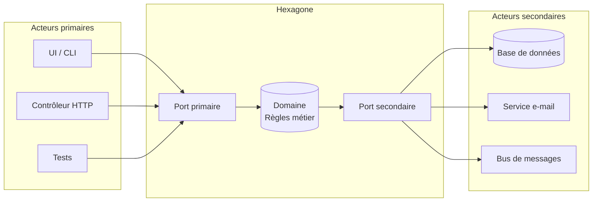
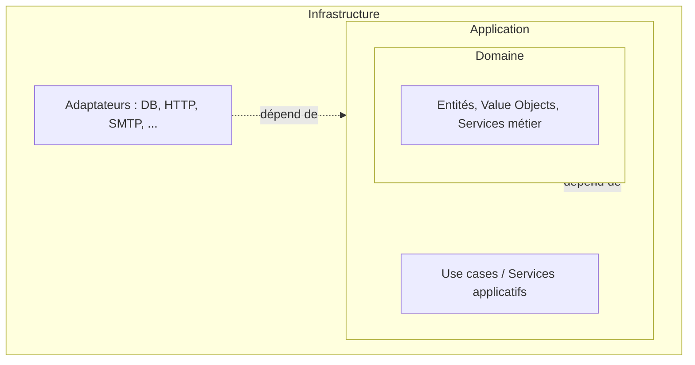
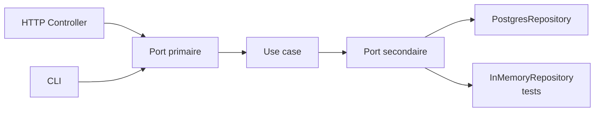
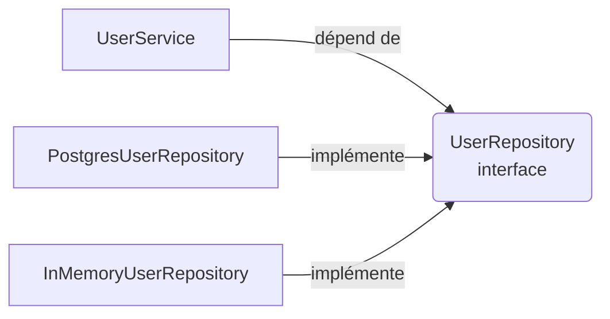
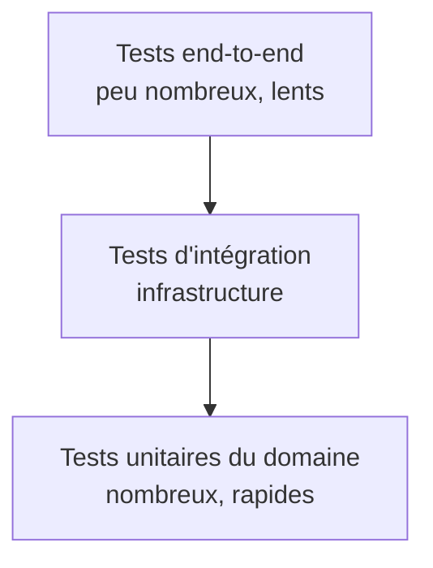
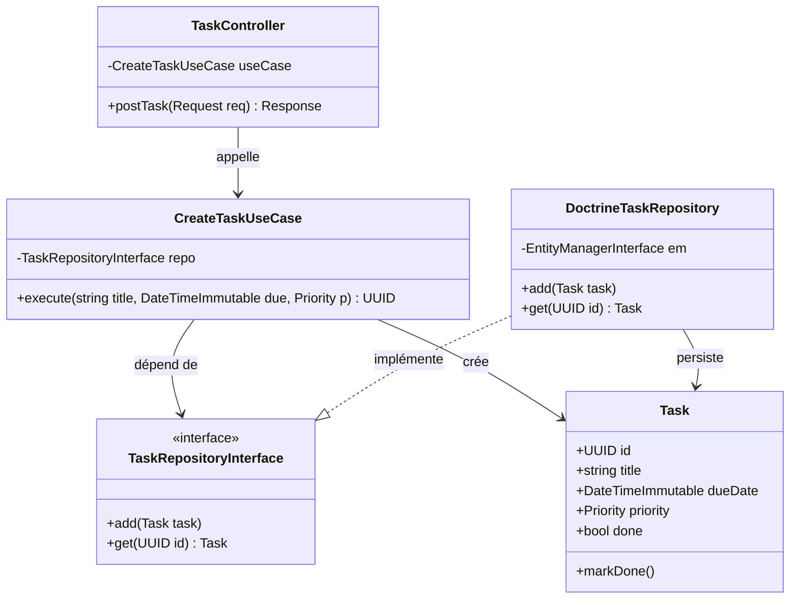

# [Tansoftware](https://www.tansoftware.com) - Architecture hexagonale


Ce dépôt est un mémo synthétique sur l'**architecture hexagonale** (aussi appelée *Ports & Adapters*),
formalisée par Alistair Cockburn en 2005. L'objectif est de fournir une référence rapide,
illustrée par des diagrammes et des exemples de code complets, à destination des développeurs
qui souhaitent découpler leur logique métier des détails techniques.

---

## Table des matières

- [1. Introduction](#1-introduction)
- [2. Pourquoi l'hexagonal plutôt que le N-tier ?](#2-pourquoi-lhexagonal-plutôt-que-le-n-tier-)
- [3. Prérequis](#3-prérequis)
- [4. Glossaire](#4-glossaire)
- [5. Les différentes couches](#5-les-différentes-couches)
  - [5.1. Le domaine](#51-le-domaine)
  - [5.2. L'application](#52-lapplication)
  - [5.3. L'infrastructure](#53-linfrastructure)
- [6. Ports et adaptateurs](#6-ports-et-adaptateurs)
  - [6.1. Ports primaires (driving)](#61-ports-primaires-driving)
  - [6.2. Ports secondaires (driven)](#62-ports-secondaires-driven)
  - [6.3. Adaptateurs](#63-adaptateurs)
- [7. L'inversion de dépendance](#7-linversion-de-dépendance)
- [8. Bénéfices en testabilité (TDD)](#8-bénéfices-en-testabilité-tdd)
- [9. Exemple complet en Python](#9-exemple-complet-en-python)
- [10. Symfony en hexagonal](#10-symfony-en-hexagonal)
- [11. Anti-patterns et pièges courants](#11-anti-patterns-et-pièges-courants)
- [12. Quand ne PAS utiliser l'hexagonal ?](#12-quand-ne-pas-utiliser-lhexagonal-)
- [13. Pour aller plus loin](#13-pour-aller-plus-loin)
- [14. Auteur](#14-auteur)
- [15. Licence](#15-licence)

---

## 1. Introduction

L'**architecture hexagonale** est un style d'architecture logicielle qui vise à découpler la
**logique métier** des **détails techniques** (persistance, interface utilisateur, services
externes, frameworks).

Au cœur de l'hexagone se trouve le **domaine**, qui contient les règles métier et les cas
d'utilisation. Il est entouré de **ports**, qui définissent les contrats d'interaction avec le
monde extérieur, et d'**adaptateurs**, qui implémentent ces contrats.



Le sens des flèches illustre la **règle d'or** : les dépendances pointent toujours **vers** le
domaine, jamais l'inverse.

[Retour en haut](#table-des-matières)

---

## 2. Pourquoi l'hexagonal plutôt que le N-tier ?

L'architecture **N-tier** classique (présentation → métier → données) est simple, mais elle
souffre de plusieurs limites :

| Aspect | N-tier classique | Hexagonal |
|---|---|---|
| Sens des dépendances | Métier dépend de la base de données | Tout dépend du métier |
| Testabilité du domaine | Nécessite mocks de la DB ou DB en mémoire | Tests purs, sans I/O |
| Remplacement d'un adaptateur (ex. SQL → MongoDB) | Coûteux, touche le métier | Isolé à un seul adaptateur |
| Indépendance du framework | Faible (souvent couplé à Spring/Symfony/Django) | Forte |
| Évolutivité | Bonne tant que la couche métier reste fine | Pensée pour absorber la complexité métier |

En résumé : l'hexagonal protège votre **investissement métier** (la partie la plus durable de
votre code) contre la volatilité des choix techniques.

[Retour en haut](#table-des-matières)

---

## 3. Prérequis

Pour tirer pleinement profit de ce mémo, il est utile (mais pas strictement nécessaire) de
connaître :

- les principes **SOLID**, en particulier le **D** (Dependency Inversion Principle) ;
- la notion d'**injection de dépendances** ;
- les bases de la **POO** (interfaces, abstractions, polymorphisme) ;
- les concepts de base du **DDD** (entité, value object, agrégat) — utiles, mais non obligatoires.

[Retour en haut](#table-des-matières)

---

## 4. Glossaire

| Terme | Définition |
|---|---|
| **Domaine** | Cœur de l'application contenant les règles métier, libre de toute dépendance technique. |
| **Port** | Interface (au sens POO) définie par le domaine pour communiquer avec l'extérieur. |
| **Adaptateur** | Implémentation concrète d'un port, côté infrastructure ou présentation. |
| **Port primaire** *(driving)* | Définit ce que l'application **offre** (ex. `CreateUser`). Appelé par les acteurs primaires. |
| **Port secondaire** *(driven)* | Définit ce dont l'application **a besoin** (ex. `UserRepository`). Implémenté par l'infrastructure. |
| **Acteur primaire** | Élément qui *initie* une interaction (UI, contrôleur HTTP, CLI, test). |
| **Acteur secondaire** | Élément que l'application *pilote* (base de données, broker, service externe). |
| **Use case** | Cas d'utilisation applicatif qui orchestre le domaine pour répondre à un besoin. |
| **DIP** | Dependency Inversion Principle : les modules de haut niveau ne dépendent pas des modules de bas niveau ; les deux dépendent d'abstractions. |

[Retour en haut](#table-des-matières)

---

## 5. Les différentes couches

L'architecture hexagonale s'organise généralement en trois couches concentriques. **Aucune
couche extérieure ne doit être connue par une couche intérieure.**



### 5.1. Le domaine

C'est le cœur de l'application. Il contient :

- les **entités** (objets identifiés par un `id` et dotés d'un cycle de vie) ;
- les **value objects** (immuables, comparés par valeur — ex. `Money`, `Email`) ;
- les **services de domaine** (logique qui ne *colle* pas à une entité unique) ;
- les **événements de domaine** (faits métier qui se sont produits).

> Règle absolue : le domaine n'importe **rien** des couches extérieures. Pas de SQL, pas de
> HTTP, pas de framework, pas de logger d'infrastructure.

### 5.2. L'application

Cette couche orchestre le domaine pour réaliser les **cas d'utilisation**. Elle contient :

- les **use cases** (un par scénario métier — ex. `RegisterUser`, `PlaceOrder`) ;
- les **interfaces de ports** (primaires et secondaires) ;
- les **DTO** d'entrée/sortie des use cases.

Elle dépend du domaine, mais reste ignorante de l'infrastructure.

### 5.3. L'infrastructure

Couche la plus externe, elle implémente les ports secondaires et expose les ports primaires :

- adaptateurs de **persistance** (SQL, NoSQL, fichier) ;
- adaptateurs de **transport** (REST, GraphQL, CLI, gRPC) ;
- adaptateurs de **services externes** (SMTP, S3, Stripe, etc.) ;
- configuration, injection de dépendances, démarrage de l'application.

[Retour en haut](#table-des-matières)

---

## 6. Ports et adaptateurs

### 6.1. Ports primaires *(driving)*

Ils définissent **ce que fait** l'application : les commandes et requêtes exposées à
l'extérieur. Exemples : `RegisterUserUseCase`, `GetOrderQuery`.

### 6.2. Ports secondaires *(driven)*

Ils définissent **ce dont l'application a besoin** : persistance, notifications, horloge,
identifiants… Exemples : `UserRepository`, `EmailNotifier`, `Clock`.

### 6.3. Adaptateurs

Les adaptateurs *adaptent* les technologies externes aux ports.

- **Adaptateurs primaires** : reçoivent une requête externe (HTTP, CLI, message) et appellent un
  port primaire après conversion des données. Exemple : `UserController` REST → `RegisterUserUseCase`.
- **Adaptateurs secondaires** : implémentent un port secondaire en utilisant une technologie
  concrète. Exemple : `PostgresUserRepository`, `SmtpEmailNotifier`.



[Retour en haut](#table-des-matières)

---

## 7. L'inversion de dépendance

Le **DIP** (Dependency Inversion Principle) est le pilier qui rend l'hexagonal possible.
Sans inversion, le domaine finirait par dépendre de la base de données ; avec inversion, c'est
l'infrastructure qui dépend du domaine.

**Exemple sans DIP :**

```python
# UserService dépend directement d'une implémentation SQL : couplage fort.
class UserService:
    def __init__(self):
        self.repo = PostgresUserRepository()  # Couplage en dur
```

**Exemple avec DIP :**

```python
# UserService dépend d'une abstraction : couplage faible.
class UserService:
    def __init__(self, repo: UserRepository):  # UserRepository = interface
        self.repo = repo
```

Schématiquement :



L'avantage : la classe `UserService` peut être testée avec un repository en mémoire et
déployée avec un repository Postgres, **sans qu'aucune ligne de son code ne change**.

[Retour en haut](#table-des-matières)

---

## 8. Bénéfices en testabilité (TDD)

L'hexagonal n'impose pas le **TDD**, mais les deux se renforcent mutuellement :

- le **domaine** est testé par des tests unitaires purs (pas d'I/O, pas de mock de framework) ;
- l'**application** est testée avec des doubles en mémoire pour les ports secondaires ;
- l'**infrastructure** est testée par des tests d'intégration (DB réelle, HTTP réel).

Pyramide de tests typique :



Un domaine bien isolé permet de viser une couverture proche de 100 % avec des tests qui
s'exécutent en quelques millisecondes.

[Retour en haut](#table-des-matières)

---

## 9. Exemple complet en Python

Voici un mini-domaine de **gestion de tâches** illustrant les trois couches. Le code est
auto-contenu et exécutable.

### 9.1. Domaine

```python
# domain/task.py
from dataclasses import dataclass, field
from datetime import date
from enum import Enum
from uuid import UUID, uuid4


class Priority(str, Enum):
    LOW = "low"
    MEDIUM = "medium"
    HIGH = "high"


@dataclass
class Task:
    title: str
    due_date: date
    priority: Priority = Priority.MEDIUM
    done: bool = False
    id: UUID = field(default_factory=uuid4)

    def mark_done(self) -> None:
        if self.done:
            raise ValueError("Tâche déjà terminée")
        self.done = True

    def is_overdue(self, today: date) -> bool:
        return not self.done and today > self.due_date
```

### 9.2. Ports (application)

```python
# application/ports.py
from abc import ABC, abstractmethod
from typing import Iterable
from uuid import UUID

from domain.task import Task


class TaskRepository(ABC):  # Port secondaire
    @abstractmethod
    def add(self, task: Task) -> None: ...

    @abstractmethod
    def get(self, task_id: UUID) -> Task: ...

    @abstractmethod
    def list_all(self) -> Iterable[Task]: ...
```

### 9.3. Use case (application)

```python
# application/use_cases.py
from dataclasses import dataclass
from datetime import date
from uuid import UUID

from application.ports import TaskRepository
from domain.task import Priority, Task


@dataclass
class CreateTaskUseCase:  # Port primaire
    repo: TaskRepository

    def execute(self, title: str, due_date: date, priority: Priority) -> UUID:
        task = Task(title=title, due_date=due_date, priority=priority)
        self.repo.add(task)
        return task.id


@dataclass
class CompleteTaskUseCase:
    repo: TaskRepository

    def execute(self, task_id: UUID) -> None:
        task = self.repo.get(task_id)
        task.mark_done()
        self.repo.add(task)  # idempotent : même id
```

### 9.4. Adaptateur secondaire (infrastructure)

```python
# infrastructure/in_memory_repository.py
from typing import Dict
from uuid import UUID

from application.ports import TaskRepository
from domain.task import Task


class InMemoryTaskRepository(TaskRepository):
    def __init__(self) -> None:
        self._store: Dict[UUID, Task] = {}

    def add(self, task: Task) -> None:
        self._store[task.id] = task

    def get(self, task_id: UUID) -> Task:
        if task_id not in self._store:
            raise KeyError(f"Tâche introuvable : {task_id}")
        return self._store[task_id]

    def list_all(self):
        return list(self._store.values())
```

### 9.5. Adaptateur primaire et composition (infrastructure)

```python
# infrastructure/cli.py
from datetime import date

from application.use_cases import CompleteTaskUseCase, CreateTaskUseCase
from domain.task import Priority
from infrastructure.in_memory_repository import InMemoryTaskRepository


def main() -> None:
    repo = InMemoryTaskRepository()
    create = CreateTaskUseCase(repo)
    complete = CompleteTaskUseCase(repo)

    task_id = create.execute(
        title="Rédiger le mémo hexagonal",
        due_date=date(2026, 12, 31),
        priority=Priority.HIGH,
    )
    complete.execute(task_id)

    for task in repo.list_all():
        print(f"{task.title} -> done={task.done}")


if __name__ == "__main__":
    main()
```

### 9.6. Test unitaire pur

```python
# tests/test_task.py
from datetime import date

import pytest

from domain.task import Priority, Task


def test_mark_done_passes_a_task_to_done():
    task = Task(title="t", due_date=date(2026, 1, 1), priority=Priority.LOW)
    task.mark_done()
    assert task.done is True


def test_mark_done_twice_raises():
    task = Task(title="t", due_date=date(2026, 1, 1))
    task.mark_done()
    with pytest.raises(ValueError):
        task.mark_done()


def test_is_overdue():
    task = Task(title="t", due_date=date(2026, 1, 1))
    assert task.is_overdue(date(2026, 6, 1)) is True
    assert task.is_overdue(date(2025, 12, 1)) is False
```

Aucun de ces tests n'a besoin d'une base de données, d'un serveur HTTP ou d'un framework :
c'est l'objectif principal de l'architecture hexagonale.

[Retour en haut](#table-des-matières)

---

## 10. Symfony en hexagonal

Symfony est un framework PHP qui se prête bien à une organisation hexagonale, à condition de
résister à la tentation de tout coller dans des `Bundle`/`Service`/`Controller` couplés à
Doctrine.



**Mapping Symfony :**

| Élément Symfony | Couche hexagonale |
|---|---|
| `Controller` | Adaptateur primaire (HTTP) |
| `Command` (console) | Adaptateur primaire (CLI) |
| `Doctrine\Repository` | Adaptateur secondaire (persistance) |
| `Mailer` | Adaptateur secondaire (e-mail) |
| Service applicatif (`UseCase`) | Couche application |
| Entité Doctrine *enrichie* OU entité POPO | Couche domaine |

> Astuce : préférez des **entités POPO** (Plain Old PHP Object) dans le domaine et un **mapper**
> Doctrine dans l'infrastructure pour éviter de coupler vos règles métier aux annotations ORM.

[Retour en haut](#table-des-matières)

---

## 11. Anti-patterns et pièges courants

| Piège | Description | Comment l'éviter |
|---|---|---|
| **Anemic domain model** | Entités sans comportement, juste des sacs de getters/setters. La logique fuite dans des `*Service` énormes. | Mettre les invariants et les transitions d'état **dans** les entités. |
| **Leaky infrastructure** | Le domaine importe `psycopg2`, `Doctrine`, `requests`… | Aucune dépendance externe dans `domain/`. Vérifier avec un test d'architecture (ex. `archunit`, `import-linter`). |
| **Fat use cases** | Use cases de 500 lignes qui font tout. | Découper par cas d'utilisation, extraire les services de domaine. |
| **Faux ports** | Une « interface » qui ne fait que recopier la classe concrète. | Concevoir les ports depuis les besoins du domaine, pas depuis l'implémentation. |
| **Dépendance circulaire** *(domain ↔ application)* | Le domaine appelle un use case. | Le domaine ne connaît que lui-même. Les use cases orchestrent. |
| **DTO confondus avec entités** | Renvoyer une entité directement à l'API. | Convertir en DTO/ViewModel dans l'adaptateur primaire. |
| **Sur-architecture** | Hexagonal pour un script de 200 lignes. | Voir section [12](#12-quand-ne-pas-utiliser-lhexagonal-). |
| **Adapter qui appelle un autre adapter** | `SmtpNotifier` qui appelle directement `PostgresUserRepository`. | Toujours passer par un use case ou par le domaine. |

[Retour en haut](#table-des-matières)

---

## 12. Quand ne PAS utiliser l'hexagonal ?

L'architecture hexagonale **a un coût** (plus de fichiers, plus d'interfaces, plus
d'indirection). Elle n'est pas toujours rentable :

- **Scripts jetables / proofs of concept** : la verbosité ne se rentabilise pas.
- **Applications CRUD pures** sans règles métier (un simple admin Django/Symfony suffit).
- **Domaine extrêmement instable** où l'on ne sait pas encore ce qu'on construit (commencer
  simple, refactorer vers l'hexagonal *quand* les frontières deviennent claires).
- **Très petites équipes** qui maîtrisent mieux un style classique : la cohérence prime sur
  l'élégance théorique.

Règle pragmatique : **si vous n'avez pas de logique métier non triviale, vous n'avez probablement
pas besoin d'hexagonal**. Mais dès qu'une règle métier mérite d'être testée seule, l'isoler
dans un domaine pur paie très vite.

[Retour en haut](#table-des-matières)

---

## 13. Pour aller plus loin

- Alistair Cockburn, *Hexagonal Architecture*, 2005 — l'article fondateur.
- Robert C. Martin, *Clean Architecture*, 2017 — vision élargie avec les *use cases*.
- Eric Evans, *Domain-Driven Design*, 2003 — complémentaire pour modéliser le domaine.
- Vaughn Vernon, *Implementing Domain-Driven Design*, 2013.
- Tom Hombergs, *Get Your Hands Dirty on Clean Architecture*, 2019 — exemple Java/Spring complet.

[Retour en haut](#table-des-matières)

---

## 14. Auteur

**Tanguy Chénier** — Tansoftware

- Site : [tansoftware.com](https://www.tansoftware.com)
- LinkedIn : [linkedin.com/in/tanguy-chenier](https://www.linkedin.com/in/tanguy-chenier/)
- GitHub Tan-Software (organisation) : [github.com/Tan-Software](https://github.com/Tan-Software)
- GitHub personnel (derniers outils) : [github.com/tanguychenier](https://github.com/tanguychenier)

[Retour en haut](#table-des-matières)

---

## 15. Licence

Ce dépôt est distribué sous licence **MIT** — voir le fichier [LICENCE](./LICENCE).

[Retour en haut](#table-des-matières)
