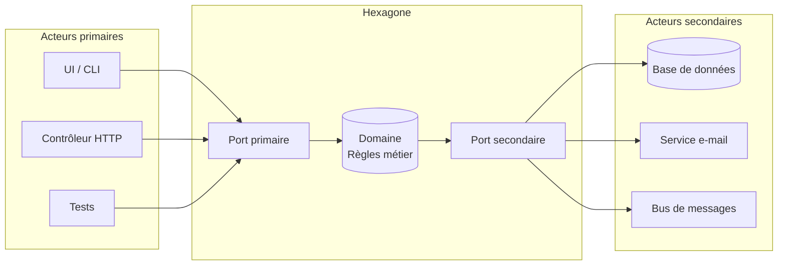
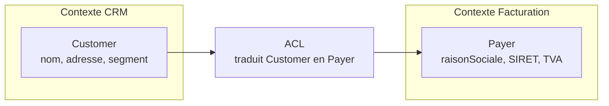
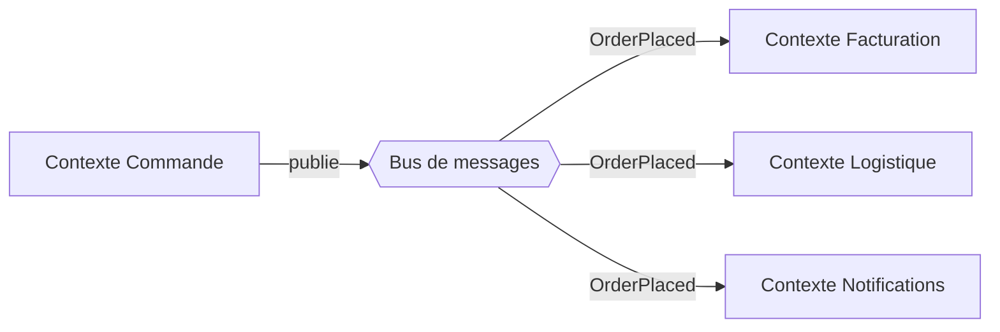
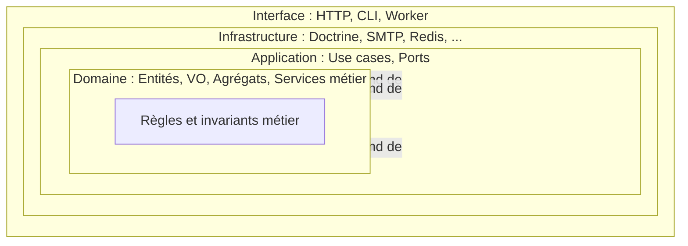
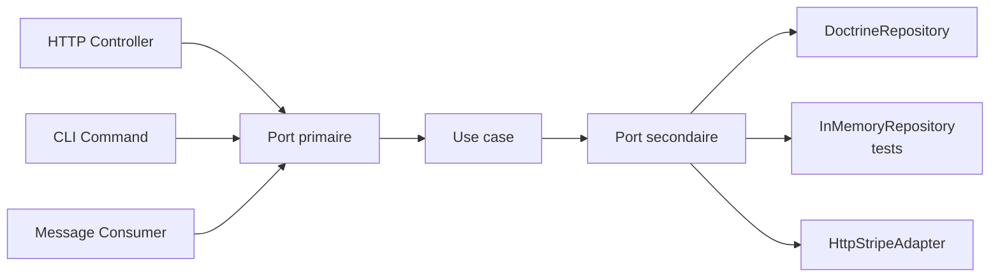
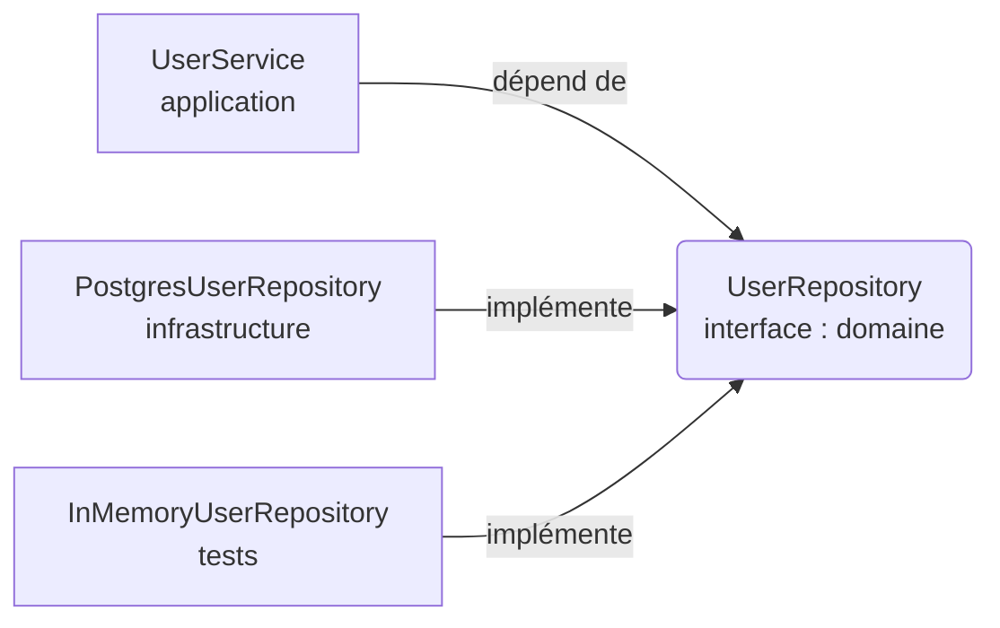
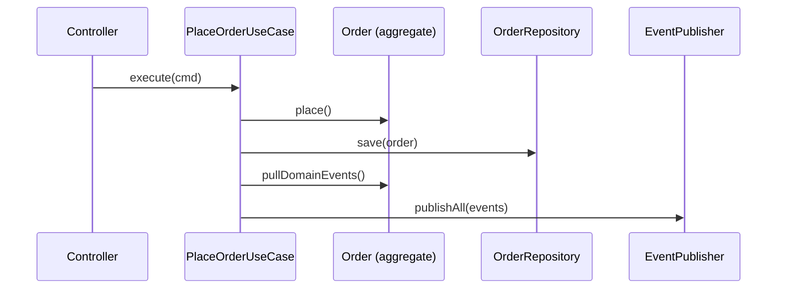
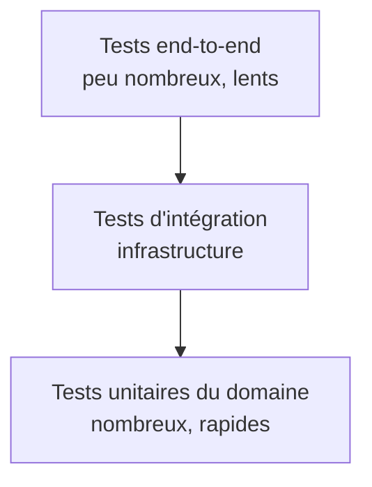

# [Tansoftware](https://www.tansoftware.com) - Architecture hexagonale


Ce dépôt est un **cours** structuré sur l'**architecture hexagonale** (aussi appelée
*Ports & Adapters*), formalisée par Alistair Cockburn en 2005, enrichi des notions de
**Domain-Driven Design (DDD)** qui en sont les compagnons naturels. L'objectif est de
fournir une référence pédagogique complète, illustrée par des diagrammes et des exemples
de code en **Python** et en **PHP/Symfony**, à destination des développeurs qui
souhaitent découpler leur **logique métier** des **détails techniques**.

> **Comment lire ce cours.** Les sections sont volontairement progressives. Chaque terme
> technique est défini dans un encadré `> **Définition.**` à sa première apparition, puis
> repris dans le glossaire. Les exemples Python servent à comprendre les idées sans bruit
> syntaxique ; les exemples PHP/Symfony montrent comment les transposer dans un framework
> de production réel.

---

## Table des matières

- [1. Introduction](#1-introduction)
- [2. Pourquoi l'hexagonal plutôt que le N-tier ?](#2-pourquoi-lhexagonal-plutôt-que-le-n-tier-)
- [3. Prérequis](#3-prérequis)
- [4. Glossaire](#4-glossaire)
- [5. Les fondations stratégiques : DDD et hexagonal](#5-les-fondations-stratégiques--ddd-et-hexagonal)
  - [5.1. Langage ubiquitaire](#51-langage-ubiquitaire)
  - [5.2. Bounded context (contexte borné)](#52-bounded-context-contexte-borné)
  - [5.3. Anti-corruption layer (ACL)](#53-anti-corruption-layer-acl)
  - [5.4. Communication entre bounded contexts](#54-communication-entre-bounded-contexts)
- [6. Les différentes couches](#6-les-différentes-couches)
  - [6.1. Le domaine](#61-le-domaine)
  - [6.2. L'application](#62-lapplication)
  - [6.3. L'infrastructure](#63-linfrastructure)
  - [6.4. L'interface (interface utilisateur / livraison)](#64-linterface-interface-utilisateur--livraison)
- [7. Ports et adaptateurs](#7-ports-et-adaptateurs)
  - [7.1. Ports primaires (driving)](#71-ports-primaires-driving)
  - [7.2. Ports secondaires (driven)](#72-ports-secondaires-driven)
  - [7.3. Adaptateurs](#73-adaptateurs)
- [8. L'inversion de dépendance](#8-linversion-de-dépendance)
- [9. Modélisation tactique : agrégats, entités, value objects](#9-modélisation-tactique--agrégats-entités-value-objects)
  - [9.1. Entité](#91-entité)
  - [9.2. Value object](#92-value-object)
  - [9.3. Aggregate root (racine d'agrégat)](#93-aggregate-root-racine-dagrégat)
  - [9.4. Services de domaine vs services applicatifs](#94-services-de-domaine-vs-services-applicatifs)
- [10. Le pattern Repository](#10-le-pattern-repository)
- [11. Événements de domaine et communication asynchrone](#11-événements-de-domaine-et-communication-asynchrone)
- [12. Bénéfices en testabilité (TDD)](#12-bénéfices-en-testabilité-tdd)
- [13. Exemple complet en Python](#13-exemple-complet-en-python)
- [14. Symfony en hexagonal : exemple complet](#14-symfony-en-hexagonal--exemple-complet)
  - [14.1. Mapping conceptuel](#141-mapping-conceptuel)
  - [14.2. Arborescence proposée](#142-arborescence-proposée)
  - [14.3. Le domaine en POPO](#143-le-domaine-en-popo)
  - [14.4. Les ports applicatifs](#144-les-ports-applicatifs)
  - [14.5. Le use case applicatif](#145-le-use-case-applicatif)
  - [14.6. L'adaptateur secondaire Doctrine](#146-ladaptateur-secondaire-doctrine)
  - [14.7. L'adaptateur primaire HTTP](#147-ladaptateur-primaire-http)
  - [14.8. Le conteneur de services Symfony](#148-le-conteneur-de-services-symfony)
  - [14.9. Tests](#149-tests)
- [15. Anti-patterns et pièges courants](#15-anti-patterns-et-pièges-courants)
- [16. Quand ne PAS utiliser l'hexagonal ?](#16-quand-ne-pas-utiliser-lhexagonal-)
- [17. Pour aller plus loin](#17-pour-aller-plus-loin)
- [18. Auteur](#18-auteur)
- [19. Licence](#19-licence)

---

## 1. Introduction

L'**architecture hexagonale** est un style d'architecture logicielle qui vise à découpler la
**logique métier** des **détails techniques** (persistance, interface utilisateur, services
externes, frameworks).

> **Définition. Logique métier (business logic).** Ensemble des règles, invariants et
> processus qui décrivent *le problème que résout l'application*, indépendamment de la
> manière dont elle est livrée à l'utilisateur ou stockée sur disque. Exemple : « une
> commande ne peut pas être expédiée si elle n'a pas été payée ».

> **Définition. Détails techniques.** Choix d'implémentation qui peuvent changer sans que
> le problème métier ne change : le moteur de base de données (PostgreSQL, MongoDB), le
> protocole de transport (HTTP, gRPC), le framework (Symfony, Laravel), le format de
> sérialisation (JSON, XML).

Au cœur de l'hexagone se trouve le **domaine**, qui contient les règles métier et les cas
d'utilisation. Il est entouré de **ports**, qui définissent les contrats d'interaction avec le
monde extérieur, et d'**adaptateurs**, qui implémentent ces contrats.

> **Définition. Port.** Une *interface* (au sens orienté objet du terme) appartenant à
> l'application et qui décrit, dans le vocabulaire du domaine, **un échange** avec
> l'extérieur. Un port n'est jamais une classe concrète ; c'est un contrat.

> **Définition. Adaptateur.** Une *implémentation concrète* d'un port. C'est l'adaptateur
> qui sait parler à PostgreSQL, à HTTP ou à un broker AMQP. Le domaine, lui, ne voit que
> le port.



Le sens des flèches illustre la **règle d'or** de l'hexagonal : les dépendances pointent
toujours **vers l'intérieur**, c'est-à-dire **vers le domaine**, jamais l'inverse. Le
domaine ignore tout du reste du monde — c'est précisément ce qui le rend stable, testable
et durable.

[Retour en haut](#table-des-matières)

---

## 2. Pourquoi l'hexagonal plutôt que le N-tier ?

L'architecture **N-tier** classique (présentation → métier → données) est simple à
comprendre, mais elle souffre de plusieurs limites structurelles.

> **Définition. Architecture N-tier.** Style d'architecture qui empile des couches en
> cascade : la présentation appelle le métier, qui appelle la persistance. Le défaut
> central : la couche métier *connaît* la couche persistance et hérite donc de ses
> contraintes (modèle relationnel, types SQL, exceptions JDBC/PDO, etc.).

| Aspect | N-tier classique | Hexagonal |
|---|---|---|
| Sens des dépendances | Métier dépend de la base de données | Tout dépend du métier |
| Testabilité du domaine | Nécessite mocks de la DB ou DB en mémoire | Tests purs, sans I/O |
| Remplacement d'un adaptateur (ex. SQL → MongoDB) | Coûteux, touche le métier | Isolé à un seul adaptateur |
| Indépendance du framework | Faible (souvent couplé à Spring/Symfony/Django) | Forte |
| Évolutivité | Bonne tant que la couche métier reste fine | Pensée pour absorber la complexité métier |
| Durée de vie typique du métier | Court à moyen terme | Long terme (plusieurs migrations techniques) |

En résumé : l'hexagonal protège votre **investissement métier** (la partie la plus durable de
votre code) contre la volatilité des choix techniques. Une application bien structurée doit
pouvoir survivre à un changement complet de framework ou de moteur de stockage **sans
réécrire son domaine**.

[Retour en haut](#table-des-matières)

---

## 3. Prérequis

Pour tirer pleinement profit de ce cours, il est utile (mais pas strictement nécessaire) de
connaître :

- les principes **SOLID**, en particulier le **D** — *Dependency Inversion Principle* (DIP) ;
- la notion d'**injection de dépendances** (DI) ;
- les bases de la **POO** : interfaces, abstractions, polymorphisme ;
- les concepts de base du **DDD** (entité, value object, agrégat) — utiles, mais
  introduits ici à mesure du besoin.

> **Définition. Injection de dépendances (DI, *Dependency Injection*).** Technique
> consistant à *fournir* à un objet ses collaborateurs (ses dépendances) depuis
> l'extérieur, plutôt que de les laisser les construire lui-même. Concrètement, on les
> reçoit dans le constructeur ou via un setter. Cela permet de remplacer une dépendance
> réelle par un double pour les tests.

> **Définition. SOLID.** Acronyme de cinq principes de conception orientée objet :
> *Single responsibility*, *Open-closed*, *Liskov substitution*, *Interface segregation*,
> *Dependency inversion*.

[Retour en haut](#table-des-matières)

---

## 4. Glossaire

| Terme | Définition |
|---|---|
| **Domaine** | Cœur de l'application contenant les règles métier, libre de toute dépendance technique. |
| **Port** | Interface (au sens POO) définie par l'application pour communiquer avec l'extérieur. |
| **Adaptateur** | Implémentation concrète d'un port, côté infrastructure ou présentation. |
| **Port primaire** *(driving)* | Définit ce que l'application **offre** (ex. `CreateUser`). Appelé par les acteurs primaires. |
| **Port secondaire** *(driven)* | Définit ce dont l'application **a besoin** (ex. `UserRepository`). Implémenté par l'infrastructure. |
| **Acteur primaire** | Élément qui *initie* une interaction (UI, contrôleur HTTP, CLI, test). |
| **Acteur secondaire** | Élément que l'application *pilote* (base de données, broker, service externe). |
| **Use case** | Cas d'utilisation applicatif qui orchestre le domaine pour répondre à un besoin métier. |
| **Service applicatif** | Synonyme de *use case* : orchestre le domaine, ne contient pas de règle métier. |
| **Service de domaine** | Logique métier qui ne tient pas dans une seule entité (ex. calcul de remise inter-comptes). |
| **Entité** | Objet métier identifié par un `id`, doté d'un cycle de vie. |
| **Value object** | Objet métier immuable, sans identité, comparé par valeur (ex. `Money`, `Email`). |
| **Aggregate root** | Entité qui sert de point d'entrée unique à un agrégat et garantit ses invariants. |
| **Agrégat** | Cluster d'entités/VO traités comme une seule unité de cohérence transactionnelle. |
| **Repository** | Port secondaire qui simule une *collection en mémoire* d'aggregate roots. |
| **DTO** | *Data Transfer Object* : structure plate, sans comportement, qui transporte des données entre couches. |
| **DIP** | *Dependency Inversion Principle* : les modules de haut niveau ne dépendent pas des modules de bas niveau ; les deux dépendent d'abstractions. |
| **POPO** | *Plain Old PHP Object* : classe PHP sans héritage de framework, ni annotation technique imposée. Équivalent du POJO en Java. |
| **Bounded context** | Frontière à l'intérieur de laquelle un terme du langage métier a un sens unique et non ambigu. |
| **Langage ubiquitaire** | Vocabulaire métier partagé entre experts, code et conversations, à l'intérieur d'un bounded context. |
| **Anti-corruption layer (ACL)** | Couche de traduction qui empêche le modèle d'un contexte de polluer celui d'un autre. |
| **Domain event** | Fait métier qui s'est produit (au passé : `OrderPlaced`, `PaymentCaptured`). |
| **Idempotence** | Propriété d'une opération qui produit le même résultat qu'elle soit appelée une ou plusieurs fois. |
| **Anémie** | Anti-pattern où les entités n'ont aucun comportement, juste des getters/setters. |

[Retour en haut](#table-des-matières)

---

## 5. Les fondations stratégiques : DDD et hexagonal

L'architecture hexagonale décrit *où mettre le code*. Le **Domain-Driven Design** (DDD)
décrit *comment modéliser le métier*. Les deux approches se complètent : l'hexagonal est
le squelette structurel, le DDD remplit son intérieur. Cette section introduit les notions
*stratégiques* du DDD qui rendent l'hexagonal pertinent à grande échelle.

### 5.1. Langage ubiquitaire

> **Définition. Langage ubiquitaire (*ubiquitous language*).** Vocabulaire commun, précis
> et stable, partagé entre les experts métier, les développeurs, la documentation et le
> code source à l'intérieur d'un même *bounded context*. Si un expert dit « commande »,
> le code contient une classe `Order`, pas `OrderEntityDto2`.

Concrètement, le langage ubiquitaire impose une discipline : **chaque terme du domaine a
un nom unique** et *ce nom apparaît tel quel dans le code*. Les noms des classes du
domaine, des méthodes, des événements et des use cases sont tirés directement des
discussions avec les experts. C'est ce qui permet au code de devenir un support de
conversation, et plus seulement un artefact technique.

À la frontière du domaine — c'est-à-dire au niveau des ports — le langage ubiquitaire est
*roi*. Un port n'a pas le droit d'utiliser un mot qui n'appartient pas au métier ;
inversement, l'adaptateur peut introduire son propre vocabulaire technique (`Row`,
`Document`, `Payload`) sans contaminer le domaine.

### 5.2. Bounded context (contexte borné)

> **Définition. Bounded context.** Frontière logique (souvent un module, un service, un
> dépôt) à l'intérieur de laquelle un terme du langage ubiquitaire a un sens unique. Un
> même mot — `Client`, `Produit`, `Facture` — peut signifier des choses très différentes
> dans deux contextes différents (commercial vs comptabilité).

Exemple :

- Dans le contexte **Catalogue**, un *Produit* a un titre, une description, des photos,
  des dimensions.
- Dans le contexte **Logistique**, un *Produit* est un objet à mettre dans un carton,
  caractérisé par un poids, un volume et une zone de stockage.
- Dans le contexte **Comptabilité**, un *Produit* est une ligne TVA avec un taux et un
  compte général.

Tenter de modéliser **un seul** `Product` qui réunit toutes ces facettes mène
inévitablement à une classe gigantesque, ambiguë, et impossible à faire évoluer. Le DDD
recommande de séparer les contextes et d'accepter que chaque contexte ait *sa propre*
définition du même mot.

L'hexagonal, lui, vit *à l'intérieur d'un* bounded context : chaque hexagone est
typiquement un contexte borné, avec son propre domaine, ses propres ports, ses propres
adaptateurs.

### 5.3. Anti-corruption layer (ACL)

> **Définition. Anti-corruption layer (ACL, couche anti-corruption).** Couche de
> traduction explicite placée à la frontière de deux bounded contexts (ou entre votre
> domaine et un système externe legacy), dont l'unique rôle est d'empêcher les concepts
> et les noms d'un côté de polluer l'autre côté.

Quand deux contextes doivent collaborer, ils ne se parlent **jamais** directement avec
leurs modèles internes. On insère une ACL qui *traduit* : elle prend les concepts du
contexte source et les exprime dans le vocabulaire du contexte destinataire.



L'ACL est typiquement implémentée comme un **adaptateur secondaire** dans l'hexagonal :
le contexte appelant définit un port (`PayerProvider`), et l'adaptateur traduit en
appelant l'API du CRM. Le domaine de la facturation ne voit jamais un `Customer` venu de
l'extérieur ; il ne voit que des `Payer` qu'il comprend.

Cas d'usage typiques d'une ACL :

- intégration avec un **legacy** dont le modèle est mal nommé ou mal taillé ;
- consommation d'une **API tierce** dont les noms ne sont pas les vôtres ;
- communication entre deux **bounded contexts** internes qui ont évolué de manière
  divergente.

### 5.4. Communication entre bounded contexts

Une fois posée la frontière, comment deux contextes échangent-ils ?

- **Synchrone** : le contexte A appelle un port secondaire (`PayerProvider`) ; un
  adaptateur appelle l'API HTTP/gRPC du contexte B. Simple à mettre en place, mais
  introduit un couplage de disponibilité (B doit répondre).
- **Asynchrone par événements de domaine** : le contexte A publie un *domain event*
  (`OrderPlaced`) sur un bus de messages ; le contexte B y souscrit et réagit. Découplage
  fort, mais introduit la complexité de la cohérence éventuelle (*eventual consistency*).

> **Définition. Cohérence éventuelle (*eventual consistency*).** Propriété d'un système
> distribué où, après une période de propagation, tous les contextes finissent par voir
> les mêmes données — mais à un instant `t`, deux contextes peuvent être temporairement
> désynchronisés.



Dans une architecture hexagonale, le **bus** est un port secondaire (`EventPublisher`) du
côté émetteur, et un adaptateur primaire (`EventListener`) du côté récepteur. Le domaine
ne sait rien de RabbitMQ, Kafka ou Symfony Messenger — il ne sait que produire un
événement dans son langage métier.

[Retour en haut](#table-des-matières)

---

## 6. Les différentes couches

L'architecture hexagonale s'organise généralement en couches concentriques. **Aucune
couche extérieure ne doit être connue par une couche intérieure.** C'est l'expression
géométrique de la règle de dépendance : *les flèches pointent toujours vers le centre*.



### 6.1. Le domaine

C'est le **cœur** de l'application. Il contient :

- les **entités** (objets identifiés par un `id` et dotés d'un cycle de vie) ;
- les **value objects** (immuables, comparés par valeur — ex. `Money`, `Email`) ;
- les **aggregate roots** (entités qui orchestrent un cluster d'objets cohérents) ;
- les **services de domaine** (logique qui ne *colle* pas à une entité unique) ;
- les **événements de domaine** (faits métier au passé, signalant une transition d'état) ;
- les **invariants** (règles toujours vraies, qu'aucune opération ne doit pouvoir violer).

> **Règle absolue.** Le domaine n'importe **rien** des couches extérieures : pas de SQL,
> pas de HTTP, pas de framework, pas de logger d'infrastructure, pas d'annotation ORM,
> pas de `Symfony\...`, pas de `Doctrine\ORM\Mapping\Column`. *Le seul code qu'on accepte
> dans le domaine est du code que l'on pourrait copier-coller dans un projet en console
> sans dépendance et qui s'exécuterait.*

Cette discipline est le test ultime : essayez de compiler ou d'exécuter votre dossier
`Domain/` sans aucune dépendance externe. S'il a besoin d'un framework, c'est qu'il n'est
pas pur.

### 6.2. L'application

Cette couche orchestre le domaine pour réaliser les **cas d'utilisation**. Elle contient :

- les **use cases** (un par scénario métier — ex. `RegisterUser`, `PlaceOrder`) ;
- les **interfaces de ports** (primaires et secondaires) ;
- les **DTO d'entrée/sortie** des use cases ;
- la **gestion transactionnelle** logique (le « tout ou rien » d'un cas d'utilisation).

Elle dépend du domaine, mais reste ignorante de l'infrastructure. **Un use case ne doit
jamais contenir de règle métier** ; il *orchestre* le domaine. La règle « un client
qui doit plus de 1000 € ne peut pas commander » appartient à l'entité `Customer`, pas au
use case `PlaceOrderUseCase`.

### 6.3. L'infrastructure

Couche externe qui implémente les ports secondaires :

- adaptateurs de **persistance** (SQL via Doctrine/PDO, NoSQL, fichier) ;
- adaptateurs de **services externes** (SMTP, S3, Stripe, etc.) ;
- adaptateurs d'**horloge**, de **génération d'identifiants**, de **chiffrement** ;
- configuration, **injection de dépendances**, démarrage de l'application ;
- **mappers** entre entités du domaine et représentations techniques (lignes SQL, JSON).

### 6.4. L'interface (interface utilisateur / livraison)

Certaines variantes (notamment la *Clean Architecture* de Robert C. Martin) séparent
l'**interface** (ou *delivery mechanism*) de l'infrastructure :

- adaptateurs de **transport entrant** : contrôleurs REST, GraphQL, CLI, gRPC, consumers
  AMQP ;
- vues, sérialisation, formats de réponse, codes HTTP.

Dans la pratique Symfony, on regroupe souvent infrastructure et interface ; mais
conceptuellement, distinguer « ce qui pilote le domaine » (interface) de « ce que le
domaine pilote » (infrastructure) clarifie la conception.

[Retour en haut](#table-des-matières)

---

## 7. Ports et adaptateurs

### 7.1. Ports primaires *(driving)*

Ils définissent **ce que fait** l'application : les commandes et requêtes exposées à
l'extérieur. Exemples : `RegisterUserUseCase`, `GetOrderQuery`. Un port primaire est
typiquement implémenté par un *use case*, et invoqué par un *adaptateur primaire* (un
contrôleur HTTP, par exemple).

> **Convention CQRS utile.** On distingue souvent les *commands* (qui modifient l'état :
> `PlaceOrder`) des *queries* (qui lisent : `GetOrderById`). Cette séparation, issue du
> *Command Query Responsibility Segregation*, n'est pas obligatoire en hexagonal mais
> clarifie souvent la conception.

### 7.2. Ports secondaires *(driven)*

Ils définissent **ce dont l'application a besoin** : persistance, notifications, horloge,
identifiants… Exemples : `UserRepository`, `EmailNotifier`, `Clock`, `IdGenerator`.

Le piège classique est de concevoir un port secondaire **depuis l'implémentation**
(« j'ai besoin de Doctrine, donc je crée un `DoctrineUserRepository` ») au lieu de le
concevoir **depuis le besoin du domaine** (« le domaine a besoin de retrouver un
utilisateur par e-mail, donc le port a une méthode `findByEmail` »). Le port doit avoir
*le vocabulaire du domaine*, jamais celui de la technologie sous-jacente.

### 7.3. Adaptateurs

Les adaptateurs *adaptent* les technologies externes aux ports.

- **Adaptateurs primaires** : reçoivent une requête externe (HTTP, CLI, message) et
  appellent un port primaire après conversion des données. Exemple : `UserController`
  REST → `RegisterUserUseCase`.
- **Adaptateurs secondaires** : implémentent un port secondaire en utilisant une
  technologie concrète. Exemple : `DoctrineUserRepository`, `SymfonyMailerNotifier`,
  `SystemClock`.



Un point souvent mal compris : **un même port peut avoir plusieurs adaptateurs en
parallèle**. C'est précisément ce qui rend les tests faciles (`InMemoryRepository`) et
les changements de fournisseur indolores (`StripeAdapter` vs `PaypalAdapter` derrière un
même `PaymentGateway`).

[Retour en haut](#table-des-matières)

---

## 8. L'inversion de dépendance

Le **DIP** (*Dependency Inversion Principle*) est le pilier qui rend l'hexagonal possible.
Sans inversion, le domaine finirait par dépendre de la base de données ; avec inversion,
c'est l'infrastructure qui dépend du domaine.

> **Définition. Dependency Inversion Principle (DIP).** *Les modules de haut niveau ne
> doivent pas dépendre des modules de bas niveau. Les deux doivent dépendre
> d'abstractions. Les abstractions ne doivent pas dépendre des détails ; les détails
> doivent dépendre des abstractions.* (Robert C. Martin)

Concrètement, en hexagonal, **l'abstraction (le port) appartient au domaine** ;
l'implémentation (l'adaptateur) appartient à l'infrastructure et **dépend** du domaine
(elle implémente *son* interface). C'est ce renversement qui inverse la flèche
traditionnelle « métier → DB » en « DB → métier ».

**Exemple sans DIP :**

```python
# UserService dépend directement d'une implémentation SQL : couplage fort.
class UserService:
    def __init__(self):
        self.repo = PostgresUserRepository()  # couplage en dur
```

Problème : `UserService` ne peut être testé qu'avec une vraie base PostgreSQL, et un
changement de moteur de stockage casse `UserService`.

**Exemple avec DIP :**

```python
# UserService dépend d'une abstraction : couplage faible.
class UserService:
    def __init__(self, repo: UserRepository):  # UserRepository = interface
        self.repo = repo
```

Schématiquement :



L'avantage : la classe `UserService` peut être testée avec un repository en mémoire et
déployée avec un repository Postgres, **sans qu'aucune ligne de son code ne change**.
C'est cette propriété qui justifie tout le reste de l'architecture.

[Retour en haut](#table-des-matières)

---

## 9. Modélisation tactique : agrégats, entités, value objects

L'hexagonal dit *où* mettre les choses ; le DDD dit *quelles* choses mettre. Voici le
vocabulaire tactique minimal pour modéliser un domaine riche.

### 9.1. Entité

> **Définition. Entité.** Objet métier doté d'une **identité unique et stable** (souvent
> un UUID), dont l'identité est conservée tout au long de son cycle de vie même si ses
> attributs changent. Un client `#42` reste `#42` même s'il change de nom.

Caractéristiques :

- comparaison par **identité**, jamais par valeur ;
- méthodes qui *font évoluer son état* tout en garantissant ses **invariants** ;
- jamais d'`setX($x)` aveugle : on préfère des méthodes métier (`renameTo`,
  `changeAddress`, `markAsVip`).

### 9.2. Value object

> **Définition. Value object (VO).** Objet métier **immuable**, sans identité, comparé
> *par valeur*. Deux `Money(10, "EUR")` sont strictement interchangeables. Un VO
> représente une *quantité* ou une *qualité*, pas une *chose*.

Avantages des VO :

- ils **portent des invariants locaux** (`Email` ne peut pas exister s'il est mal formé) ;
- ils **rendent le code typé** : une signature `transfer(Money amount)` est plus claire
  que `transfer(float amount)` ;
- ils **éliminent les bugs de conversion** : on n'additionne pas un `Money(EUR)` et un
  `Money(USD)` par accident.

Règle pratique : *si vous hésitez entre une primitive et un VO, prenez le VO*.

### 9.3. Aggregate root (racine d'agrégat)

> **Définition. Agrégat.** Cluster d'entités et de VO étroitement liés que l'on traite
> comme **une seule unité de cohérence transactionnelle**. Toute modification doit
> traverser la **racine** de l'agrégat (*aggregate root*), qui en garantit les invariants.

Exemple : un agrégat `Order` contient une racine `Order` et des `OrderLine` enfants. On
ne modifie **jamais** une `OrderLine` directement depuis l'extérieur ; on appelle
`order.addLine(...)`, `order.removeLine(...)`. La racine vérifie alors que la commande
est encore modifiable, que la ligne est valide, que le total est cohérent.

Trois règles de conception :

1. **Une seule racine** par agrégat. Les entités enfants sont *internes* à l'agrégat.
2. **Les références entre agrégats se font par identifiant**, jamais par référence
   d'objet. Un `Order` ne référence pas un objet `Customer` complet, il garde un
   `customerId`.
3. **Un repository par aggregate root**, pas un par entité. On ne *persiste* pas une
   `OrderLine` toute seule ; on persiste l'`Order` entier.

### 9.4. Services de domaine vs services applicatifs

Distinction souvent floue mais essentielle :

> **Définition. Service de domaine.** Logique métier qui **ne tient pas naturellement
> dans une seule entité ou VO**, parce qu'elle implique plusieurs agrégats ou parce
> qu'elle représente un calcul abstrait. Vit dans la couche **domaine**. Exemple :
> `TransferService` qui débite un compte et crédite un autre.

> **Définition. Service applicatif (use case).** Coordonne **les étapes techniques** d'un
> cas d'utilisation : lit depuis un repository, appelle le domaine, persiste, publie un
> événement. Vit dans la couche **application**. Ne contient pas de règle métier.

Test simple pour les distinguer :

- *Si on enlevait le service, perdrait-on une règle métier ?* → service de domaine.
- *Si on enlevait le service, perdrait-on de l'orchestration technique ?* → service
  applicatif.

Un service applicatif peut appeler un service de domaine ; l'inverse est interdit.

[Retour en haut](#table-des-matières)

---

## 10. Le pattern Repository

> **Définition. Repository.** Port secondaire qui présente au domaine une **collection
> en mémoire d'aggregate roots** : on `add`, on `get`, on `find`, on `remove`. Le
> repository ne révèle **aucun** détail de stockage : pas de `SELECT`, pas de `JOIN`, pas
> de `find_by_id_with_lock_for_update_recursive`.

Le repository est probablement le port le plus mal implémenté en pratique. Voici les
règles que l'expert applique :

1. **Un repository par aggregate root.** Pas un par table SQL, pas un par entité enfant.
2. **Le contrat est dans le domaine**, l'implémentation dans l'infrastructure.
3. **Le vocabulaire est métier** : `findActiveCustomersWithOverduePayment()`, pas
   `findByStatusAndDateLessThan(int $status, DateTime $d)`.
4. **Pas de fuite ORM** : la signature ne mentionne ni `QueryBuilder`, ni `EntityManager`,
   ni `Criteria`, ni `Doctrine\Collections`.
5. **Renvoie des aggregate roots reconstitués**, pas des `array` ou des `stdClass`.
6. **Pas de pagination générique** dans le port — sauf si la pagination est un concept
   métier (ce qui est rare).

> **Anti-pattern : repository fourre-tout.** Méthode `findBy(array $criteria)` qui
> accepte n'importe quoi. C'est l'API d'un ORM, pas d'un repository de domaine. Les
> appelants finissent par dupliquer la logique de critères partout, et le port devient
> une fuite de l'ORM.

```php
// MAUVAIS : signature qui fuit l'ORM
interface OrderRepositoryInterface
{
    public function findBy(array $criteria, ?array $orderBy = null): array;
}

// BON : signature dans le langage métier
interface OrderRepositoryInterface
{
    public function findById(OrderId $id): ?Order;
    public function findUnpaidOrdersOlderThan(\DateTimeImmutable $threshold): iterable;
    public function save(Order $order): void;
}
```

[Retour en haut](#table-des-matières)

---

## 11. Événements de domaine et communication asynchrone

> **Définition. Domain event (événement de domaine).** Objet immuable qui représente
> **un fait métier qui s'est produit**, nommé au passé : `OrderPlaced`, `PaymentCaptured`,
> `CustomerUpgradedToVip`. Il porte les données minimales nécessaires pour que d'autres
> parties du système puissent réagir.

Un événement de domaine est *produit* par une entité ou un agrégat à l'occasion d'une
transition d'état :

```php
final class Order
{
    /** @var DomainEvent[] */
    private array $recordedEvents = [];

    public function place(): void
    {
        if ($this->status !== OrderStatus::Draft) {
            throw new DomainException('Order already placed');
        }
        $this->status = OrderStatus::Placed;
        $this->recordedEvents[] = new OrderPlaced($this->id, $this->total);
    }

    /** @return DomainEvent[] */
    public function pullDomainEvents(): array
    {
        $events = $this->recordedEvents;
        $this->recordedEvents = [];
        return $events;
    }
}
```

Le **service applicatif** récupère les événements après l'opération métier et les publie
via un port `EventPublisher`. Un adaptateur (Symfony Messenger, RabbitMQ, Kafka) les
distribue ensuite aux consommateurs.



Avantages de ce pattern :

- **découplage temporel** : les autres contextes réagissent quand ils peuvent ;
- **historicité** : chaque événement est un fait du passé, traçable et rejouable ;
- **extensibilité** : ajouter un nouveau consommateur n'impacte pas le producteur.

[Retour en haut](#table-des-matières)

---

## 12. Bénéfices en testabilité (TDD)

L'hexagonal n'impose pas le **TDD** (*Test-Driven Development*), mais les deux se
renforcent mutuellement :

- le **domaine** est testé par des tests unitaires purs (pas d'I/O, pas de mock de
  framework, exécution en millisecondes) ;
- l'**application** est testée avec des doubles en mémoire pour les ports secondaires ;
- l'**infrastructure** est testée par des tests d'intégration (DB réelle, HTTP réel) ;
- l'ensemble est validé par quelques tests **end-to-end**, peu nombreux et lents.

> **Définition. Double de test.** Objet qui *remplace* une dépendance réelle dans un
> test : *fake* (implémentation simplifiée), *stub* (renvoie des valeurs prédéfinies),
> *mock* (vérifie qu'une méthode a bien été appelée), *spy* (enregistre les appels).

Pyramide de tests typique :



Un domaine bien isolé permet de viser une couverture proche de 100 % avec des tests qui
s'exécutent en quelques millisecondes, sans dépendance externe — donc reproductibles à
l'identique sur n'importe quelle machine, à n'importe quel moment.

[Retour en haut](#table-des-matières)

---

## 13. Exemple complet en Python

Voici un mini-domaine de **gestion de tâches** illustrant les trois couches. Le code est
auto-contenu et exécutable. La version PHP/Symfony équivalente est donnée
[à la section 14](#14-symfony-en-hexagonal--exemple-complet).

### 13.1. Domaine

```python
# domain/task.py
from dataclasses import dataclass, field
from datetime import date
from enum import Enum
from uuid import UUID, uuid4


class Priority(str, Enum):
    LOW = "low"
    MEDIUM = "medium"
    HIGH = "high"


@dataclass
class Task:
    title: str
    due_date: date
    priority: Priority = Priority.MEDIUM
    done: bool = False
    id: UUID = field(default_factory=uuid4)

    def mark_done(self) -> None:
        if self.done:
            raise ValueError("Tâche déjà terminée")
        self.done = True

    def is_overdue(self, today: date) -> bool:
        return not self.done and today > self.due_date
```

### 13.2. Ports (application)

```python
# application/ports.py
from abc import ABC, abstractmethod
from typing import Iterable
from uuid import UUID

from domain.task import Task


class TaskRepository(ABC):  # Port secondaire
    @abstractmethod
    def add(self, task: Task) -> None: ...

    @abstractmethod
    def get(self, task_id: UUID) -> Task: ...

    @abstractmethod
    def list_all(self) -> Iterable[Task]: ...
```

### 13.3. Use case (application)

```python
# application/use_cases.py
from dataclasses import dataclass
from datetime import date
from uuid import UUID

from application.ports import TaskRepository
from domain.task import Priority, Task


@dataclass
class CreateTaskUseCase:  # Port primaire
    repo: TaskRepository

    def execute(self, title: str, due_date: date, priority: Priority) -> UUID:
        task = Task(title=title, due_date=due_date, priority=priority)
        self.repo.add(task)
        return task.id


@dataclass
class CompleteTaskUseCase:
    repo: TaskRepository

    def execute(self, task_id: UUID) -> None:
        task = self.repo.get(task_id)
        task.mark_done()
        self.repo.add(task)  # idempotent : même id
```

### 13.4. Adaptateur secondaire (infrastructure)

```python
# infrastructure/in_memory_repository.py
from typing import Dict
from uuid import UUID

from application.ports import TaskRepository
from domain.task import Task


class InMemoryTaskRepository(TaskRepository):
    def __init__(self) -> None:
        self._store: Dict[UUID, Task] = {}

    def add(self, task: Task) -> None:
        self._store[task.id] = task

    def get(self, task_id: UUID) -> Task:
        if task_id not in self._store:
            raise KeyError(f"Tâche introuvable : {task_id}")
        return self._store[task_id]

    def list_all(self):
        return list(self._store.values())
```

### 13.5. Adaptateur primaire et composition (infrastructure)

```python
# infrastructure/cli.py
from datetime import date

from application.use_cases import CompleteTaskUseCase, CreateTaskUseCase
from domain.task import Priority
from infrastructure.in_memory_repository import InMemoryTaskRepository


def main() -> None:
    repo = InMemoryTaskRepository()
    create = CreateTaskUseCase(repo)
    complete = CompleteTaskUseCase(repo)

    task_id = create.execute(
        title="Rédiger le mémo hexagonal",
        due_date=date(2026, 12, 31),
        priority=Priority.HIGH,
    )
    complete.execute(task_id)

    for task in repo.list_all():
        print(f"{task.title} -> done={task.done}")


if __name__ == "__main__":
    main()
```

### 13.6. Test unitaire pur

```python
# tests/test_task.py
from datetime import date

import pytest

from domain.task import Priority, Task


def test_mark_done_passes_a_task_to_done():
    task = Task(title="t", due_date=date(2026, 1, 1), priority=Priority.LOW)
    task.mark_done()
    assert task.done is True


def test_mark_done_twice_raises():
    task = Task(title="t", due_date=date(2026, 1, 1))
    task.mark_done()
    with pytest.raises(ValueError):
        task.mark_done()


def test_is_overdue():
    task = Task(title="t", due_date=date(2026, 1, 1))
    assert task.is_overdue(date(2026, 6, 1)) is True
    assert task.is_overdue(date(2025, 12, 1)) is False
```

Aucun de ces tests n'a besoin d'une base de données, d'un serveur HTTP ou d'un framework :
c'est l'objectif principal de l'architecture hexagonale.

[Retour en haut](#table-des-matières)

---

## 14. Symfony en hexagonal : exemple complet

Symfony est un framework PHP qui se prête très bien à une organisation hexagonale, à
condition de **résister à la tentation** de tout coller dans des `Bundle`/`Service`/
`Controller` couplés à Doctrine. Cette section reprend le mini-domaine de gestion de
tâches et le décline en PHP 8.2+ / Symfony 7.

### 14.1. Mapping conceptuel

| Élément Symfony | Couche hexagonale | Rôle |
|---|---|---|
| `Controller` | Adaptateur primaire (HTTP) | Reçoit la requête, valide, appelle un use case, sérialise la réponse |
| `Console\Command` | Adaptateur primaire (CLI) | Lance un use case depuis la ligne de commande |
| `Messenger Handler` | Adaptateur primaire (message) | Réagit à un message asynchrone en appelant un use case |
| `Doctrine\Repository` étendu | Adaptateur secondaire (persistance) | Implémente un port de domaine `XxxRepositoryInterface` |
| `Symfony\Mailer` | Adaptateur secondaire (e-mail) | Implémente un port `EmailNotifierInterface` |
| `services.yaml` | Composition / câblage | Lie chaque interface du domaine à son adaptateur |
| Use case (classe `*UseCase`) | Couche application | Orchestre le domaine |
| Entité POPO | Couche domaine | Règles et invariants métier |
| Mapper Doctrine ↔ POPO | Infrastructure | Traduit la POPO en entité ORM et inversement |

> **Définition. Conteneur de services Symfony.** Composant Symfony qui *construit* tous
> les services de l'application en injectant automatiquement leurs dépendances
> (*autowiring*). Il lit la configuration (`services.yaml`, attributs PHP, *compiler
> passes*), résout le graphe et instancie chaque service au moment où il est demandé.

> **Définition. Autowiring.** Mécanisme par lequel le conteneur Symfony, à partir des
> *types* déclarés dans le constructeur d'une classe, retrouve automatiquement le service
> correspondant et l'injecte. Pour qu'il sache *quelle* implémentation injecter quand le
> type est une interface, il faut un **alias** dans `services.yaml`.

### 14.2. Arborescence proposée

```
src/
  TaskManagement/                    # Bounded context "Gestion de tâches"
    Domain/
      Model/
        Task.php
        TaskId.php
        Priority.php
      Event/
        TaskCompleted.php
      Repository/
        TaskRepositoryInterface.php
    Application/
      UseCase/
        CreateTask/
          CreateTaskCommand.php
          CreateTaskUseCase.php
        CompleteTask/
          CompleteTaskCommand.php
          CompleteTaskUseCase.php
      Port/
        ClockInterface.php
    Infrastructure/
      Persistence/
        Doctrine/
          DoctrineTaskRepository.php
          TaskMapper.php
          TaskOrmEntity.php       # entité Doctrine, séparée de la POPO du domaine
      Clock/
        SystemClock.php
    UserInterface/
      Http/
        TaskController.php
      Cli/
        CreateTaskCommand.php     # adaptateur Console
```

Chaque bounded context a son propre quadruplet `Domain / Application / Infrastructure /
UserInterface`. Cette arborescence rend la frontière hexagonale **visible à l'œil nu**.

### 14.3. Le domaine en POPO

```php
<?php
// src/TaskManagement/Domain/Model/TaskId.php
declare(strict_types=1);

namespace App\TaskManagement\Domain\Model;

use Symfony\Component\Uid\Uuid;

final class TaskId
{
    public function __construct(public readonly string $value)
    {
        if (!Uuid::isValid($value)) {
            throw new \InvalidArgumentException('TaskId must be a valid UUID');
        }
    }

    public static function generate(): self
    {
        return new self((string) Uuid::v4());
    }

    public function equals(self $other): bool
    {
        return $this->value === $other->value;
    }
}
```

> **Tolérance pratique.** Le composant `symfony/uid` est une bibliothèque utilitaire,
> pas un framework. La règle « zéro Symfony dans le domaine » s'entend pour les
> *frameworks* (HTTP, ORM, DI). Importer un VO d'UUID est admissible si l'équipe en
> assume le précédent.

```php
<?php
// src/TaskManagement/Domain/Model/Priority.php
declare(strict_types=1);

namespace App\TaskManagement\Domain\Model;

enum Priority: string
{
    case Low = 'low';
    case Medium = 'medium';
    case High = 'high';
}
```

```php
<?php
// src/TaskManagement/Domain/Model/Task.php
declare(strict_types=1);

namespace App\TaskManagement\Domain\Model;

use App\TaskManagement\Domain\Event\TaskCompleted;

final class Task
{
    /** @var object[] */
    private array $recordedEvents = [];

    public function __construct(
        public readonly TaskId $id,
        private string $title,
        private \DateTimeImmutable $dueDate,
        private Priority $priority,
        private bool $done = false,
    ) {
        if ($title === '') {
            throw new \DomainException('Title cannot be empty');
        }
    }

    public static function create(
        string $title,
        \DateTimeImmutable $dueDate,
        Priority $priority,
    ): self {
        return new self(TaskId::generate(), $title, $dueDate, $priority);
    }

    public function markDone(\DateTimeImmutable $now): void
    {
        if ($this->done) {
            throw new \DomainException('Task already completed');
        }
        $this->done = true;
        $this->recordedEvents[] = new TaskCompleted($this->id, $now);
    }

    public function isOverdue(\DateTimeImmutable $today): bool
    {
        return !$this->done && $today > $this->dueDate;
    }

    /** @return object[] */
    public function pullDomainEvents(): array
    {
        $events = $this->recordedEvents;
        $this->recordedEvents = [];
        return $events;
    }

    // Getters lecture seule pour la couche infrastructure
    public function title(): string { return $this->title; }
    public function dueDate(): \DateTimeImmutable { return $this->dueDate; }
    public function priority(): Priority { return $this->priority; }
    public function isDone(): bool { return $this->done; }
}
```

Notez :

- aucune annotation Doctrine, aucune dépendance HTTP ;
- les invariants sont **dans** le constructeur et dans `markDone` ;
- les événements de domaine sont *enregistrés* mais non *publiés* ; c'est le use case
  qui se charge de les transmettre au bus.

### 14.4. Les ports applicatifs

```php
<?php
// src/TaskManagement/Domain/Repository/TaskRepositoryInterface.php
declare(strict_types=1);

namespace App\TaskManagement\Domain\Repository;

use App\TaskManagement\Domain\Model\Task;
use App\TaskManagement\Domain\Model\TaskId;

interface TaskRepositoryInterface
{
    public function save(Task $task): void;

    public function get(TaskId $id): Task;

    /** @return iterable<Task> */
    public function listAll(): iterable;
}
```

```php
<?php
// src/TaskManagement/Application/Port/ClockInterface.php
declare(strict_types=1);

namespace App\TaskManagement\Application\Port;

interface ClockInterface
{
    public function now(): \DateTimeImmutable;
}
```

> **Pourquoi un port `Clock` ?** Pour que `markDone` reçoive *l'heure* depuis l'extérieur
> au lieu d'appeler `new \DateTimeImmutable()` lui-même. Cela rend le domaine
> *déterministe* et testable (on injecte une horloge fixe dans les tests).

### 14.5. Le use case applicatif

```php
<?php
// src/TaskManagement/Application/UseCase/CompleteTask/CompleteTaskCommand.php
declare(strict_types=1);

namespace App\TaskManagement\Application\UseCase\CompleteTask;

final readonly class CompleteTaskCommand
{
    public function __construct(public string $taskId) {}
}
```

```php
<?php
// src/TaskManagement/Application/UseCase/CompleteTask/CompleteTaskUseCase.php
declare(strict_types=1);

namespace App\TaskManagement\Application\UseCase\CompleteTask;

use App\TaskManagement\Application\Port\ClockInterface;
use App\TaskManagement\Domain\Model\TaskId;
use App\TaskManagement\Domain\Repository\TaskRepositoryInterface;
use Symfony\Component\Messenger\MessageBusInterface;

final class CompleteTaskUseCase
{
    public function __construct(
        private TaskRepositoryInterface $tasks,
        private ClockInterface $clock,
        private MessageBusInterface $eventBus,
    ) {}

    public function __invoke(CompleteTaskCommand $cmd): void
    {
        $task = $this->tasks->get(new TaskId($cmd->taskId));
        $task->markDone($this->clock->now());
        $this->tasks->save($task);

        foreach ($task->pullDomainEvents() as $event) {
            $this->eventBus->dispatch($event);
        }
    }
}
```

> **Note.** `MessageBusInterface` est ici importé directement de Symfony pour la lisibilité.
> Une version plus pure définirait un port `EventPublisherInterface` dans
> `Application/Port/` et un adaptateur `MessengerEventPublisher` dans `Infrastructure/`.
> C'est un arbitrage : pureté maximale (port dédié) vs pragmatisme (Symfony Messenger
> est déjà un bus stable et bien isolé). Choisissez selon le ratio coût/bénéfice de votre
> contexte.

### 14.6. L'adaptateur secondaire Doctrine

Pour respecter la règle « domaine sans annotation ORM », on sépare l'**entité du domaine**
(`Task`, POPO) de l'**entité Doctrine** (`TaskOrmEntity`, annotée pour l'ORM). Un
*mapper* fait la traduction.

```php
<?php
// src/TaskManagement/Infrastructure/Persistence/Doctrine/TaskOrmEntity.php
declare(strict_types=1);

namespace App\TaskManagement\Infrastructure\Persistence\Doctrine;

use Doctrine\ORM\Mapping as ORM;

#[ORM\Entity]
#[ORM\Table(name: 'task')]
class TaskOrmEntity
{
    #[ORM\Id]
    #[ORM\Column(type: 'uuid')]
    public string $id;

    #[ORM\Column(type: 'string', length: 255)]
    public string $title;

    #[ORM\Column(type: 'datetime_immutable')]
    public \DateTimeImmutable $dueDate;

    #[ORM\Column(type: 'string', length: 16)]
    public string $priority;

    #[ORM\Column(type: 'boolean')]
    public bool $done;
}
```

```php
<?php
// src/TaskManagement/Infrastructure/Persistence/Doctrine/TaskMapper.php
declare(strict_types=1);

namespace App\TaskManagement\Infrastructure\Persistence\Doctrine;

use App\TaskManagement\Domain\Model\Priority;
use App\TaskManagement\Domain\Model\Task;
use App\TaskManagement\Domain\Model\TaskId;

final class TaskMapper
{
    public function toOrm(Task $task): TaskOrmEntity
    {
        $orm = new TaskOrmEntity();
        $orm->id = $task->id->value;
        $orm->title = $task->title();
        $orm->dueDate = $task->dueDate();
        $orm->priority = $task->priority()->value;
        $orm->done = $task->isDone();
        return $orm;
    }

    public function toDomain(TaskOrmEntity $orm): Task
    {
        return new Task(
            new TaskId($orm->id),
            $orm->title,
            $orm->dueDate,
            Priority::from($orm->priority),
            $orm->done,
        );
    }
}
```

```php
<?php
// src/TaskManagement/Infrastructure/Persistence/Doctrine/DoctrineTaskRepository.php
declare(strict_types=1);

namespace App\TaskManagement\Infrastructure\Persistence\Doctrine;

use App\TaskManagement\Domain\Model\Task;
use App\TaskManagement\Domain\Model\TaskId;
use App\TaskManagement\Domain\Repository\TaskRepositoryInterface;
use Doctrine\ORM\EntityManagerInterface;

final class DoctrineTaskRepository implements TaskRepositoryInterface
{
    public function __construct(
        private EntityManagerInterface $em,
        private TaskMapper $mapper,
    ) {}

    public function save(Task $task): void
    {
        $orm = $this->mapper->toOrm($task);
        $this->em->merge($orm);     // ou persist + gestion du upsert selon votre stratégie
        $this->em->flush();
    }

    public function get(TaskId $id): Task
    {
        $orm = $this->em->find(TaskOrmEntity::class, $id->value);
        if ($orm === null) {
            throw new \DomainException("Task not found: {$id->value}");
        }
        return $this->mapper->toDomain($orm);
    }

    public function listAll(): iterable
    {
        foreach ($this->em->getRepository(TaskOrmEntity::class)->findAll() as $orm) {
            yield $this->mapper->toDomain($orm);
        }
    }
}
```

Ce découplage a un coût (deux classes au lieu d'une). Pour un petit projet, on peut
**partir** d'une entité Doctrine annotée qui *est* aussi l'entité du domaine, et
introduire le mapper le jour où l'on veut nettoyer la frontière. L'important est d'avoir
*au moins* une interface `TaskRepositoryInterface` dans le domaine.

### 14.7. L'adaptateur primaire HTTP

```php
<?php
// src/TaskManagement/UserInterface/Http/TaskController.php
declare(strict_types=1);

namespace App\TaskManagement\UserInterface\Http;

use App\TaskManagement\Application\UseCase\CompleteTask\CompleteTaskCommand;
use App\TaskManagement\Application\UseCase\CompleteTask\CompleteTaskUseCase;
use Symfony\Component\HttpFoundation\JsonResponse;
use Symfony\Component\HttpFoundation\Response;
use Symfony\Component\Routing\Attribute\Route;

final class TaskController
{
    public function __construct(
        private CompleteTaskUseCase $completeTask,
    ) {}

    #[Route('/tasks/{id}/complete', methods: ['POST'])]
    public function complete(string $id): Response
    {
        try {
            ($this->completeTask)(new CompleteTaskCommand($id));
            return new JsonResponse(null, Response::HTTP_NO_CONTENT);
        } catch (\DomainException $e) {
            return new JsonResponse(['error' => $e->getMessage()], Response::HTTP_CONFLICT);
        }
    }
}
```

Le contrôleur ne fait *que* trois choses : extraire les données de la requête, instancier
une *command* applicative, et traduire la réponse (ou l'exception métier) en HTTP. Toute
règle métier est interdite ici.

### 14.8. Le conteneur de services Symfony

C'est la pièce qui *câble* l'hexagone. Le fichier `config/services.yaml` lie chaque
**interface du domaine** à son **adaptateur d'infrastructure** :

```yaml
# config/services.yaml
services:
    _defaults:
        autowire: true
        autoconfigure: true

    App\:
        resource: '../src/'
        exclude:
            - '../src/Kernel.php'

    # Liaison interface <-> implémentation
    App\TaskManagement\Domain\Repository\TaskRepositoryInterface:
        alias: App\TaskManagement\Infrastructure\Persistence\Doctrine\DoctrineTaskRepository

    App\TaskManagement\Application\Port\ClockInterface:
        alias: App\TaskManagement\Infrastructure\Clock\SystemClock
```

Avec ces alias, l'autowiring de Symfony sait que `TaskRepositoryInterface` doit être
satisfait par `DoctrineTaskRepository` en production. Pour les tests fonctionnels, on
peut *redéfinir* l'alias vers une implémentation `InMemoryTaskRepository` dans
`config/services_test.yaml` :

```yaml
# config/services_test.yaml
services:
    App\TaskManagement\Domain\Repository\TaskRepositoryInterface:
        alias: App\TaskManagement\Tests\Fixtures\InMemoryTaskRepository
        public: true
```

C'est *exactement* la promesse de l'hexagonal : *changer un adaptateur sans toucher au
domaine ni à l'application*. Le seul fichier modifié est le câblage.

### 14.9. Tests

```php
<?php
// tests/TaskManagement/Domain/TaskTest.php
declare(strict_types=1);

namespace App\Tests\TaskManagement\Domain;

use App\TaskManagement\Domain\Model\Priority;
use App\TaskManagement\Domain\Model\Task;
use App\TaskManagement\Domain\Model\TaskId;
use PHPUnit\Framework\TestCase;

final class TaskTest extends TestCase
{
    public function testMarkDoneTransitionsToDone(): void
    {
        $task = new Task(
            TaskId::generate(),
            'Rédiger le mémo',
            new \DateTimeImmutable('2026-12-31'),
            Priority::High,
        );

        $task->markDone(new \DateTimeImmutable('2026-05-02'));

        self::assertTrue($task->isDone());
        self::assertCount(1, $task->pullDomainEvents());
    }

    public function testMarkDoneTwiceThrows(): void
    {
        $task = new Task(
            TaskId::generate(),
            't',
            new \DateTimeImmutable('2026-12-31'),
            Priority::Low,
        );
        $task->markDone(new \DateTimeImmutable('2026-05-02'));

        $this->expectException(\DomainException::class);
        $task->markDone(new \DateTimeImmutable('2026-05-03'));
    }
}
```

Aucun *bootstrap* Symfony, aucune base de données, aucun `KernelTestCase`. Ces tests
s'exécutent en quelques millisecondes et n'ont **aucune raison** de casser tant que la
règle métier ne change pas.

[Retour en haut](#table-des-matières)

---

## 15. Anti-patterns et pièges courants

| Piège | Description | Comment l'éviter |
|---|---|---|
| **Anemic domain model** | Entités sans comportement, juste des sacs de getters/setters. La logique fuite dans des `*Service` énormes. | Mettre les invariants et les transitions d'état **dans** les entités. Méthodes métier nommées (`markDone`), pas `setDone($b)`. |
| **Leaky infrastructure** | Le domaine importe `psycopg2`, `Doctrine\ORM\Mapping`, `Symfony\HttpFoundation`… | Aucune dépendance externe dans `Domain/`. Vérifier avec un test d'architecture (ex. `deptrac` en PHP, `archunit`/`import-linter`). |
| **Fat use cases** | Use cases de 500 lignes qui font tout : validation, logique métier, persistance, e-mail. | Découper par cas d'utilisation, extraire les services de domaine, déléguer la validation à un VO. |
| **Faux ports** | Une « interface » qui ne fait que recopier la classe concrète, méthode pour méthode. | Concevoir les ports depuis les besoins du domaine, pas depuis l'implémentation. Les noms de méthodes doivent être métier. |
| **Repository fourre-tout** | `findBy(array $criteria)` qui accepte tout. | Méthodes nommées par cas d'usage : `findUnpaidOrders()`, `findCustomersDueForReminder()`. |
| **Dépendance circulaire** *(domain ↔ application)* | Le domaine appelle un use case. | Le domaine ne connaît que lui-même. Les use cases orchestrent. |
| **DTO confondus avec entités** | Renvoyer une entité directement à l'API. | Convertir en DTO/ViewModel dans l'adaptateur primaire. Ne jamais sérialiser une entité. |
| **Sur-architecture** | Hexagonal pour un script de 200 lignes. | Voir section [16](#16-quand-ne-pas-utiliser-lhexagonal-). |
| **Adapter qui appelle un autre adapter** | `SmtpNotifier` qui appelle directement `PostgresUserRepository`. | Toujours passer par un use case ou par le domaine. Les adaptateurs ne se parlent pas entre eux. |
| **Domaine couplé au framework** | `extends AbstractController`, `implements MessageHandlerInterface` dans le domaine. | Le domaine est PHP pur (POPO). Les adaptateurs *seuls* étendent les classes du framework. |
| **Pas de bounded context** | Tout le code dans un seul `src/Entity/`, un seul `src/Service/`, ambiguïté sur les noms. | Découper par bounded context (`src/Catalog/`, `src/Billing/`, `src/Shipping/`). |
| **Annotation ORM dans le domaine** | `#[ORM\Entity]` directement sur l'entité métier. | Soit assumer le compromis (petit projet), soit séparer entité ORM et entité domaine via un mapper. |
| **Use case qui contient une règle métier** | `if ($order->total > 1000) ...` dans le use case. | Déplacer la règle dans `Order` ou dans un service de domaine. Le use case orchestre, point. |
| **Horloge implicite** | `new \DateTimeImmutable()` au milieu du domaine. | Injecter une `ClockInterface`. Rend le domaine déterministe et testable. |
| **Identifiants générés par la DB** | Dépendre de l'auto-incrément SQL pour avoir un id. | Générer l'id côté domaine (UUID). L'agrégat naît avec son identité. |

[Retour en haut](#table-des-matières)

---

## 16. Quand ne PAS utiliser l'hexagonal ?

L'architecture hexagonale **a un coût** (plus de fichiers, plus d'interfaces, plus
d'indirection). Elle n'est pas toujours rentable :

- **Scripts jetables / proofs of concept** : la verbosité ne se rentabilise pas.
- **Applications CRUD pures** sans règles métier (un simple admin Symfony EasyAdmin ou
  Django suffit).
- **Domaine extrêmement instable** où l'on ne sait pas encore ce qu'on construit
  (commencer simple, refactorer vers l'hexagonal *quand* les frontières deviennent
  claires).
- **Très petites équipes** qui maîtrisent mieux un style classique : la cohérence prime
  sur l'élégance théorique.
- **Latences critiques** sur des chemins ultra-chauds : la double indirection (port +
  adaptateur + mapper) ajoute des nanosecondes ; rare, mais existant en HFT et en jeu
  vidéo temps réel.

> **Règle pragmatique.** Si vous n'avez pas de logique métier non triviale, vous n'avez
> probablement pas besoin d'hexagonal. Mais dès qu'une règle métier mérite d'être testée
> seule, l'isoler dans un domaine pur paie très vite. Et plus le projet vit longtemps,
> plus l'investissement est rentable.

[Retour en haut](#table-des-matières)

---

## 17. Pour aller plus loin

- Alistair Cockburn, *Hexagonal Architecture*, 2005 — l'article fondateur.
- Robert C. Martin, *Clean Architecture*, 2017 — vision élargie avec les *use cases* et
  la règle de dépendance.
- Eric Evans, *Domain-Driven Design*, 2003 — le livre bleu, fondations stratégiques et
  tactiques.
- Vaughn Vernon, *Implementing Domain-Driven Design*, 2013 — le livre rouge, exemples
  concrets et patterns d'implémentation.
- Vaughn Vernon, *Domain-Driven Design Distilled*, 2016 — une introduction synthétique
  au DDD pour qui ne veut pas avaler les 600 pages du livre rouge.
- Tom Hombergs, *Get Your Hands Dirty on Clean Architecture*, 2019 — exemple Java/Spring
  complet, transposable sans douleur en PHP/Symfony.
- Carlos Buenosvinos, Christian Soronellas et Keyvan Akbary, *Domain-Driven Design in
  PHP*, 2017 — le pendant PHP du livre rouge, avec exemples Symfony/Doctrine.
- Matthias Noback, *Object Design Style Guide* et *Advanced Web Application Architecture*
  — beaucoup d'idées concrètes pour structurer un projet PHP moderne.

[Retour en haut](#table-des-matières)

---

## 18. Auteur

**Tanguy Chénier** — Tansoftware

- Site : [tansoftware.com](https://www.tansoftware.com)
- LinkedIn : [linkedin.com/in/tanguy-chenier](https://www.linkedin.com/in/tanguy-chenier/)
- GitHub Tan-Software (organisation) : [github.com/Tan-Software](https://github.com/Tan-Software)
- GitHub personnel (derniers outils) : [github.com/tanguychenier](https://github.com/tanguychenier)

[Retour en haut](#table-des-matières)

---

## 19. Licence

Ce dépôt est distribué sous licence **MIT** — voir le fichier [LICENCE](./LICENCE).

[Retour en haut](#table-des-matières)
