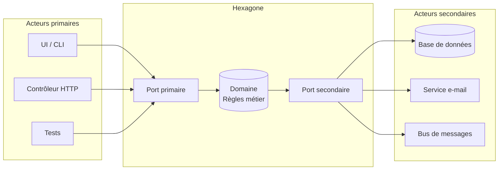

[↑ Sommaire](../README.md#table-des-matières) · [Concepts architecturaux de base →](02-concepts-architecturaux-de-base.md)

# 1. Introduction et fondamentaux

## 1. Introduction

L'**architecture hexagonale** sépare la **logique métier** des **détails techniques**
(stockage des données, interface utilisateur, services externes, frameworks).

> **Que veut dire « logique métier » (en anglais *business logic*) ?** C'est l'ensemble
> des règles qui décrivent *le problème que résout l'application*, indépendamment de la
> manière dont on l'affiche ou dont on la stocke. Exemple : « une commande ne peut pas
> être expédiée si elle n'a pas été payée ». Analogie : dans un restaurant, la logique
> métier, ce sont les recettes et les règles du chef (on ne sert pas un plat cru). Que la
> cuisine soit au gaz ou à l'induction (la technique) ne change pas les recettes.

> **Que veut dire « détails techniques » ?** Ce sont les choix d'outils qui peuvent
> changer sans que le problème métier change : le moteur de base de données (PostgreSQL,
> MongoDB), le protocole de communication (HTTP, gRPC), le framework (Symfony, Laravel),
> le format d'échange des données (JSON, XML). Ce sont les appareils de la cuisine, pas
> les recettes.

Au cœur de l'hexagone se trouve le **domaine**, qui contient les règles métier et les cas
d'utilisation. Il est entouré de **ports**, qui définissent les contrats d'échange avec le
monde extérieur, et d'**adaptateurs**, qui réalisent concrètement ces contrats.

> **Que veut dire « port » ?** Un port est une *interface*, c'est-à-dire une liste de
> fonctions promises sans le code qui les réalise, un simple contrat. Il appartient à
> l'application et décrit, dans le vocabulaire du métier, un échange avec l'extérieur.
> Analogie : la prise électrique murale. Elle promet « du 230 volts ici ». Elle ne dit
> pas d'où vient l'électricité (barrage, éolienne, centrale). Un port n'est jamais une
> classe concrète ; c'est la forme du trou de la prise.

> **Que veut dire « adaptateur » ?** C'est l'*implémentation concrète* d'un port : le code
> qui sait réellement parler à PostgreSQL, à HTTP ou à un *broker* de messages. Analogie :
> l'appareil que vous branchez dans la prise (lampe, ordinateur). Le mur (le domaine) ne
> voit que la prise (le port), jamais l'appareil. On peut changer d'appareil sans toucher
> au mur.
>
> *Broker* veut dire « courtier » : un programme intermédiaire qui reçoit les messages
> d'un côté et les distribue de l'autre, comme un bureau de tri postal.

Le sens des flèches illustre la **règle d'or** de l'hexagonal : les dépendances pointent
toujours **vers l'intérieur**, c'est-à-dire **vers le domaine**, jamais l'inverse.

> **Que veut dire « dépendance » ?** Un morceau de code A « dépend de » B quand A a besoin
> de B pour fonctionner (il l'appelle, l'importe, le connaît). Analogie : si votre recette
> exige une marque précise de four, la recette dépend de ce four ; changez de four et la
> recette casse. On veut donc que les recettes (le domaine) ne dépendent d'aucun appareil.

Le domaine ignore tout du reste du monde. C'est précisément ce qui le rend stable,
testable et durable : aucun changement d'appareil ne peut le casser, puisqu'il n'en
connaît aucun.

[Retour en haut](#table-des-matières)

---

## 2. Pourquoi l'hexagonal plutôt que le N-tier ?

L'architecture **N-tier** classique (présentation puis métier puis données) est simple à
comprendre, mais elle souffre de plusieurs limites profondes.

> **Que veut dire « N-tier » ?** *Tier* veut dire « étage » ou « niveau » en anglais, et
> *N* signifie « un nombre quelconque ». Une architecture N-tier empile donc des couches
> en cascade : la présentation (l'écran) appelle le métier, qui appelle la persistance
> (le stockage). Analogie : une chaîne de commandement où chaque chef parle au chef du
> dessous. Le défaut : la couche métier *connaît* la couche stockage et hérite donc de ses
> contraintes (le modèle de la base de données, les types SQL, les erreurs du pilote de
> base de données). Le métier devient prisonnier de la technique.
>
> *SQL* veut dire *Structured Query Language*, « langage de requêtes structuré » : le
> langage standard pour interroger une base de données relationnelle (des tables avec des
> lignes et des colonnes). *Persistance* veut dire « le fait de conserver des données
> durablement », typiquement sur disque, pour les retrouver après extinction du programme.

| Aspect | N-tier classique | Hexagonal |
|---|---|---|
| Sens des dépendances | Métier dépend de la base de données | Tout dépend du métier |
| Testabilité du domaine | Nécessite des doublures de la base ou une base en mémoire | Tests purs, sans entrées-sorties (I/O) |
| Remplacement d'un adaptateur (ex. SQL → MongoDB) | Coûteux, touche le métier | Isolé à un seul adaptateur |
| Indépendance du framework | Faible (souvent couplé à Spring/Symfony/Django) | Forte |
| Évolutivité | Bonne tant que la couche métier reste fine | Pensée pour absorber la complexité métier |
| Durée de vie typique du métier | Court à moyen terme | Long terme (plusieurs migrations techniques) |

> **Que veut dire « I/O » (entrées-sorties) ?** *I/O* est l'abréviation de *Input/Output*,
> « entrée/sortie ». Cela désigne toute communication d'un programme avec l'extérieur :
> lire un fichier, interroger une base, appeler le réseau. Ces opérations sont lentes et
> imprévisibles. Un « test pur, sans I/O » ne touche à rien de tout cela : il s'exécute
> entièrement en mémoire, donc en une fraction de milliseconde.

En résumé : l'hexagonal protège votre **investissement métier** (la partie la plus durable
de votre code) contre l'instabilité des choix techniques. Une application bien structurée
doit pouvoir survivre à un changement complet de framework ou de moteur de stockage **sans
réécrire son domaine**.

[Retour en haut](#table-des-matières)

---

## 3. Prérequis

Quelques notions facilitent la lecture. Elles sont expliquées au fil du texte, mais les
voici regroupées :

- les principes **SOLID**, en particulier le **D**, le *Dependency Inversion Principle*
  (DIP) ;
- la notion d'**injection de dépendances** (DI) ;
- les bases de la **POO** : interfaces, abstractions, polymorphisme ;
- les concepts de base du **DDD** (entité, value object, agrégat), introduits ici à
  mesure du besoin.

> **Que veut dire « POO » ?** *POO* signifie « programmation orientée objet ». C'est une
> façon d'écrire du code en regroupant les données et les fonctions qui les manipulent
> dans des « objets ». Une *interface* est la liste des fonctions qu'un objet promet
> d'offrir ; le *polymorphisme* est le fait que plusieurs objets différents respectent la
> même interface et sont donc interchangeables (une lampe et un grille-pain se branchent
> tous deux dans la même prise).

> **Que veut dire « injection de dépendances » (DI, *Dependency Injection*) ?** C'est le
> fait de *fournir* à un objet ses collaborateurs depuis l'extérieur, au lieu de le
> laisser les fabriquer lui-même. Concrètement, on les passe dans le constructeur (la
> fonction qui crée l'objet). Analogie : un cuisinier qui reçoit ses ingrédients livrés
> plutôt que d'aller les cueillir. On peut alors lui livrer de faux ingrédients pour
> tester sa recette sans aller au marché.

> **Que veut dire « SOLID » ?** C'est un moyen mnémotechnique pour cinq principes de bonne
> conception orientée objet, dont l'initiale forme le mot SOLID (« solide » en anglais) :
> *Single responsibility* (une seule responsabilité par classe), *Open-closed* (ouvert à
> l'extension, fermé à la modification), *Liskov substitution* (toute sous-classe doit
> pouvoir remplacer sa classe mère), *Interface segregation* (de petites interfaces
> spécifiques plutôt qu'une grosse), *Dependency inversion* (dépendre d'abstractions, pas
> de détails, expliqué en détail en section 8).

[Retour en haut](#table-des-matières)

---

## 4. Glossaire

| Terme | Définition |
|---|---|
| **Domaine** | Cœur de l'application contenant les règles métier, libre de toute dépendance technique. |
| **Port** | Interface (au sens POO) définie par l'application pour communiquer avec l'extérieur. |
| **Adaptateur** | Implémentation concrète d'un port, côté infrastructure ou présentation. |
| **Port primaire** *(driving)* | Définit ce que l'application **offre** (ex. `CreateUser`). Appelé par les acteurs primaires. |
| **Port secondaire** *(driven)* | Définit ce dont l'application **a besoin** (ex. `UserRepository`). Implémenté par l'infrastructure. |
| **Acteur primaire** | Élément qui *initie* une interaction (UI, contrôleur HTTP, CLI, test). |
| **Acteur secondaire** | Élément que l'application *pilote* (base de données, broker, service externe). |
| **Use case** | Cas d'utilisation applicatif qui orchestre le domaine pour répondre à un besoin métier. |
| **Service applicatif** | Synonyme de *use case* : orchestre le domaine, ne contient pas de règle métier. |
| **Service de domaine** | Logique métier qui ne tient pas dans une seule entité (ex. calcul de remise inter-comptes). |
| **Entité** | Objet métier identifié par un `id`, doté d'un cycle de vie. |
| **Value object** | Objet métier immuable, sans identité, comparé par valeur (ex. `Money`, `Email`). |
| **Aggregate root** | Entité qui sert de point d'entrée unique à un agrégat et garantit ses invariants. |
| **Agrégat** | Cluster d'entités/VO traités comme une seule unité de cohérence transactionnelle. |
| **Repository** | Port secondaire qui simule une *collection en mémoire* d'aggregate roots. |
| **DTO** | *Data Transfer Object* : structure plate, sans comportement, qui transporte des données entre couches. |
| **DIP** | *Dependency Inversion Principle* : les modules de haut niveau ne dépendent pas des modules de bas niveau ; les deux dépendent d'abstractions. |
| **POPO** | *Plain Old PHP Object* : classe PHP sans héritage de framework, ni annotation technique imposée. Équivalent du POJO en Java. |
| **Bounded context** | Frontière à l'intérieur de laquelle un terme du langage métier a un sens unique et non ambigu. |
| **Langage ubiquitaire** | Vocabulaire métier partagé entre experts, code et conversations, à l'intérieur d'un bounded context. |
| **Anti-corruption layer (ACL)** | Couche de traduction qui empêche le modèle d'un contexte de polluer celui d'un autre. |
| **Domain event** | Fait métier qui s'est produit (au passé : `OrderPlaced`, `PaymentCaptured`). |
| **Idempotence** | Propriété d'une opération qui produit le même résultat qu'elle soit appelée une ou plusieurs fois. |
| **Anémie** | Anti-pattern où les entités n'ont aucun comportement, juste des getters/setters. |
| **BDUF** | *Big Design Up Front* : tentation de tout modéliser (ports, adaptateurs, agrégats) avant la première ligne de test. À éviter. |
| **CQRS** | *Command Query Responsibility Segregation* : sépare les commandes (qui écrivent) des requêtes (qui lisent). |
| **Read model** | Modèle de lecture dénormalisé, distinct des agrégats, pensé pour servir efficacement une vue. |
| **Composition Root** | Unique endroit du programme où l'on assemble le graphe d'objets et où l'on associe ports et adaptateurs. |
| **Strangler Fig pattern** | Stratégie de migration legacy : enrober progressivement le code existant jusqu'à le remplacer entièrement. |
| **Transactional outbox** | Pattern garantissant qu'un événement de domaine est publié *si et seulement si* l'écriture du même use case a été commitée. |
| **Onion Architecture** | Variante cousine de l'hexagonal (Palermo, 2008), couches concentriques centrées sur le domaine. |
| **Clean Architecture** | Synthèse de Robert C. Martin (2012), élève le *use case* en couche autonome avec ses propres *boundaries*. |

[Retour en haut](#table-des-matières)

---

---

[↑ Sommaire](../README.md#table-des-matières) · [Concepts architecturaux de base →](02-concepts-architecturaux-de-base.md)
