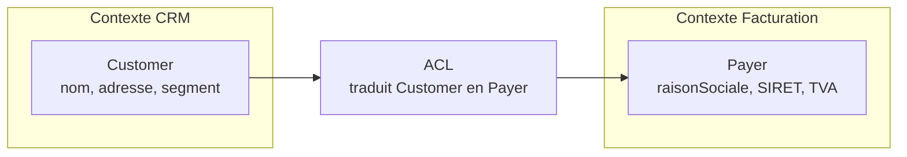
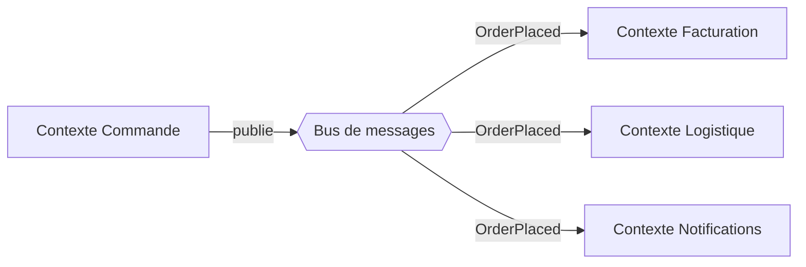
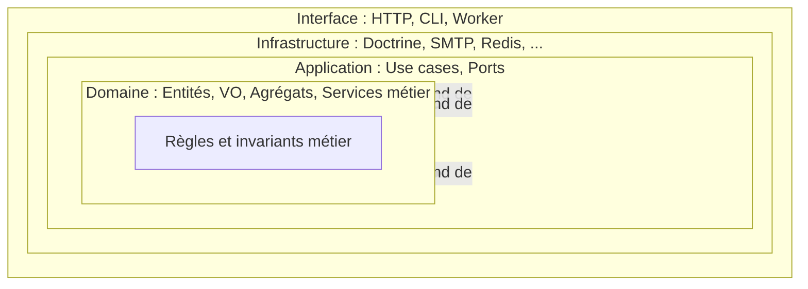
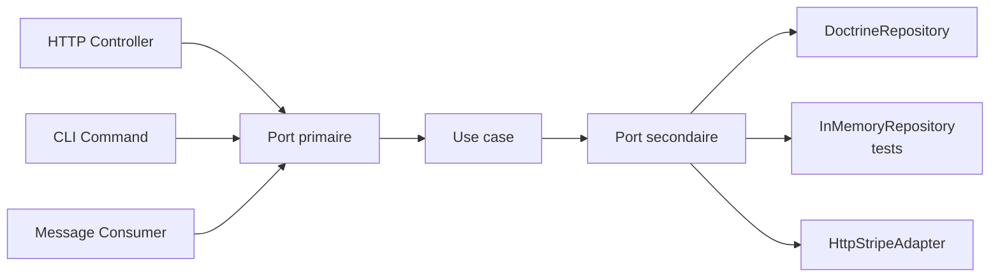
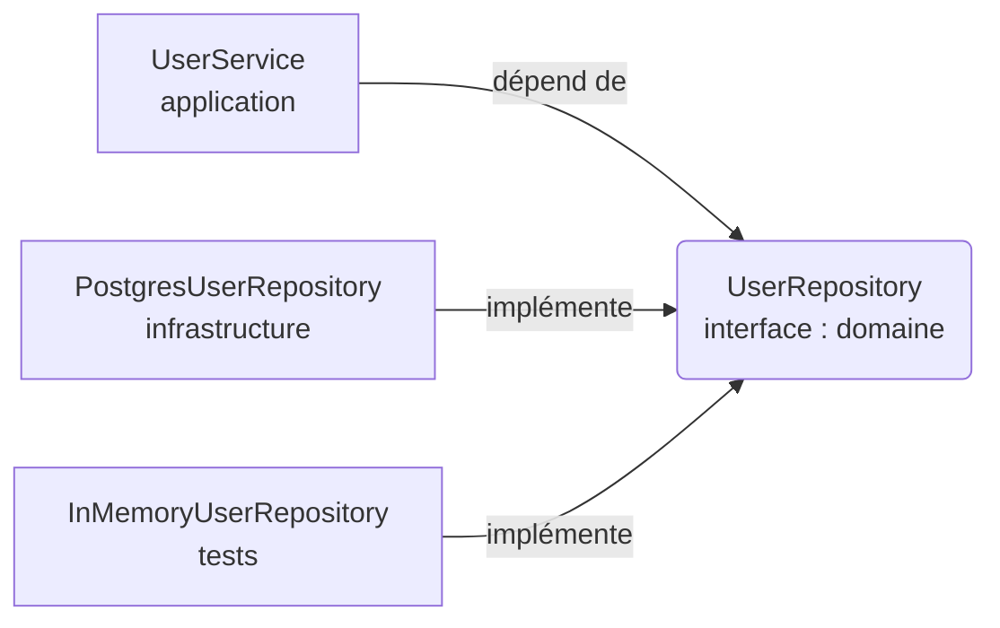

[← Introduction et fondamentaux](01-introduction-et-fondamentaux.md) · [↑ Sommaire](../README.md#table-des-matières) · [Modélisation tactique du domaine →](03-modelisation-tactique-du-domaine.md)

# 2. Concepts architecturaux de base

## 5. Les fondations stratégiques : DDD et hexagonal

L'architecture hexagonale décrit *où mettre le code*. Le **Domain-Driven Design** (DDD)
décrit *comment modéliser le métier*. Les deux se complètent : l'hexagonal est le
squelette, le DDD le remplit. Voici les notions *stratégiques* du DDD, celles qui
concernent l'organisation d'ensemble plutôt que le détail du code.

> **Que veut dire « Domain-Driven Design » (DDD) ?** Traduit, « conception pilotée par le
> domaine ». C'est une approche, formalisée par Eric Evans en 2003, qui dit : modélisez le
> code à partir du vrai métier et de son vocabulaire, pas à partir de la base de données.
> Le *domaine*, c'est le sujet que traite le logiciel (la vente, la facturation, la
> logistique). « Piloté par le domaine » signifie donc « guidé d'abord par le métier ».
> *Stratégique* désigne les grandes décisions de découpage (quels modules, quelles
> frontières) ; *tactique* (section 9) désigne les briques de code à l'intérieur.

### 5.1. Langage ubiquitaire

> **Que veut dire « langage ubiquitaire » (en anglais *ubiquitous language*) ?**
> *Ubiquitaire* veut dire « présent partout ». C'est un vocabulaire commun, précis et
> stable, employé à l'identique par les experts métier, les développeurs, la documentation
> et le code. Si un expert dit « commande », le code contient une classe `Order`, jamais
> `OrderEntityDto2`. Analogie : dans un hôpital, médecins, infirmiers et dossiers
> utilisent les mêmes mots pour les mêmes choses, sinon les erreurs s'accumulent.

Concrètement, le langage ubiquitaire impose une discipline : **chaque terme du domaine a
un nom unique** et *ce nom apparaît tel quel dans le code*. Les noms des classes du
domaine, des méthodes, des événements et des use cases sont tirés directement des
discussions avec les experts. C'est ce qui permet au code de devenir un support de
conversation, et plus seulement un artefact technique.

À la frontière du domaine (c'est-à-dire au niveau des ports) le langage ubiquitaire est
*roi*. Un port n'a pas le droit d'utiliser un mot qui n'appartient pas au métier ;
inversement, l'adaptateur peut introduire son propre vocabulaire technique (`Row`,
`Document`, `Payload`) sans contaminer le domaine.

### 5.2. Bounded context (contexte borné)

> **Que veut dire « bounded context » (contexte borné) ?** Traduit, « contexte délimité ».
> C'est une frontière (souvent un module, un service ou un dépôt) à l'intérieur de laquelle
> un mot du vocabulaire métier a un sens unique. Un même mot (`Client`, `Produit`,
> `Facture`) peut désigner des choses très différentes dans deux contextes (le service
> commercial et la comptabilité). Analogie : le mot « avocat » ne signifie pas la même
> chose au tribunal et chez le marchand de fruits ; chaque lieu est son propre contexte
> borné.

Exemple :

- Dans le contexte **Catalogue**, un *Produit* a un titre, une description, des photos,
  des dimensions.
- Dans le contexte **Logistique**, un *Produit* est un objet à mettre dans un carton,
  caractérisé par un poids, un volume et une zone de stockage.
- Dans le contexte **Comptabilité**, un *Produit* est une ligne TVA avec un taux et un
  compte général.

Tenter de modéliser **un seul** `Product` qui réunit toutes ces facettes mène
inévitablement à une classe gigantesque, ambiguë, et impossible à faire évoluer. Le DDD
recommande de séparer les contextes et d'accepter que chaque contexte ait *sa propre*
définition du même mot.

L'hexagonal, lui, vit *à l'intérieur d'un* bounded context : chaque hexagone est
typiquement un contexte borné, avec son propre domaine, ses propres ports, ses propres
adaptateurs.

### 5.3. Anti-corruption layer (ACL)

> **Que veut dire « anti-corruption layer » (ACL, couche anti-corruption) ?** C'est une
> couche de traduction placée à la frontière entre deux contextes (ou entre votre domaine
> et un vieux système externe), dont l'unique rôle est d'empêcher les mots et les concepts
> d'un côté de contaminer l'autre. Analogie : un interprète à une réunion internationale.
> Chaque partie parle sa langue ; l'interprète traduit pour qu'aucune ne soit obligée
> d'apprendre la langue de l'autre.
>
> *Legacy* veut dire « hérité du passé » : du code ancien, toujours en service, souvent mal
> structuré, que l'on doit composer avec sans pouvoir le réécrire d'un coup.

Quand deux contextes doivent collaborer, ils ne se parlent **jamais** directement avec
leurs modèles internes. On insère une ACL qui *traduit* : elle prend les concepts du
contexte source et les exprime dans le vocabulaire du contexte destinataire.



L'ACL est typiquement implémentée comme un **adaptateur secondaire** dans l'hexagonal :
le contexte appelant définit un port (`PayerProvider`), et l'adaptateur traduit en
appelant l'API du CRM. Le domaine de la facturation ne voit jamais un `Customer` venu de
l'extérieur ; il ne voit que des `Payer` qu'il comprend.

Cas d'usage typiques d'une ACL :

- intégration avec un **legacy** dont le modèle est mal nommé ou mal taillé ;
- consommation d'une **API tierce** dont les noms ne sont pas les vôtres ;
- communication entre deux **bounded contexts** internes qui ont évolué de manière
  divergente.

### 5.4. Communication entre bounded contexts

Une fois posée la frontière, comment deux contextes échangent-ils ?

- **Synchrone** : le contexte A appelle un port secondaire (`PayerProvider`) ; un
  adaptateur appelle l'API HTTP/gRPC du contexte B. Simple à mettre en place, mais
  introduit un couplage de disponibilité (B doit répondre).
- **Asynchrone par événements de domaine** : le contexte A publie un *domain event*
  (`OrderPlaced`) sur un bus de messages ; le contexte B y souscrit et réagit. Découplage
  fort, mais introduit la complexité de la cohérence éventuelle (*eventual consistency*).

> **Que veut dire « cohérence éventuelle » (en anglais *eventual consistency*) ?** Dans un
> système réparti sur plusieurs machines, après un court délai de propagation, tous les
> contextes finissent par voir les mêmes données. Mais à un instant donné, deux d'entre eux
> peuvent être brièvement désynchronisés. « Éventuelle » est un faux ami de l'anglais :
> il faut comprendre « finit par devenir cohérente », pas « peut-être ». Analogie : un
> commérage dans un village ; tout le monde finira par le savoir, mais pas exactement au
> même instant.



> **Que veut dire « bus de messages » ?** C'est un canal partagé où l'on dépose des
> messages et où d'autres viennent les récupérer, sans que l'expéditeur connaisse les
> destinataires. Analogie : un tableau d'affichage dans un hall ; on y punaise une note,
> et quiconque est intéressé la lit. RabbitMQ, Kafka et Symfony Messenger sont trois outils
> qui jouent ce rôle de tableau d'affichage.

Dans une architecture hexagonale, le bus est un port secondaire (`EventPublisher`) du côté
qui émet, et un adaptateur primaire (`EventListener`) du côté qui reçoit. Le domaine ne
sait rien de RabbitMQ, Kafka ou Symfony Messenger : il sait seulement produire un événement
dans son langage métier.

[Retour en haut](#table-des-matières)

---

## 6. Les différentes couches

L'architecture hexagonale s'organise en couches emboîtées comme des poupées russes.
**Aucune couche extérieure ne doit être connue d'une couche intérieure.** C'est la forme
géométrique de la règle de dépendance : *les flèches pointent toujours vers le centre*.

> **Que veut dire « couche » ?** Un regroupement de code qui partage un même rôle et un
> même niveau de proximité avec le métier. De l'intérieur vers l'extérieur : le domaine
> (les règles), l'application (l'enchaînement des étapes), l'infrastructure (la technique),
> l'interface (la porte d'entrée). Analogie : les peaux d'un oignon, le cœur étant le plus
> protégé.



### 6.1. Le domaine

C'est le **cœur** de l'application. Il contient :

- les **entités** (objets identifiés par un `id` et dotés d'un cycle de vie) ;
- les **value objects** (immuables, comparés par valeur, par exemple `Money`, `Email`) ;
- les **aggregate roots** (entités qui pilotent un groupe d'objets cohérents) ;
- les **services de domaine** (logique qui ne *colle* pas à une entité unique) ;
- les **événements de domaine** (faits métier au passé, signalant un changement d'état) ;
- les **invariants** (règles toujours vraies, qu'aucune opération ne doit pouvoir violer).

> **Que veut dire « invariant » ?** Une condition qui doit rester vraie en permanence,
> avant comme après chaque opération. Analogie : sur un compte courant sans découvert
> autorisé, « le solde ne peut jamais être négatif » est un invariant. Tout le rôle du
> domaine est de rendre ces règles impossibles à enfreindre.

> **Règle absolue.** Le domaine n'importe **rien** des couches extérieures : pas de SQL,
> pas de HTTP, pas de framework, pas de logger d'infrastructure, pas d'annotation ORM,
> pas de `Symfony\...`, pas de `Doctrine\ORM\Mapping\Column`. *Le seul code qu'on accepte
> dans le domaine est du code que l'on pourrait copier-coller dans un projet en console
> sans dépendance et qui s'exécuterait.*

Cette discipline est le test ultime : essayez de compiler ou d'exécuter votre dossier
`Domain/` sans aucune dépendance externe. S'il a besoin d'un framework, c'est qu'il n'est
pas pur.

### 6.2. L'application

Cette couche orchestre le domaine pour réaliser les **cas d'utilisation**. Elle contient :

- les **use cases** (un par scénario métier, par exemple `RegisterUser`, `PlaceOrder`) ;
- les **interfaces de ports** (primaires et secondaires) ;
- les **DTO d'entrée/sortie** des use cases ;
- la **gestion transactionnelle** logique (le « tout ou rien » d'un cas d'utilisation).

> **Que veut dire « use case » (cas d'utilisation) ?** Un scénario complet rendu par
> l'application, du début à la fin, vu côté métier : « inscrire un utilisateur », « passer
> une commande ». Le use case enchaîne les étapes (lire, appeler le domaine, sauvegarder)
> sans contenir lui-même de règle métier. Analogie : un chef d'orchestre, qui ne joue
> d'aucun instrument mais coordonne les musiciens.

> **Que veut dire « DTO » ?** *Data Transfer Object*, « objet de transport de données ».
> C'est une structure plate, sans intelligence, qui sert uniquement à transporter des
> valeurs d'une couche à une autre. Analogie : une enveloppe ; elle contient l'information
> mais ne décide rien.

> **Que veut dire « transactionnel » (le « tout ou rien ») ?** Une *transaction* regroupe
> plusieurs opérations sur les données en un bloc indivisible : soit tout réussit, soit
> rien n'est appliqué. Analogie : un virement bancaire ; débiter un compte sans créditer
> l'autre serait catastrophique, donc les deux se font ensemble ou pas du tout.

Elle dépend du domaine, mais reste ignorante de l'infrastructure. **Un use case ne doit
jamais contenir de règle métier** ; il *orchestre* le domaine. La règle « un client
qui doit plus de 1000 € ne peut pas commander » appartient à l'entité `Customer`, pas au
use case `PlaceOrderUseCase`.

### 6.3. L'infrastructure

Couche externe qui réalise concrètement les ports secondaires :

- adaptateurs de **persistance** (SQL via Doctrine/PDO, NoSQL, fichier) ;
- adaptateurs de **services externes** (SMTP, S3, Stripe, etc.) ;
- adaptateurs d'**horloge**, de **génération d'identifiants**, de **chiffrement** ;
- configuration, **injection de dépendances**, démarrage de l'application ;
- **mappers** entre entités du domaine et représentations techniques (lignes SQL, JSON).

> **Que veut dire « ORM » ?** *Object-Relational Mapping*, « correspondance objet vers
> relationnel ». C'est un outil (Doctrine en PHP) qui traduit automatiquement les objets
> du code en lignes de table SQL et inversement. Analogie : un traducteur entre la langue
> des objets et celle des tables. *NoSQL* désigne les bases qui ne sont pas des tables
> relationnelles (documents, clé-valeur). *SMTP* est le protocole d'envoi d'e-mails ; *S3*
> un service de stockage de fichiers ; *Stripe* un service de paiement.

> **Que veut dire « mapper » ?** Un petit objet dont le seul travail est de convertir une
> forme de donnée en une autre, par exemple une entité métier en ligne de base de données.
> Analogie : un changeur de devises, qui transforme des euros en dollars sans modifier la
> valeur réelle de l'argent.

### 6.4. L'interface (interface utilisateur / livraison)

Certaines variantes (notamment la *Clean Architecture* de Robert C. Martin) séparent
l'**interface** (ou *delivery mechanism*, « mécanisme de livraison ») de l'infrastructure :

- adaptateurs de **transport entrant** : contrôleurs REST, GraphQL, ligne de commande
  (CLI), gRPC, consommateurs de messages AMQP ;
- vues, sérialisation, formats de réponse, codes HTTP.

> **Que veut dire « sérialisation » ?** Transformer un objet en mémoire en une suite de
> caractères transmissible (souvent du JSON ou du XML), puis l'inverse à la réception.
> Analogie : démonter un meuble pour le faire tenir dans un carton de transport, puis le
> remonter à l'arrivée. *CLI* veut dire *Command Line Interface*, « interface en ligne de
> commande » : piloter le programme en tapant des commandes au clavier, sans écran
> graphique.

Dans la pratique Symfony, on regroupe souvent infrastructure et interface ; mais
conceptuellement, distinguer « ce qui pilote le domaine » (interface) de « ce que le
domaine pilote » (infrastructure) clarifie la conception.

[Retour en haut](#table-des-matières)

---

## 7. Ports et adaptateurs

### 7.1. Ports primaires *(driving)*

> **Que veut dire « port primaire » (en anglais *driving*, « qui conduit ») ?** C'est un
> port par lequel le monde extérieur *commande* l'application. Le mot *driving* renvoie au
> conducteur d'une voiture : c'est lui qui décide où l'on va. Un acteur primaire (un écran,
> un contrôleur HTTP) appuie sur un port primaire pour déclencher un use case.

Ils définissent **ce que fait** l'application : les commandes et requêtes exposées à
l'extérieur. Exemples : `RegisterUserUseCase`, `GetOrderQuery`. Un port primaire est
typiquement réalisé par un *use case*, et appelé par un *adaptateur primaire* (un
contrôleur HTTP, par exemple).

> **Aperçu de CQRS (détaillé en section 14).** *CQRS* veut dire *Command Query
> Responsibility Segregation*, « séparation des responsabilités entre commandes et
> requêtes ». On sépare les *commands* qui *modifient* l'état (`PlaceOrder`) des *queries*
> qui *lisent* l'état (`GetOrderById`). Analogie : dans un magasin, la caisse (qui modifie
> le stock) et la vitrine (qui montre les produits) sont deux comptoirs distincts. Cette
> séparation n'est pas obligatoire mais clarifie souvent la conception.

### 7.2. Ports secondaires *(driven)*

> **Que veut dire « port secondaire » (en anglais *driven*, « qui est conduit ») ?** C'est
> un port par lequel l'application *commande* un service extérieur dont elle a besoin
> (stockage, e-mail, horloge). Ici, c'est l'application qui conduit et l'extérieur qui
> obéit, d'où *driven*. Analogie : le conducteur (l'application) appuie sur la pédale
> d'accélérateur (le port secondaire) et le moteur (l'adaptateur) exécute.

Ils définissent **ce dont l'application a besoin** : persistance, notifications, horloge,
identifiants. Exemples : `UserRepository`, `EmailNotifier`, `Clock`, `IdGenerator`.

Le piège classique est de concevoir un port secondaire **depuis l'implémentation**
(« j'ai besoin de Doctrine, donc je crée un `DoctrineUserRepository` ») au lieu de le
concevoir **depuis le besoin du domaine** (« le domaine a besoin de retrouver un
utilisateur par e-mail, donc le port a une méthode `findByEmail` »). Le port doit avoir
*le vocabulaire du domaine*, jamais celui de la technologie sous-jacente.

### 7.3. Adaptateurs

Les adaptateurs *adaptent* les technologies externes aux ports.

- **Adaptateurs primaires** : reçoivent une requête externe (HTTP, CLI, message) et
  appellent un port primaire après conversion des données. Exemple : `UserController`
  REST → `RegisterUserUseCase`.
- **Adaptateurs secondaires** : implémentent un port secondaire en utilisant une
  technologie concrète. Exemple : `DoctrineUserRepository`, `SymfonyMailerNotifier`,
  `SystemClock`.



Un point souvent mal compris : **un même port peut avoir plusieurs adaptateurs en
parallèle**. C'est précisément ce qui rend les tests faciles (`InMemoryRepository`) et
les changements de fournisseur indolores (`StripeAdapter` vs `PaypalAdapter` derrière un
même `PaymentGateway`).

### 7.4. Toutes les interfaces ne sont pas des ports

Un malentendu très répandu en PHP : appeler *« port »* **toute** interface du projet.
C'est faux, et c'est nuisible : quand tout est port, le mot ne distingue plus rien et perd
son utilité.

> **Règle.** Une interface est un **port** *uniquement* si elle décrit un échange à la
> **frontière de l'hexagone**. Les interfaces internes (`StrategyInterface`,
> `FormatterInterface` au sein de l'application, `EventInterface` dans le domaine) sont
> des interfaces ordinaires, utiles pour la conception, mais elles ne sont pas des
> ports.

Ports légitimes (en PHP/Symfony) :

| Interface | Port ? | Raison |
|---|---|---|
| `TaskRepositoryInterface` (Domain) | Oui (port secondaire) | Frontière vers la persistance |
| `EmailNotifierInterface` (Application) | Oui (port secondaire) | Frontière vers SMTP |
| `ClockInterface` (Application) | Oui (port secondaire) | Frontière vers l'horloge système |
| `PlaceOrderUseCaseInterface` (Application) | Oui (port primaire) | Frontière offerte aux acteurs entrants |
| `OrderEventInterface` (Domain) | **Non** | Type interne au domaine, aucune frontière |
| `OrderStatusStrategy` interne au domaine | **Non** | Polymorphisme métier, pas un échange externe |
| `LoggerInterface` (PSR-3) injecté dans un adaptateur | **Non** | Détail d'implémentation interne à l'adaptateur |

Pourquoi cette discipline compte : si vous déclarez un alias dans `services.yaml` pour
*chaque* interface du projet, vous noyez les véritables ports (les seuls qui méritent d'être
inspectés à chaque revue d'architecture) sous une mer d'interfaces ordinaires.

> **Que veut dire « PSR-3 » ?** *PSR* signifie *PHP Standard Recommendation*,
> « recommandation standard PHP » : des conventions partagées par l'écosystème PHP. PSR-3
> est celle qui décrit l'interface standard d'un *logger* (un journal d'événements). C'est
> un détail technique d'adaptateur, pas un port métier.

[Retour en haut](#table-des-matières)

---

## 8. L'inversion de dépendance

Le **DIP** (*Dependency Inversion Principle*) est le pilier qui rend l'hexagonal possible.
Sans inversion, le domaine finirait par dépendre de la base de données ; avec inversion,
c'est l'infrastructure qui dépend du domaine.

> **Que veut dire « Dependency Inversion Principle » (DIP) ?** Traduit, « principe
> d'inversion des dépendances ». La formule originale de Robert C. Martin : *les modules de
> haut niveau ne doivent pas dépendre des modules de bas niveau ; les deux doivent dépendre
> d'abstractions. Les abstractions ne doivent pas dépendre des détails ; les détails
> doivent dépendre des abstractions.* En clair : le code important (le métier) ne se branche
> pas sur le code technique ; au contraire, c'est le code technique qui se branche sur un
> contrat défini par le métier. Analogie : votre rasoir électrique ne se câble pas
> directement à la centrale ; c'est la centrale qui respecte le standard de la prise, et
> votre rasoir s'y conforme. « Inversion » nomme ce renversement du sens habituel.

Concrètement, en hexagonal, **l'abstraction (le port) appartient au domaine** ;
le code concret (l'adaptateur) appartient à l'infrastructure et **dépend** du domaine
(il réalise *son* interface). C'est ce renversement qui inverse la flèche habituelle
« métier vers base de données » en « base de données vers métier ».

> **Que veut dire « abstraction » ?** Une description épurée qui dit *ce qu'on attend* sans
> dire *comment c'est fait*. Une interface est une abstraction. Analogie : « un moyen de
> transport » est abstrait ; « ce TGV précis » est concret. Dépendre de l'abstraction
> permet d'échanger le concret sans rien casser.

**Exemple sans DIP :**

```python
# UserService dépend directement d'une implémentation SQL : couplage fort.
class UserService:
    def __init__(self):
        self.repo = PostgresUserRepository()  # couplage en dur
```

Problème : `UserService` ne peut être testé qu'avec une vraie base PostgreSQL, et un
changement de moteur de stockage casse `UserService`.

**Exemple avec DIP :**

```python
# UserService dépend d'une abstraction : couplage faible.
class UserService:
    def __init__(self, repo: UserRepository):  # UserRepository = interface
        self.repo = repo
```

Schématiquement :



L'avantage : la classe `UserService` peut être testée avec un repository en mémoire et
déployée avec un repository Postgres, **sans qu'aucune ligne de son code ne change**.
C'est cette propriété qui justifie tout le reste de l'architecture.

[Retour en haut](#table-des-matières)

---

---

[← Introduction et fondamentaux](01-introduction-et-fondamentaux.md) · [↑ Sommaire](../README.md#table-des-matières) · [Modélisation tactique du domaine →](03-modelisation-tactique-du-domaine.md)
