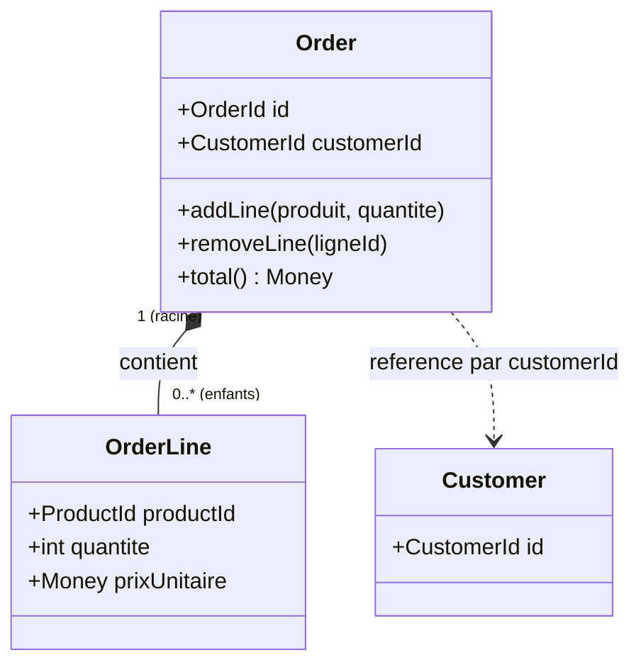
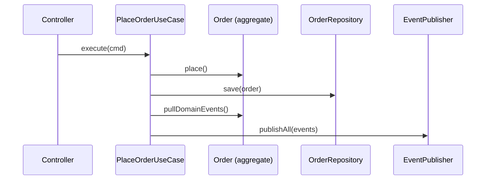
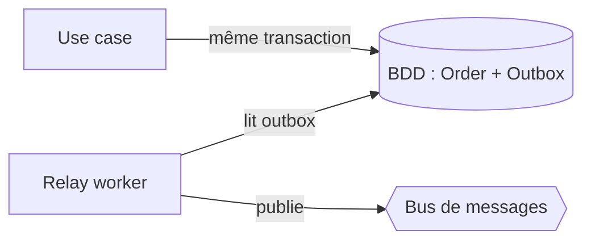

[← Concepts architecturaux de base](02-concepts-architecturaux-de-base.md) · [↑ Sommaire](../README.md#table-des-matières) · [Tests, comparaisons et CQRS →](04-tests-comparaisons-et-cqrs.md)

# 3. Modélisation tactique du domaine

## 9. Modélisation tactique : agrégats, entités, value objects

L'hexagonal dit *où* mettre les choses ; le DDD dit *quelles* choses mettre. Voici le
vocabulaire de base pour modéliser un domaine riche. *Tactique* s'oppose ici à
*stratégique* (section 5) : on descend des grandes frontières aux briques de code.

### 9.1. Entité

> **Que veut dire « entité » ?** Un objet métier reconnu par une **identité propre, unique
> et stable** (souvent un UUID), conservée toute sa vie même si ses attributs changent. Un
> client `#42` reste `#42` même s'il change de nom. Analogie : vous restez vous-même malgré
> un changement de coiffure ou d'adresse ; votre identité ne tient pas à vos attributs.
>
> *UUID* veut dire *Universally Unique Identifier*, « identifiant unique universel » : un
> long code (par exemple `f47ac10b-58cc-...`) pratiquement impossible à voir apparaître
> deux fois, ce qui sert à étiqueter un objet de façon sûre.

Caractéristiques :

- comparaison par **identité**, jamais par valeur ;
- méthodes qui *font évoluer son état* tout en garantissant ses **invariants** ;
- jamais d'`setX($x)` aveugle : on préfère des méthodes métier (`renameTo`,
  `changeAddress`, `markAsVip`).

### 9.2. Value object

> **Que veut dire « value object » (VO, objet-valeur) ?** Un objet métier **immuable** (que
> l'on ne modifie jamais après création), sans identité, comparé *par sa valeur*. Deux
> `Money(10, "EUR")` sont parfaitement interchangeables, comme deux pièces de 10 euros : on
> ne se demande pas « laquelle ». Un VO représente une *quantité* ou une *qualité*, pas une
> *chose*. Analogie : un billet de banque (une valeur) face à une personne (une entité,
> avec son histoire).

Avantages des VO :

- ils **portent des invariants locaux** (`Email` ne peut pas exister s'il est mal formé) ;
- ils **rendent le code typé** : une signature `transfer(Money amount)` est plus claire
  que `transfer(float amount)` ;
- ils **éliminent les bugs de conversion** : on n'additionne pas un `Money(EUR)` et un
  `Money(USD)` par accident.

Règle pratique : *si vous hésitez entre une primitive et un VO, prenez le VO*.

### 9.3. Aggregate root (racine d'agrégat)

> **Que veut dire « agrégat » et « aggregate root » (racine d'agrégat) ?** Un *agrégat* est
> un petit groupe d'entités et de value objects étroitement liés, traité comme **une seule
> unité de cohérence** : on les sauvegarde et on les modifie ensemble, jamais séparément.
> L'*aggregate root* (la racine) est l'unique objet par lequel on a le droit de toucher au
> groupe ; c'est lui qui garantit les invariants. Analogie : une commande au restaurant. La
> note (la racine) regroupe ses lignes de plats ; on n'ajoute pas un plat directement, on
> passe toujours par la note, qui recalcule le total et refuse une note déjà payée. *Mot
> anglais « cluster »* = grappe, groupe serré.

Exemple : un agrégat `Order` contient une racine `Order` et des `OrderLine` enfants. On
ne modifie **jamais** une `OrderLine` directement depuis l'extérieur ; on appelle
`order.addLine(...)`, `order.removeLine(...)`. La racine vérifie alors que la commande
est encore modifiable, que la ligne est valide, que le total est cohérent.

Trois règles de conception :

1. **Une seule racine** par agrégat. Les entités enfants sont *internes* à l'agrégat.
2. **Les références entre agrégats se font par identifiant**, jamais par référence
   d'objet. Un `Order` ne référence pas un objet `Customer` complet, il garde un
   `customerId`.
3. **Un repository par aggregate root**, pas un par entité. On ne *persiste* pas une
   `OrderLine` toute seule ; on persiste l'`Order` entier.

Le diagramme suivant montre la frontière de l'agrégat (le cadre) : tout passe par la
racine, et le lien vers `Customer` se fait par identifiant, pas par objet.



### 9.4. Services de domaine vs services applicatifs

Distinction souvent floue mais essentielle :

> **Que veut dire « service de domaine » ?** C'est une logique métier qui **ne loge
> naturellement dans aucune entité ni VO**, parce qu'elle concerne plusieurs agrégats à la
> fois. Elle vit dans la couche **domaine**. Exemple : un `TransferService` qui débite un
> compte et crédite un autre ; la règle ne « tient » ni dans le compte débité ni dans le
> compte crédité seul. Analogie : la règle du jeu d'échecs « le roque » implique deux
> pièces ; elle n'appartient ni à la tour seule, ni au roi seul.

> **Que veut dire « service applicatif » (autre nom du use case) ?** C'est l'objet qui
> coordonne **les étapes techniques** d'un cas d'utilisation : lire depuis un repository,
> appeler le domaine, sauvegarder, publier un événement. Il vit dans la couche
> **application** et ne contient **aucune** règle métier. C'est le chef d'orchestre, pas le
> compositeur.

Test simple pour les distinguer :

- *Si on enlevait le service, perdrait-on une règle métier ?* Alors c'est un service de
  domaine.
- *Si on enlevait le service, perdrait-on seulement de l'enchaînement technique ?* Alors
  c'est un service applicatif.

Un service applicatif peut appeler un service de domaine ; l'inverse est interdit.

[Retour en haut](#table-des-matières)

---

## 10. Le pattern Repository

> **Que veut dire « repository » (entrepôt, dépôt) ?** C'est un port secondaire qui fait
> *comme si* tous vos aggregate roots vivaient dans une simple collection en mémoire : on
> `add`, on `get`, on `find`, on `remove`. Il cache totalement le stockage réel : aucun
> `SELECT`, aucun `JOIN`, aucun nom de requête SQL tordu. Analogie : un bibliothécaire ;
> vous demandez « le livre numéro 42 » et il vous le rapporte, sans que vous sachiez s'il
> est rangé en rayon, en réserve ou numérisé.
>
> *SELECT* et *JOIN* sont des mots-clés SQL (lire des lignes, croiser deux tables) : ce sont
> précisément les détails que le repository ne doit jamais laisser voir.

Le repository est probablement le port le plus mal réalisé en pratique. Voici les règles
solides à appliquer :

1. **Un repository par aggregate root.** Pas un par table SQL, pas un par entité enfant.
2. **Le contrat est dans le domaine**, l'implémentation dans l'infrastructure.
3. **Le vocabulaire est métier** : `findActiveCustomersWithOverduePayment()`, pas
   `findByStatusAndDateLessThan(int $status, DateTime $d)`.
4. **Pas de fuite ORM** : la signature ne mentionne ni `QueryBuilder`, ni `EntityManager`,
   ni `Criteria`, ni `Doctrine\Collections`.
5. **Renvoie des aggregate roots reconstitués**, pas des `array` ou des `stdClass`.
6. **Pas de pagination générique** dans le port, sauf si la pagination est un concept
   métier (ce qui est rare).

> **Que veut dire « anti-pattern » ?** Un *pattern* (« patron » ou « modèle ») est une
> solution éprouvée à un problème récurrent. Un *anti-pattern* est l'inverse : une solution
> tentante mais qui empire les choses sur le long terme. Repérer les anti-patterns évite de
> répéter des erreurs connues.

> **Anti-pattern : repository fourre-tout.** Une méthode `findBy(array $criteria)` qui
> accepte n'importe quoi. C'est l'API d'un ORM, pas d'un repository de domaine. Les
> appelants finissent par recopier la même logique de critères partout, et le port se met
> à laisser fuir l'ORM. (*API* veut dire *Application Programming Interface*, « interface de
> programmation » : l'ensemble des fonctions qu'un composant offre aux autres.)

```php
// MAUVAIS : signature qui fuit l'ORM
interface OrderRepositoryInterface
{
    public function findBy(array $criteria, ?array $orderBy = null): array;
}

// BON : signature dans le langage métier
interface OrderRepositoryInterface
{
    public function findById(OrderId $id): ?Order;
    public function findUnpaidOrdersOlderThan(\DateTimeImmutable $threshold): iterable;
    public function save(Order $order): void;
}
```

[Retour en haut](#table-des-matières)

---

## 11. Événements de domaine et communication asynchrone

> **Que veut dire « domain event » (événement de domaine) ?** Un objet immuable qui
> annonce **un fait métier déjà arrivé**, nommé au passé : `OrderPlaced` (commande passée),
> `PaymentCaptured` (paiement encaissé). Il transporte juste assez d'informations pour que
> d'autres parties du système réagissent. Analogie : un faire-part ; il déclare un fait
> accompli (« le mariage a eu lieu ») et chacun en fait ce qu'il veut.

> **Que veut dire « asynchrone » ?** *Synchrone* : on appelle quelqu'un et on attend sa
> réponse avant de continuer (un appel téléphonique). *Asynchrone* : on dépose un message
> et on continue son travail ; l'autre y répondra quand il pourra (un e-mail). La
> communication par événements est asynchrone, ce qui découple les parties dans le temps.

Un événement de domaine est *produit* par une entité ou un agrégat lors d'un changement
d'état :

```php
final class Order
{
    /** @var DomainEvent[] */
    private array $recordedEvents = [];

    public function place(): void
    {
        if ($this->status !== OrderStatus::Draft) {
            throw new DomainException('Order already placed');
        }
        $this->status = OrderStatus::Placed;
        $this->recordedEvents[] = new OrderPlaced($this->id, $this->total);
    }

    /** @return DomainEvent[] */
    public function pullDomainEvents(): array
    {
        $events = $this->recordedEvents;
        $this->recordedEvents = [];
        return $events;
    }
}
```

Le **service applicatif** récupère les événements après l'opération métier et les publie
via un port `EventPublisher`. Un adaptateur (Symfony Messenger, RabbitMQ, Kafka) les
distribue ensuite aux consommateurs.



Avantages de ce pattern :

- **découplage temporel** : les autres contextes réagissent quand ils peuvent ;
- **historicité** : chaque événement est un fait du passé, traçable et rejouable ;
- **extensibilité** : ajouter un nouveau consommateur n'impacte pas le producteur.

> **Piège en production : la fenêtre fatale entre `save` et `publish`.** Le use case
> ci-dessus appelle d'abord `repository->save($order)`, puis `eventBus->publish($events)`.
> Si le programme s'arrête brutalement *entre* les deux, l'agrégat est enregistré mais
> l'événement n'est jamais émis : incohérence silencieuse. La solution éprouvée est le
> **transactional outbox**.

> **Que veut dire « transactional outbox » (boîte d'envoi transactionnelle) ?** Plutôt que
> de publier l'événement séparément, on l'écrit dans une table `outbox` (« boîte d'envoi »)
> *dans la même transaction* que l'agrégat. Comme la transaction est « tout ou rien », soit
> les deux sont enregistrés, soit aucun. Un programme à part (le *relay*, « relais ») lit
> ensuite cette table et publie vraiment les événements sur le bus, en cochant ceux qui sont
> partis. Analogie : au lieu de poster une lettre à part (risque de l'oublier), on la glisse
> dans le même colis que le reste ; un facteur passe ensuite vider la boîte. *Worker* veut
> dire « ouvrier » : un programme de fond qui tourne sans intervention humaine.



Sans outbox, on accepte un risque résiduel ; avec outbox, la livraison est garantie *au
moins une fois*. Il faut alors que les consommateurs soient **idempotents**, ce qui est de
toute façon une bonne discipline.

> **Que veut dire « idempotent » ?** Une opération est idempotente si l'exécuter une fois
> ou plusieurs fois produit exactement le même résultat. Analogie : appuyer sur le bouton
> « éteindre » d'un appareil déjà éteint ne change rien ; il reste éteint. Comme un
> événement peut être livré deux fois, le consommateur doit pouvoir le retraiter sans dégât
> (par exemple en ignorant un paiement déjà encaissé).

[Retour en haut](#table-des-matières)

---

---

[← Concepts architecturaux de base](02-concepts-architecturaux-de-base.md) · [↑ Sommaire](../README.md#table-des-matières) · [Tests, comparaisons et CQRS →](04-tests-comparaisons-et-cqrs.md)
