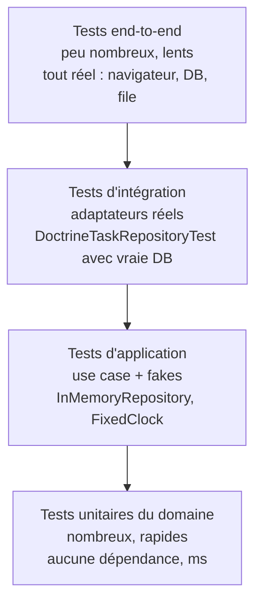
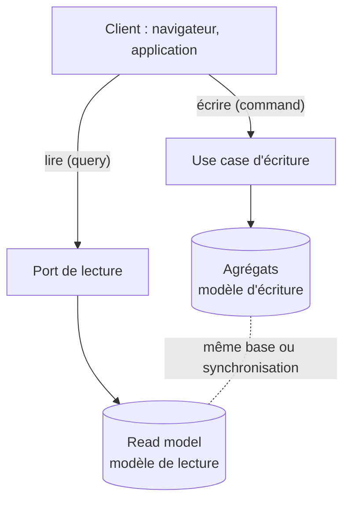

[← Modélisation tactique du domaine](03-modelisation-tactique-du-domaine.md) · [↑ Sommaire](../README.md#table-des-matières) · [Câblage, mise à l'échelle et migration →](05-cablage-mise-a-lechelle-et-migration.md)

# 4. Tests, comparaisons et CQRS

## 12. Bénéfices en testabilité (TDD)

L'hexagonal n'impose pas le **TDD** (*Test-Driven Development*), mais les deux se
renforcent. Voici *quel type de test* écrire à *quelle couche*, puis, point souvent passé
sous silence, pourquoi le design hexagonal **émerge** des tests au lieu d'être posé
d'avance.

> **Que veut dire « TDD » (*Test-Driven Development*) ?** Traduit, « développement piloté
> par les tests ». On écrit le test *avant* le code. Le cycle s'appelle *red, green,
> refactor* (« rouge, vert, remanier ») : on écrit un test qui échoue (rouge), on écrit le
> minimum pour qu'il réussisse (vert), puis on nettoie le code sans casser les tests
> (remanier). Analogie : tracer la cible avant de tirer, plutôt que de dessiner la cible
> autour du trou après coup. *Refactoriser* veut dire réorganiser le code sans changer ce
> qu'il fait.

> **Que veut dire « double de test » ?** Un objet qui *remplace* une vraie dépendance le
> temps d'un test, comme une doublure remplace l'acteur pour les cascades. Variantes :
> *fake* (version simplifiée mais qui marche, par exemple un repository en mémoire), *stub*
> (renvoie des valeurs fixées d'avance), *mock* (vérifie qu'une méthode a bien été appelée
> avec tels arguments), *spy* (« espion », enregistre les appels pour les examiner après).

### 12.1. La pyramide hexagonale

> **Que veut dire « test unitaire », « test d'intégration », « test end-to-end » ?** Un
> *test unitaire* vérifie une petite brique isolée, sans rien d'extérieur (rapide, par
> milliers). Un *test d'intégration* vérifie que deux pièces réelles s'emboîtent, par
> exemple un adaptateur face à une vraie base. Un *test end-to-end* (« de bout en bout »)
> parcourt tout le système comme un vrai utilisateur (lent, peu nombreux). Analogie : tester
> une pièce de moteur seule, puis tester le moteur monté, puis faire rouler la voiture
> entière sur circuit.

À chaque couche correspond *un type de test* avec *des dépendances bien définies*.



| Couche testée | Dépendances réelles | Dépendances doublées | Objectif |
|---|---|---|---|
| Domaine | Aucune | Aucune | Vérifier les invariants et transitions d'état |
| Application (use case) | Le domaine | Tous les ports secondaires (fakes en mémoire) | Vérifier l'orchestration |
| Infrastructure (adaptateur) | DB / HTTP / file réels | Aucune | Vérifier que l'adaptateur respecte le contrat du port |
| End-to-end | Tout | Aucune | Vérifier qu'un parcours utilisateur fonctionne |

> **Piège fréquent.** Un test « unitaire » qui démarre Doctrine, crée une vraie base en
> mémoire (SQLite) et appelle `DoctrineTaskRepository` n'est *pas* un test unitaire : c'est
> un test d'intégration. La promesse hexagonale (« les tests unitaires tournent sans
> infrastructure ») n'est tenue que si la classe testée ne touche aucun adaptateur réel.

### 12.2. TDD : le design émerge des tests, pas d'un BDUF

Une lecture naïve de l'hexagonal donne l'impression d'un processus en cascade : *« je
définis d'abord tous mes ports, puis tous mes adaptateurs, puis je remplis le domaine »*.
C'est faux, et ce malentendu produit des architectures sur-modélisées avant la première
ligne de code utile.

> **Que veut dire « BDUF » (*Big Design Up Front*) ?** Traduit, « grande conception faite
> d'avance ». C'est l'anti-pattern qui consiste à dessiner toute l'architecture (interfaces,
> classes, schéma de base) *avant* d'avoir écrit le moindre code ou test. L'hexagonal y est
> très exposé car son vocabulaire séduisant (ports, adaptateurs, agrégats) donne envie de
> tout créer trop tôt. Analogie : commander tous les meubles d'une maison sur plan, avant
> d'avoir vécu dedans et de savoir comment on s'en sert.

La pratique correcte, qui mêle hexagonal et TDD :

1. **Partir d'un cas d'utilisation** réel (`PlaceOrder`, `RegisterUser`) ; pas d'une
   couche, pas d'un module.
2. **Écrire un test d'application** (use case + fakes) qui décrit le scénario *du point
   de vue métier*. Ce test ne compile pas encore : c'est normal.
3. **Faire émerger le port secondaire dont vous avez besoin** au moment où le test le
   réclame (ex. *« il faudrait un `OrderRepository` »*). Le port a *exactement* les
   méthodes que le test exige, pas une de plus.
4. **Implémenter le strict minimum** dans le domaine pour faire passer le test.
5. **Refactoriser** : extraire des VO, déplacer une règle d'un use case vers une entité,
   simplifier des signatures.
6. **Écrire l'adaptateur réel** (Doctrine, HTTP) seulement quand le besoin de production
   le demande. Tant que vous itérez sur la conception, le fake suffit.

Cette inversion (*test d'abord, port ensuite, adaptateur en dernier*) garantit qu'**aucun
port ne survit s'il n'est pas justifié par un test**. C'est le meilleur garde-fou contre la
sur-architecture. Un port qu'aucun test ne motive est un port spéculatif : supprimez-le.

> **Règle de l'expert.** Si vous écrivez un port `XxxRepositoryInterface` avant d'avoir
> un test qui s'en sert, vous faites du BDUF. Renversez : un test rouge dicte le port,
> jamais l'inverse.

### 12.3. Test d'application avec fakes en mémoire

L'exemple Symfony de la [section 19.9](#199-tests) ne montre que des tests de domaine.
Voici le chaînon manquant : le test d'application, qui exerce un *use case* avec un
repository et une horloge en mémoire.

```php
<?php
// tests/TaskManagement/Application/CompleteTaskUseCaseTest.php
declare(strict_types=1);

namespace App\Tests\TaskManagement\Application;

use App\TaskManagement\Application\Port\ClockInterface;
use App\TaskManagement\Application\UseCase\CompleteTask\CompleteTaskCommand;
use App\TaskManagement\Application\UseCase\CompleteTask\CompleteTaskUseCase;
use App\TaskManagement\Domain\Event\TaskCompleted;
use App\TaskManagement\Domain\Model\Priority;
use App\TaskManagement\Domain\Model\Task;
use App\TaskManagement\Domain\Model\TaskId;
use App\TaskManagement\Domain\Repository\TaskRepositoryInterface;
use PHPUnit\Framework\TestCase;
use Symfony\Component\Messenger\Envelope;
use Symfony\Component\Messenger\MessageBusInterface;

// Fake : implémentation simplifiée, *fonctionnelle*, du port secondaire.
final class InMemoryTaskRepository implements TaskRepositoryInterface
{
    /** @var array<string, Task> */
    private array $store = [];

    public function save(Task $task): void { $this->store[$task->id->value] = $task; }
    public function get(TaskId $id): Task
    {
        return $this->store[$id->value]
            ?? throw new \DomainException("Task not found: {$id->value}");
    }
    public function listAll(): iterable { return array_values($this->store); }
}

// Fake : horloge fixe, déterministe.
final class FixedClock implements ClockInterface
{
    public function __construct(private \DateTimeImmutable $now) {}
    public function now(): \DateTimeImmutable { return $this->now; }
}

// Spy : enregistre les messages dispatchés sans les transporter réellement.
final class SpyEventBus implements MessageBusInterface
{
    /** @var object[] */
    public array $dispatched = [];
    public function dispatch(object $message, array $stamps = []): Envelope
    {
        $this->dispatched[] = $message;
        return new Envelope($message);
    }
}

final class CompleteTaskUseCaseTest extends TestCase
{
    public function testCompleteTaskMarksItDoneAndPublishesEvent(): void
    {
        $repo = new InMemoryTaskRepository();
        $clock = new FixedClock(new \DateTimeImmutable('2026-05-02 12:00:00'));
        $bus = new SpyEventBus();

        $task = new Task(
            TaskId::generate(),
            'Rédiger le mémo',
            new \DateTimeImmutable('2026-12-31'),
            Priority::High,
        );
        $repo->save($task);

        $useCase = new CompleteTaskUseCase($repo, $clock, $bus);
        $useCase(new CompleteTaskCommand($task->id->value));

        self::assertTrue($repo->get($task->id)->isDone());
        self::assertCount(1, $bus->dispatched);
        self::assertInstanceOf(TaskCompleted::class, $bus->dispatched[0]);
    }
}
```

Ce test :

- *n'instancie pas* le kernel Symfony ;
- *ne touche pas* à Doctrine, ni à une vraie file de messages ;
- s'exécute en *quelques millisecondes* ;
- échouera *uniquement* si la logique d'orchestration ou la règle métier change.

C'est le test à écrire **en premier**, avant même d'avoir un adaptateur Doctrine.

[Retour en haut](#table-des-matières)

---

## 13. Hexagonal vs Clean Architecture vs Onion

Trois noms circulent pour des architectures *cousines* mais *non identiques* : Hexagonal
(Cockburn, 2005), Onion (Palermo, 2008), Clean Architecture (Martin, 2012). Beaucoup de
tutoriels les confondent. Elles partagent un cœur commun mais diffèrent dans les détails,
et ces détails comptent au moment de structurer un projet.

> **Que veut dire « Onion Architecture » (architecture en oignon) ?** Variante de Jeffrey
> Palermo. Couches concentriques, de l'intérieur vers l'extérieur : modèle de domaine, puis
> services de domaine, puis services applicatifs, puis infrastructure. Comme un oignon, et
> avec la même règle : toute dépendance va vers le centre.

> **Que veut dire « Clean Architecture » (architecture propre) ?** Synthèse de Robert C.
> Martin. Quatre cercles : *Entities* (règles métier de l'entreprise), puis *Use Cases*
> (règles propres à l'application), puis *Interface Adapters* (contrôleurs, presenters,
> gateways), puis *Frameworks & Drivers* (base, web, périphériques). Elle ajoute la notion
> de *boundary* (« frontière » explicite entre cercles) et de *presenter* (objet chargé de
> mettre en forme la sortie, par exemple en JSON ou en HTML).

| Aspect | Hexagonal | Onion | Clean |
|---|---|---|---|
| Année | 2005 | 2008 | 2012 |
| Métaphore | Polygone à *N* côtés | Couches concentriques | Cercles concentriques |
| Vocabulaire central | *Ports & Adapters* | *Domain / Application / Infra* | *Entities / Use Cases / Interface Adapters / Frameworks* |
| Symétrie entrée/sortie | Forte (tout est port) | Asymétrique | Asymétrique (controller vs presenter) |
| Use cases nommés | Implicites | Implicites | **Explicites** (cercle dédié) |
| Direction des dépendances | Vers l'hexagone | Vers le domaine | Vers le centre (*Dependency Rule*) |

Points communs :

- séparer la **logique métier** des **détails techniques** ;
- inverser les dépendances via des interfaces possédées par les couches internes ;
- rendre testables les règles métier sans I/O.

Différences pratiques qui changent quelque chose :

1. **Symétrie**. L'hexagonal traite les flux entrants et sortants de la même manière :
   ce sont tous des ports. Clean introduit deux notions distinctes (les *controllers* en
   entrée, les *presenters* en sortie) qui rappellent le pattern MVP (*Model-View-Presenter*,
   un découpage écran/données/présentation).
2. **Use cases comme cercle**. Clean élève le *use case* au rang de couche autonome avec
   ses propres *boundaries* (interfaces d'entrée et de sortie). L'hexagonal les place
   dans une couche application sans cérémonie particulière.
3. **Onion** est essentiellement de l'hexagonal redessiné en oignon. Elle est moins
   précise sur les ports nommés et plus insistante sur la pureté du domaine. Sur le
   plan opérationnel, les deux conduisent au même code.

> **Posture pragmatique.** Pour un projet PHP/Symfony, choisir une étiquette importe
> moins que respecter les invariants partagés : domaine pur, ports possédés par
> l'intérieur, adaptateurs à l'extérieur, dépendances dirigées vers le centre. Le reste
> est cosmétique.

[Retour en haut](#table-des-matières)

---

## 14. Hexagonal et CQRS : commandes, requêtes, lecture

L'architecture hexagonale ne dit rien de la manière dont les données *sortent* de
l'application. Le **CQRS** apporte une réponse claire, qui s'intègre bien dans un hexagone à
condition d'en comprendre les compromis.

> **Que veut dire « CQRS » (*Command Query Responsibility Segregation*) ?** Traduit,
> « séparation des responsabilités entre commandes et requêtes ». On sépare les opérations
> qui *modifient* l'état (les *commands*, qui ne renvoient idéalement rien, `void`) de
> celles qui *lisent* l'état (les *queries*, qui renvoient un DTO). Conséquence : les deux
> côtés peuvent avoir des modèles, des chemins de code, voire des stockages différents.
> Analogie : un robinet (qui modifie le niveau d'eau) et une jauge (qui le lit) sont deux
> dispositifs séparés, même si tous deux concernent la même cuve.

> **Que veut dire « read model » (modèle de lecture) ?** Une représentation des données
> pensée pour être *lue vite*, souvent *dénormalisée* (les informations sont recopiées et
> pré-assemblées pour éviter de recalculer à chaque lecture), distincte du modèle
> d'écriture (les agrégats). Analogie : un tableau de bord de voiture ; il affiche
> directement la vitesse, sans vous obliger à recalculer à partir des tours de roue. *Vue
> SQL*, *index Elasticsearch*, *projection d'événements* sont trois techniques pour le
> construire.

### 14.1. Côté écriture : le use case retourne `void` (ou un identifiant)

Une *command* applicative doit retourner le strict minimum :

- `void` quand l'identifiant est connu de l'appelant ;
- l'**identifiant** (`OrderId`) quand l'application l'a généré.

Retourner l'agrégat entier depuis un use case d'écriture est un anti-pattern : cela
encourage l'appelant à le sérialiser tel quel, à fuiter sa structure interne, et à le
modifier en dehors de la transaction.

```php
// BON : la commande renvoie void, ou l'id généré
final class PlaceOrderUseCase
{
    public function __invoke(PlaceOrderCommand $cmd): OrderId { /* ... */ }
}

// MAUVAIS : la commande renvoie l'agrégat sérialisé
final class PlaceOrderUseCase
{
    public function __invoke(PlaceOrderCommand $cmd): Order { /* ... */ }
}
```

### 14.2. Côté lecture : un port dédié, pas le repository d'écriture

Le repository (port d'écriture) sert à *charger un agrégat pour le modifier*. Il est
inadapté pour servir une page d'écran qui affiche 50 commandes paginées avec leurs
clients. Pour cela, on définit un **port de lecture** distinct.

```php
// Domain/Repository/OrderRepositoryInterface.php  (côté écriture)
interface OrderRepositoryInterface
{
    public function get(OrderId $id): Order;       // charge un agrégat complet
    public function save(Order $order): void;
}

// Application/Query/OrderListReadModel.php  (côté lecture)
interface OrderListReadModel
{
    /** @return iterable<OrderListItemDto> */
    public function listForCustomer(CustomerId $id, int $offset, int $limit): iterable;
}
```

L'adaptateur de lecture peut interroger *directement* la base avec un `SELECT` qui croise
plusieurs tables, sans passer par les agrégats : c'est tout l'intérêt. Le port de lecture
vit dans `Application/` (et non dans `Domain/`) car son DTO est orienté *écran*, pas métier.

Les deux chemins, écriture et lecture, partent du même client mais ne se croisent pas :



### 14.3. Trois niveaux d'engagement CQRS

| Niveau | Description | Coût | Quand l'adopter |
|---|---|---|---|
| **CQRS léger** | Use cases *commands* et *queries* séparés, même base, mêmes tables | Quasi nul | Par défaut |
| **CQRS modéré** | Read models dénormalisés (vues SQL, projections) dans la même base | Moyen | Quand les requêtes de lecture deviennent complexes ou lentes |
| **CQRS complet** | Stockage d'écriture et de lecture séparés, synchronisés par événements | Élevé | Très gros volumes, latence de lecture critique |

> **Posture.** En PHP/Symfony, le CQRS léger est le bon réglage par défaut : un dossier
> `Application/UseCase/` pour les commandes, un dossier `Application/Query/` pour les
> lectures, le même Doctrine dessous. Ne montez d'un niveau qu'avec une raison mesurée (par
> exemple un *p95* de requête qui dépasse son SLA, ou un volume qui justifie une copie de la
> base dédiée à la lecture).
>
> *p95* veut dire « 95e centile » : la durée que 95 % des requêtes ne dépassent pas (une
> mesure de lenteur plus honnête que la moyenne). *SLA* veut dire *Service Level
> Agreement*, « engagement de niveau de service » : la performance promise (par exemple
> « réponse sous 200 ms »).

[Retour en haut](#table-des-matières)

---

---

[← Modélisation tactique du domaine](03-modelisation-tactique-du-domaine.md) · [↑ Sommaire](../README.md#table-des-matières) · [Câblage, mise à l'échelle et migration →](05-cablage-mise-a-lechelle-et-migration.md)
