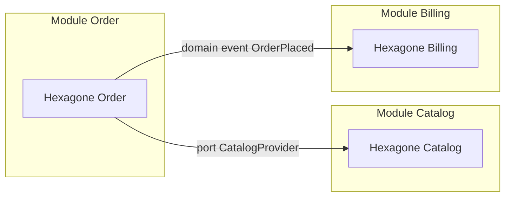
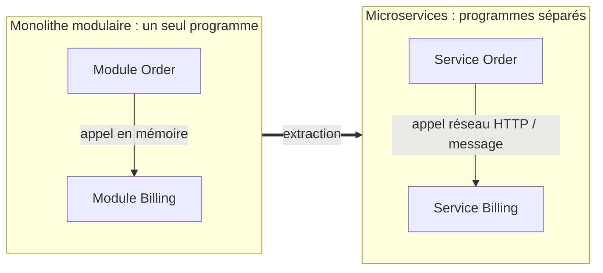
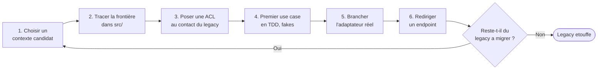
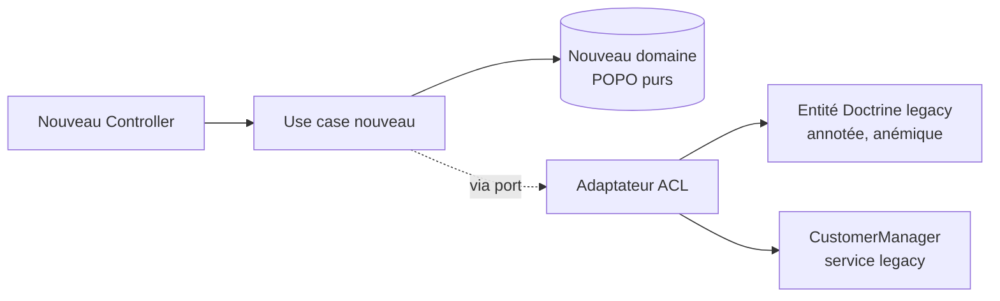

[← Tests, comparaisons et CQRS](04-tests-comparaisons-et-cqrs.md) · [↑ Sommaire](../README.md#table-des-matières) · [Exemples complets →](06-exemples-complets.md)

# 5. Câblage, mise à l'échelle et migration

## 15. Composition Root et câblage

Question rarement traitée de front : *où* exactement décide-t-on quelle implémentation va
satisfaire quel port ? La réponse a un nom.

> **Que veut dire « Composition Root » (racine de composition) ?** C'est l'*unique* endroit
> du programme, situé tout au début du démarrage, où l'on assemble le graphe des objets : on
> choisit quel adaptateur réalise quel port, on règle les dépendances, on crée le conteneur.
> Aucune autre partie du code n'a le droit de fabriquer un adaptateur directement. Analogie :
> le standard téléphonique d'autrefois, où une seule opératrice branchait les fils pour
> relier chaque appelant au bon correspondant.

Pourquoi un *seul* endroit ? Parce que c'est la seule façon de garantir qu'un changement de
branchement (passer de `DoctrineTaskRepository` à `InMemoryTaskRepository` en test)
n'oblige à modifier *rien* d'autre. Si plusieurs endroits fabriquent des adaptateurs, vous
avez plusieurs racines de composition, donc des couplages cachés.

| Plateforme | Où vit la Composition Root |
|---|---|
| Symfony | `config/services.yaml` + le compilateur du conteneur |
| Spring | Classe `@Configuration` |
| .NET | `Startup.cs` / `Program.cs` |
| Node.js (sans framework) | `index.js` ou `bootstrap.js` |
| Python (Flask/FastAPI) | Le module qui crée l'application + injection manuelle |

En Symfony, la Composition Root se compose de :

- `config/services.yaml` (et ses variantes `_dev.yaml`, `_test.yaml`, `_prod.yaml`) ;
- les `CompilerPass` que vous écrivez pour des liaisons dynamiques (rare) ;
- les attributs `#[AsAlias]`, `#[AsTaggedItem]` quand vous préférez la configuration en
  PHP plutôt qu'en YAML.

> **Anti-pattern : Composition Root éclatée.** Instancier `new DoctrineTaskRepository(...)`
> à l'intérieur d'un contrôleur, d'un use case ou d'une factory métier. Le code n'est
> plus testable : on ne peut plus substituer le repository sans toucher à la classe qui
> l'instancie. Si vous voyez un `new` d'adaptateur en dehors de `config/`, c'est une
> fuite.

Astuce concrète Symfony : utilisez `bin/console debug:container --parameters` et
`bin/console debug:autowiring` pour vérifier que *chaque* interface du domaine a bien un
alias unique. Une interface sans alias égale un port sans implémentation, donc une erreur à
l'exécution (*runtime*, « au moment où le programme tourne », par opposition à la
compilation).

[Retour en haut](#table-des-matières)

---

## 16. Hexagonal à l'échelle : monolithe modulaire et microservices

Un seul hexagone est rarement suffisant pour un système réel. Cette section traite la
question de la *composition* de plusieurs hexagones.

> **Que veut dire « monolithe modulaire » ?** Un *monolithe* est une application livrée et
> lancée d'un seul bloc. *Modulaire* signifie qu'à l'intérieur, elle est découpée en
> modules indépendants, chacun étant un bounded context complet (avec ses propres
> `Domain/`, `Application/`, `Infrastructure/`). Les modules se parlent par des ports
> explicites, jamais en fouillant dans le code interne (*internals*) du voisin. Analogie :
> un immeuble unique, mais avec des appartements bien séparés et des interphones officiels
> entre eux.

> **Que veut dire « microservice » ?** Un bounded context lancé comme un *programme
> séparé*, qui parle aux autres par le réseau (HTTP, gRPC, messages). Les frontières
> hexagonales deviennent alors des frontières de déploiement. Analogie : non plus des
> appartements dans un immeuble, mais des maisons indépendantes reliées par la route.

### 16.1. Composition dans un monolithe modulaire

Règles de composition :

1. **Aucun module n'importe l'`Domain/` d'un autre.** La communication se fait toujours
   via un port défini dans le module *appelant* et implémenté en infrastructure.
2. **Les domain events sont le canal de prédilection** pour les notifications
   inter-modules. Le producteur n'a pas à savoir qui consomme.
3. **Une ACL par frontière** : chaque module qui consomme un autre traduit le vocabulaire
   à la frontière, comme expliqué [section 5.3](#53-anti-corruption-layer-acl).
4. **Outils de contrôle structurel** : `deptrac` (PHP) ou `phparkitect` vérifient
   *automatiquement* qu'aucun `import` (lien de code) ne franchit une frontière interdite.
   Sans cette vérification automatique, les frontières finissent toujours par fuiter.

### 16.2. De monolithe modulaire à microservices

Un monolithe modulaire bien fait se *casse* en microservices presque mécaniquement :

- chaque module devient un service ;
- les ports synchrones deviennent des appels HTTP/gRPC ;
- les domain events deviennent des messages Kafka/AMQP/Messenger transport ;
- l'ACL devient une DTO sur le réseau au lieu d'un mapper en mémoire.

> **Conseil solide.** Commencez *toujours* par un monolithe modulaire. Tant que les
> frontières hexagonales sont propres et vérifiées par `deptrac`, le passage en
> microservices devient une extraction presque mécanique. Commencer directement en
> microservices, avant d'avoir compris ses bounded contexts, conduit à un *distributed
> monolith* (« monolithe distribué » : des services soi-disant séparés mais si emmêlés
> qu'on ne peut plus les déployer indépendamment), le pire des deux mondes.

[Retour en haut](#table-des-matières)

---

## 17. Migrer un legacy Symfony vers l'hexagonal

La plupart des projets Symfony en production *ne sont pas* hexagonaux au départ. Voici
comment introduire l'hexagonal *sans* big-bang.

> **Que veut dire « big-bang » (en migration logicielle) ?** Tout réécrire d'un coup, puis
> basculer du jour au lendemain. C'est l'approche la plus risquée : si quoi que ce soit
> casse, tout casse en même temps. On lui préfère une migration progressive.

> **Que veut dire « Strangler Fig pattern » (motif du ficus étrangleur) ?** Stratégie de
> migration popularisée par Martin Fowler. On ne réécrit pas le legacy d'un coup ; on
> l'enrobe peu à peu. Chaque nouvelle fonctionnalité (et chaque réécriture d'une ancienne)
> passe par la nouvelle architecture, jusqu'à ce que le legacy soit doucement étouffé.
> L'image vient d'une plante tropicale, le ficus étrangleur, qui pousse autour d'un arbre
> hôte et finit par le remplacer entièrement.

> **Que veut dire « endpoint » ?** Un point d'entrée précis de l'application accessible de
> l'extérieur, typiquement une URL associée à une action (par exemple `POST /tasks/42/
> complete`). Migrer « un endpoint à la fois » veut dire rebrancher une seule URL vers le
> nouveau code, sans toucher aux autres.

### 17.1. Étapes recommandées

1. **Identifier un bounded context candidat**. Choisir un module métier suffisamment
   indépendant et suffisamment douloureux pour justifier l'effort. Idéalement un module
   sur lequel des évolutions sont déjà prévues.
2. **Tracer la frontière** dans `src/`. Créer `src/<NouveauContext>/Domain/`,
   `Application/`, `Infrastructure/`, `UserInterface/`. Les vieilles classes restent où
   elles sont.
3. **Poser une ACL au contact du legacy**. Définir un port (`LegacyCustomerProvider`)
   dans `Application/Port/`, et un adaptateur dans `Infrastructure/` qui *traduit* depuis
   les vieilles entités Doctrine du legacy. Le nouveau domaine ne voit *jamais* les
   entités legacy.
4. **Écrire le premier use case en TDD** dans le nouveau contexte. Faire passer les
   tests avec des fakes en mémoire.
5. **Brancher l'adaptateur Doctrine** réel *seulement après* que la conception du domaine
   soit stable.
6. **Rediriger un endpoint** vers le nouveau use case (un `Controller` du nouveau
   contexte qui remplace la route legacy).
7. **Itérer** : un endpoint à la fois, un cas d'utilisation à la fois.

Ces étapes forment une boucle que l'on répète jusqu'à ce que le legacy soit étouffé :

### 17.2. Schéma : ACL au contact du legacy

> **Que veut dire « anémique » (modèle de domaine anémique) ?** Se dit d'entités vidées de
> tout comportement, réduites à des sacs de getters et setters, dont toute la logique a fui
> dans des classes `*Service` géantes. Analogie : un patient anémique manque de fer ; ces
> entités manquent de logique. C'est un anti-pattern (voir section 20).

Règles d'or de la migration :

- **N'importez jamais** une classe du legacy directement dans le nouveau domaine.
- **N'étendez jamais** une classe du legacy depuis le nouveau code.
- **Doublez les écritures** pendant la transition : le nouveau code écrit dans le nouveau
  modèle *et* dans l'ancien (via l'ACL), jusqu'à ce que tous les lecteurs aient migré.
- **Outillez la frontière** avec `deptrac` pour bloquer les `import` interdits dès la *CI*.
  Sans contrainte automatique, la frontière finit toujours par fuiter.

> **Que veut dire « CI » ?** *Continuous Integration*, « intégration continue » : un
> serveur qui, à chaque envoi de code, relance automatiquement les tests et les
> vérifications. Analogie : un contrôle qualité posté à la sortie d'usine, qui inspecte
> chaque pièce avant qu'elle ne parte.

> **Piège classique du strangler.** Coincer la migration à 70 % parce que les 30 %
> restants sont *trop pénibles* à extraire. Pour éviter cela : prioriser la migration
> par valeur métier, et accepter que certains coins du legacy resteront *définitivement*
> derrière une ACL. Une ACL stable est préférable à une migration zombie.

[Retour en haut](#table-des-matières)

---

---

[← Tests, comparaisons et CQRS](04-tests-comparaisons-et-cqrs.md) · [↑ Sommaire](../README.md#table-des-matières) · [Exemples complets →](06-exemples-complets.md)
